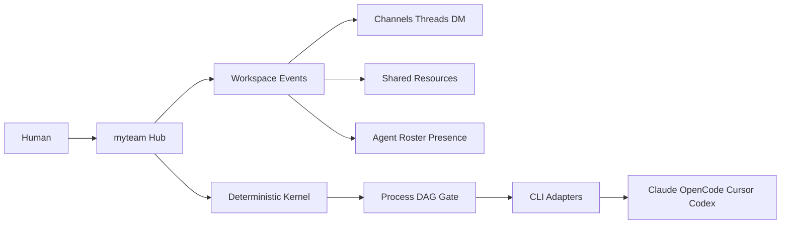

# OpenAgents 对 myteam 的升级清单

## 总体判断

OpenAgents 与 myteam 同属多 Agent 协作平台，但优势方向不同：

- OpenAgents 强在 Workspace、Launcher、事件网络、频道、共享资源和 agent 在线管理。
- myteam 强在确定性任务编排、Interaction 合同、Gate 验收、SQLite 真相库、Strategy/Skill 分层。

升级方向不应是照搬 OpenAgents，而是在保留 myteam 编排内核的前提下，把 Hub 升级成更完整的 Agent Workspace。

目标形态：

## P0：统一 Workspace 事件流

### 借鉴 OpenAgents

OpenAgents 把 message、agent status、file、resource、system activity 都建模为事件，并通过事件流驱动 Workspace。

### myteam 当前问题

- Chat SSE、Observability run_event、DM memory、group routing、deliverables 分散在不同路径。
- 前端看到的是多个功能页，而不是统一协作时间线。
- Agent 协作、用户聊天、项目执行之间缺少一个共同事件模型。

### 升级内容

- 设计轻量 `WorkspaceEvent`，字段包括：
  - `id`
  - `type`
  - `source`
  - `target`
  - `payload`
  - `metadata`
  - `visibility`
  - `timestamp`
- 事件类型建议：
  - `chat.message.posted`
  - `chat.message.replied`
  - `agent.status.changed`
  - `project.created`
  - `project.task.updated`
  - `project.gate.completed`
  - `resource.file.uploaded`
  - `resource.context.updated`
- 将关键运行事件、聊天消息、任务状态变更都写入同一事件表或事件投影视图。

### 涉及模块

- `backend/common/store.py`
- `backend/hub/api/server.py`
- `backend/hub/api/observability_api.py`
- `backend/hub/services/chat_service.py`
- `frontend/app.js`

### 验收标准

- 能按 project、agent、channel、event type 查询事件。
- 项目执行过程可以生成统一时间线。
- Chat、Project、Observability 不再各自维护完全孤立的历史。
- 不破坏现有 `adapter.events.AgentEvent` 和 kernel `InteractionRequest` / `InteractionResponse` 合同。

## P0：频道、线程和项目 Workspace

### 借鉴 OpenAgents

OpenAgents Workspace 提供 channels、direct messages、replies、threads 和 @mention 协作。

### myteam 当前问题

- 已有 DM 和 group，但更像简单路由，不像长期协作空间。
- 项目执行、任务讨论、交付物、评审结果分散。
- 用户很难围绕一个项目追踪完整上下文。

### 升级内容

- 引入三类会话：
  - `direct/{agent_id}`：人与单个 agent 的私聊。
  - `channel/general`：通用频道。
  - `channel/project-{project_id}`：项目频道。
- 支持 `thread_id` 或 `parent_id`，让任务讨论、review、Gate 结果可以挂在线程下。
- 保留 @mention 作为显式调度入口，但将 mention 事件和 agent 响应都落库。
- 项目启动时自动创建项目频道。
- task status、deliverable、review、triage、budget event 自动流入项目频道。

### 涉及模块

- `backend/base/group_manager.py`
- `backend/hub/services/chat_service.py`
- `backend/common/context_assembler.py`
- `backend/common/store.py`
- `frontend/index.html`
- `frontend/app.js`
- `frontend/style.css`

### 验收标准

- 用户可以在项目频道看到完整项目进展。
- 频道消息可检索，并可被 Context Assembler 引用。
- @mention 指定 agent 后，事件中能看到请求、目标 agent、响应和状态。
- DM 记忆路径继续可用。

## P0：持久化 Job / Supervisor

### 借鉴 OpenAgents

OpenAgents Launcher/daemon 负责 agent 启动、保活、状态、重连和进程监控。

### myteam 当前问题

- Hub 启动 kernel run 仍有进程内存状态。
- 项目运行、取消、恢复、崩溃处理还不够像长期服务。
- Agent runtime 的 online、busy、error 状态不够明确。

### 升级内容

- 新增持久化 job/run 表，记录：
  - `job_id`
  - `project_id`
  - `status`
  - `pid` 或 worker 标识
  - `started_at`
  - `updated_at`
  - `cancel_requested`
  - `error`
- 建立 supervisor 服务：
  - 启动 kernel job。
  - 取消 job。
  - 记录 crash。
  - 支持 backoff retry。
  - Hub 重启后可恢复或标记 orphan job。
- 建立 agent runtime 状态：
  - `online`
  - `idle`
  - `busy`
  - `error`
  - `last_seen`
  - `current_task`

### 涉及模块

- `backend/hub/api/server.py`
- `backend/common/run_kernel.py`
- `backend/common/process.py`
- `backend/common/agent_port.py`
- `backend/common/store.py`
- `backend/base/agent_chat.py`

### 验收标准

- Hub 重启后仍能查询上一次 job 状态。
- 运行中的项目可以被取消，并在 Store 中留下取消记录。
- Agent 当前 busy/idle 状态可在前端显示。
- 不再依赖单纯的进程内 `_KERNEL_RUNS` 作为唯一真相。

## P1：共享资源层

### 借鉴 OpenAgents

OpenAgents 将 files、tools、context 都视为 addressable resources。

### myteam 当前问题

- deliverables、KB memory、skills、agent workspace 文件都存在，但没有统一资源目录。
- Agent prompt、Hub UI、observability 使用的是不同入口。
- 用户上传文件和任务交付物还没有统一抽象。

### 升级内容

- 建立资源索引：
  - `resource/file/...`：交付物、上传文件、报告。
  - `resource/context/...`：KB、项目简报、对话摘要。
  - `resource/skill/...`：Skill Pack、task_type 关联能力。
  - `resource/tool/...`：未来共享工具入口。
- 给资源增加基础元数据：
  - owner
  - project_id
  - content_type
  - created_at
  - updated_at
  - source
  - visibility
- 在 Hub 暴露资源列表和详情 API。
- 在 worker prompt 中允许引用资源地址，而不是只拼接长文本。

### 涉及模块

- `backend/common/store.py`
- `backend/common/memory.py`
- `backend/common/skill_registry.py`
- `backend/common/agent_transport.py`
- `backend/hub/api/observability_api.py`
- `frontend/app.js`

### 验收标准

- 项目交付物、KB、Skill 可以在统一资源列表中看到。
- Agent 执行任务时能收到相关资源引用。
- 前端可以按 project 和 resource type 过滤资源。
- 原有 deliverables 路径保持兼容。

## P1：Agent 能力发现和 Workspace Manifest

### 借鉴 OpenAgents

OpenAgents 通过 manifest 暴露 network capabilities、transports、agents 和资源能力。

### myteam 当前问题

- Agent/backend/task_type/skill 能力分散在多个 API 和配置文件中。
- 外部工具无法快速知道当前 myteam Hub 支持什么。
- 后续如果要接 Cursor、OpenAgents 或其他 agent 网络，缺少发现入口。

### 升级内容

- 新增类似 `/.well-known/myteam.json` 的 manifest。
- 暴露：
  - workspace id/name
  - API version
  - supported backends
  - agents
  - task types
  - skills
  - resources
  - SSE endpoints
  - auth mode
- 保持只读，不把配置写入 manifest。

### 涉及模块

- `backend/hub/api/server.py`
- `backend/base/agent_chat.py`
- `backend/common/registry.py`
- `backend/common/skill_registry.py`
- `backend/adapter/registry.py`

### 验收标准

- 访问 manifest 可获得当前 Hub 的核心能力清单。
- 不暴露密钥、token、本地绝对敏感路径。
- 前端或外部脚本可以基于 manifest 自动发现 API。

## P1：事件处理器链，暂不做完整插件系统

### 借鉴 OpenAgents

OpenAgents mods 是事件管线拦截器，分为 guard、transform、observe。

### myteam 当前判断

完整插件框架现在过早，容易破坏系统简洁性。更适合先做内置事件处理器链。

### 升级内容

- 内置处理器：
  - `persistence`：事件落库。
  - `notification`：推送 SSE。
  - `projection`：生成项目、频道、agent 状态读模型。
  - `audit`：记录关键操作。
  - `policy`：未来多用户/分享时再启用。
- 事件处理器只处理 Hub/Workspace 事件，不介入 kernel 的合同校验。

### 涉及模块

- `backend/common/store.py`
- `backend/hub/api/server.py`
- `backend/hub/services/notify_service.py`
- `backend/hub/api/observability_api.py`

### 验收标准

- 新增事件类型只需注册处理器，不需要到处改前端轮询逻辑。
- SSE 推送和持久化都走统一处理链。
- 处理器失败不会污染 kernel task 状态。

## P2：共享文件上传和项目文件区

### 借鉴 OpenAgents

OpenAgents Studio 支持上传、下载、预览、按频道共享文件。

### myteam 当前问题

- 交付物主要由 agent 写入。
- 用户提供文件给项目或 agent 的路径还不够产品化。
- 文件和任务上下文之间缺少结构化关联。

### 升级内容

- Hub 增加项目文件区：
  - 上传文件。
  - 文件挂到 project/channel/task。
  - 文件进入 resource index。
  - Agent prompt 中注入相关文件引用。
- 支持基础预览：
  - Markdown
  - text
  - JSON
  - image metadata

### 涉及模块

- `backend/hub/api/server.py`
- `backend/common/store.py`
- `backend/common/agent_transport.py`
- `frontend/app.js`
- `frontend/index.html`

### 验收标准

- 用户能向项目上传文件。
- 文件可被 agent 在任务执行时引用。
- 文件出现在项目频道和资源列表中。

## P2：更完整的 Agent Roster / Presence

### 借鉴 OpenAgents

OpenAgents Workspace 关注 agent 是否在线、能力是什么、当前状态如何。

### myteam 当前问题

- agent 配置和 workspace 扫描已有，但实时状态不够清晰。
- 用户不知道某个 agent 是可用、忙碌、错误还是缺少配置。

### 升级内容

- Agent 列表增加：
  - backend
  - model
  - capability
  - workspace status
  - runtime status
  - current project/task
  - last event
- 状态来源：
  - config scan
  - adapter capability
  - supervisor job
  - recent run_event

### 涉及模块

- `backend/hub/services/agent_registry.py`
- `backend/common/agent_registry.py`
- `backend/base/agent_chat.py`
- `backend/adapter/registry.py`
- `frontend/app.js`

### 验收标准

- 前端能展示 agent 是否可用。
- 启动项目时能提前发现 agent 缺配置或 workspace 不存在。
- 运行中 agent 显示 busy 和当前任务。

## P2：OpenAgents 兼容桥接预研

### 借鉴 OpenAgents

OpenAgents 的 ONM/Event/Workspace 可能成为外部 agent workspace 的事实标准之一。

### myteam 当前判断

短期不应做完整兼容，但可以预留桥接边界。

### 升级内容

- 对照 OpenAgents event envelope，保持 myteam `WorkspaceEvent` 可映射。
- manifest 中预留 capabilities。
- 设计 import/export adapter：
  - OpenAgents channel message -> myteam WorkspaceEvent
  - myteam project event -> OpenAgents channel message

### 涉及模块

- `backend/hub/api/server.py`
- `backend/common/store.py`
- `backend/adapter/`

### 验收标准

- 有一份事件字段映射文档。
- 不引入 OpenAgents 运行时依赖。
- 不影响 myteam 本地优先架构。

## 暂不建议做

这些能力现在复杂度和风险高，建议后置：

- DID / 去中心化身份。
- 跨网络 federation。
- gRPC 多 transport。
- 桌面 Launcher。
- 公网 tunnel。
- 共享浏览器。
- 开放远程 agent 自由接入。
- 完整第三方插件市场。

原因：

- myteam 当前差异化在确定性执行，不在开放网络协议。
- 远程共享和公网能力会引入权限、密钥、文件隔离、安全审计问题。
- 插件系统过早会增加维护成本。

## 推荐实施顺序

### Milestone 1：Workspace 事件底座

- 新增 WorkspaceEvent 模型和 Store 持久化。
- 将 chat message、project run_event、agent status 投影到统一事件。
- 前端增加项目时间线视图。

### Milestone 2：频道和项目协作空间

- 新增 channel/thread 数据结构。
- 项目自动创建频道。
- @mention 和 agent 回复进入频道事件流。

### Milestone 3：Job Supervisor

- job/run 状态持久化。
- 替代内存态运行记录。
- 支持恢复、取消、错误标记。

### Milestone 4：共享资源层

- 建立 resource index。
- deliverables、KB、skills 进入统一资源列表。
- agent prompt 支持资源引用。

### Milestone 5：Manifest 和外部集成准备

- 暴露 `/.well-known/myteam.json`。
- 建立 OpenAgents 事件映射文档。
- 预留未来桥接入口。

## 成功标准

完成上述升级后，myteam 应该从“带 Hub 的本地多 Agent 编排器”提升为“可长期运行、可追踪、可协作的 Agent Team Workspace”：

- 用户能围绕项目查看完整协作上下文。
- Agent 的状态、任务、交付物、记忆、技能都能被统一发现。
- Kernel 的确定性合同和 Gate 不被削弱。
- 后续接入 OpenAgents/Cursor/Claude Code 等外部生态更容易。
