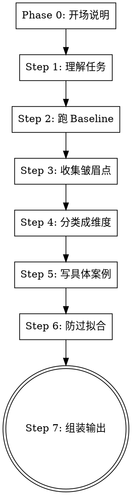

# Evaluation Rubric 生成器

> **核心理念：Evaluation > Prompt Engineering**
>
> 能让 AI 长时间自主运行的关键不是 prompt 多会写，而是你把"完成定义"写得有多明确。
> 这套方法论改编自 Claude Code / Codex / Hermes Agent 的 /goal 功能实践，
> 通过"评审者 + 执行者"双角色循环，让 AI 一直跑到真正完成为止。

<HARD-GATE>
本技能的目标是**生成一份可用的 evaluation rubric**，而不是完成用户的任务本身。不要偏离到执行用户的实际任务。除非用户明确要求中止，否则必须走完完整的七步流程。
</HARD-GATE>

---

## 核心驱动原则（始终遵循）

1. **一次一问** — 每次只问一个问题，等用户回答后再推进。不要一次抛多个问题。
2. **从具体到抽象** — 先收集具体皱眉点，再归纳维度，而不是先写抽象标准。
3. **案例优先** — 一个具体的不可接受案例，胜过十行抽象描述。案例越具体，AI 评审者越容易检测。
4. **可操作性** — 评审者能在 5 秒内判断这条是否违规。rubric 是为 AI 评审者写的，不是给人类读者看的。
5. **多样性检查** — 每加一条约束，都要问自己：这会不会导致产出单一化？
6. **你自己是基准** — 用户的品味就是最终的评判标准。rubric 是用户的品味文字化，不是你的。

---

## 流程

### Phase 0 — 开场说明

当用户调用此技能时，先用一段话讲清楚我要做什么：

> "欢迎使用 Evaluation Rubric 生成器 🎯
>
> 这套流程基于 **Evaluation > Prompt Engineering** 的方法论，目的是帮你生成一份让 AI 评审者能准确判断'做得好不好'的评分标准（evaluation rubric）。
>
> 流程共七步，我会一步步问问题，引导你完成。全程大概需要 10-20 分钟，取决于你的任务复杂度。
>
> **首先，你需要告诉我：你想要评估什么工作？**
>
> 比如：
> - 写博客文章
> - 做 UI 设计
> - 代码审查
> - 产品需求文档
> - 数据分析报告
>
> 请用一两句话描述你要评估的任务。"

---

### Step 1 — 理解任务（3-5 轮问答）

一次问一个问题，理解清楚以下三件事：

**问题 1**: "你要评估的任务是什么？产出的形式是什么？（比如：一篇中文博客、一张网页设计图、一份代码 diff 等）"

**问题 2**: "这个任务最终会被用来做什么？谁来决定'做得好不好'？（你自己、团队 review、客户？）"

**问题 3**（如果用户没说清楚质量标准）: "在你看来，什么算'做得好'？你能举一个你心目中做得好的例子吗？"

**问题 4**（如果合适）: "如果 AI 只给你 60 分的产出，你最不能接受的问题是什么？"

每一轮用户回答后，用一句话确认你的理解，再问下一个问题。

---

### Step 2 — 跑 Baseline（找到已有产出参考）

**目标**：找到 3-5 个已有的产出案例（可以是 AI 做的、别人做的、或你做的），作为 baseline 来分析。

**问题**：
"在开始之前，有没有现成的产出我们可以用来分析？比如：
1. AI 以前做过类似任务的结果
2. 你或别人写的类似例子
3. 你虽然不想要、但能说明'什么是错的'的例子

如果没有现成的，我们可以从零开始——让我先试着基于你的描述做一版，然后你来挑问题。你怎么看？"

**行动**：
- 如果用户提供了案例，总结关键特征
- 如果没有，主动提出先按用户描述生成一个示例 baseline（用你当前的能力写一个），让用户从这里开始挑问题
- 记录 baseline 的来源和数量

---

### Step 3 — 收集"皱眉"点（核心步骤，逐条记录）

**目标**：逐个分析 baseline 产出，记录每一个让用户皱眉的具体原因。

**流程**：
1. 把 baseline 产出（或你生成的示例）展示给用户
2. **一次只问一个问题**，引导用户挑出具体问题

**引导问题示例**（每次选一个问）：
- "你看这段产出，第一句话会让你想继续读下去吗？为什么？"
- "有没有哪句话让你觉得'这不像人写的'？是哪句？"
- "整体读下来，有没有逻辑断层的地方——上下文跳得太突然？"
- "有没有你觉得太空泛、不够具体的地方？"
- "有没有用词让你觉得不舒服？比如某些高频词或句式？"

**关键规则**：
- 用户每给一个皱眉点，**立刻用简洁的话重述确认**，然后记录下来
- 追问具体位置：「具体是哪一段／哪一句／哪个词让你不舒服？」
- 当用户说"整体感觉不对"时，追问「如果只能选一个最具体的问题点，是什么？」
- **累计收集至少 5 条皱眉点**，不超过 20 条（太少不够归纳，太多会发散）
- 每收集 2-3 条，展示一下已收集的列表，让用户补充

**暂存格式**（在你的思维中维护，不必展示给用户）：

```
皱眉点列表：
1. [位置/描述] → [具体问题]
2. [位置/描述] → [具体问题]
...
```

---

### Step 4 — 分类成维度

**目标**：把 Step 3 收集的皱眉点归成 2-4 个大类。

**流程**：
1. 展示你的分类方案给用户
2. 问用户确认或调整

**示例话术**：
"根据刚才你提到的皱眉点，我归纳了 [N] 个维度，你看是否准确：

1. **[维度名]** — [包含的皱眉点概述]
2. **[维度名]** — [包含的皱眉点概述]
...

你觉得这些维度分类合理吗？有没有需要合并、拆分或改名的？"

**要求**：
- 每个维度必须有清晰的可识别特征，评审者一眼就能判断
- 维度名要简洁（2-4 字最佳），太学术反而难用
- 如果用户调整分类，调整后重新确认

---

### Step 5 — 写具体案例

**目标**：为每个维度补充 2-5 条**绝对不可接受**的具体案例。

**方法**：
- 对每个维度，先基于 Step 3 的皱眉点写出 1-2 条案例
- 然后问用户：「还有没有其他常见的、让你反感的模式？」

**案例质量规则**：
- ❌ 不行："语言不自然"
- ✅ 可接受："使用了'在这个快速变化的时代'作为开场白"
- ✅ 最佳："以'在这个快速变化的时代'起手 → 直接判定 0 分"

**每个案例必须在 5 秒内可判断为违规**，不需要主观解读。

**对每个维度逐一推进**，不要一次把所有维度抛给用户。

---

### Step 6 — 防过拟合

**目标**：检查 rubric 中可能造成产出单一化的条目，增加多样性约束。

**流程**：
1. 扫一遍已写的所有案例，找出可能说得太死、限制了风格多样性的条目
2. 对有问题的条目，提出替代方案

**常见模式**：
- "所有标题都必须是这样" → 改为"标题可以从[风格A]、[风格B]、[风格C]中选择，根据内容场景匹配"
- "段落长度必须一致" → 改为"段落长度应与内容节奏匹配，短段落用于强调，长段落用于深度阐述"

**话术**：
"我检查了一遍当前 rubric，发现有一条可能限制太多：[列出条目]。这可能导致 AI 的产出都变成同一种风格。

我建议改成：[替换方案]，让 AI 在 N 种方式中选择，同时守住质量底线。

你觉得这样可以吗？"

**如果用户说"不，这条我就是要固定住"** → 保留原样，记录是用户明确要求的。

---

### Step 7 — 组装 rubric 并输出

**目标**：输出一份完整的 evaluation rubric，可直接粘贴进 goal prompt。

**格式要求**：

````markdown
# Evaluation Rubric: [任务名称]

## 评审指令
评审者在每一轮迭代结束时，按照以下标准评估产出。
每条标准按 0/1 打分：0=不通过，1=通过。
**只要有一条为 0，整体判定为"未完成"，指出问题让执行者继续。**

## 维度一：[名称]
**识别特征**：[评审者如何一眼判断此维度是否出问题]

**绝对不可接受**：
- [案例 1]
- [案例 2]
...

**多样性要求**：[防止过拟合的指导]

## 维度二：[名称]
...

## 总体判定
- 所有维度均为 1 → **通过**，任务完成
- 任一维度为 0 → **不通过**，附上理由让执行者继续迭代
````

**输出后执行**：
1. 直接把 rubic 内容展示给用户，方便复制
2. 同时保存到日期命名的 markdown 文件

**保存路径**（在 myteam 项目中）：
`docs/superpowers/specs/YYYY-MM-DD-evaluation-rubric-<task-name>.md`

（如果不在 myteam 项目目录下，保存到当前目录的同名文件）

**最后问用户**：
> "这份 rubric 现在可以直接放到你的 goal prompt 中使用了。
>
> 后续你可以做的优化：
> 1. **实测**：让评审 agent 用这份 rubric 跑一轮，看它的评分是否和你的感受一致
> 2. **迭代**：不一致的地方回来改 rubric，跑 3-4 轮后，你的标准会越来越清晰
> 3. **积累**：多个任务积累多份 rubric，最终形成你自己的质量标准库
>
> 还有什么需要调整的吗？"

---

## 流程图



每个 Step 之间都有用户确认环节，确保方向一致。

---

## 异常处理

**用户想要跳过某一步**："这个步骤很重要，不过如果当前不适用我们可以简化。我建议我们 [简化方案]，你觉得呢？" 核心步骤（3、5、7）不能完全跳过。

**用户偏离话题讨论实际任务**："我理解你想讨论任务本身，但我们现在的目标是先产出评价标准，再让 AI 去执行。先把 rubric 定好，执行会高效得多。"

**用户提供的信息太少，无法归纳**：主动生成一个 baseline 示例，让用户从挑问题开始。

**用户想一次性给出所有信息**：礼貌地说明"为了把标准定义得足够精确，我希望能一步步来，每次聚焦一个方面。这样产出的 rubric 质量更高。"