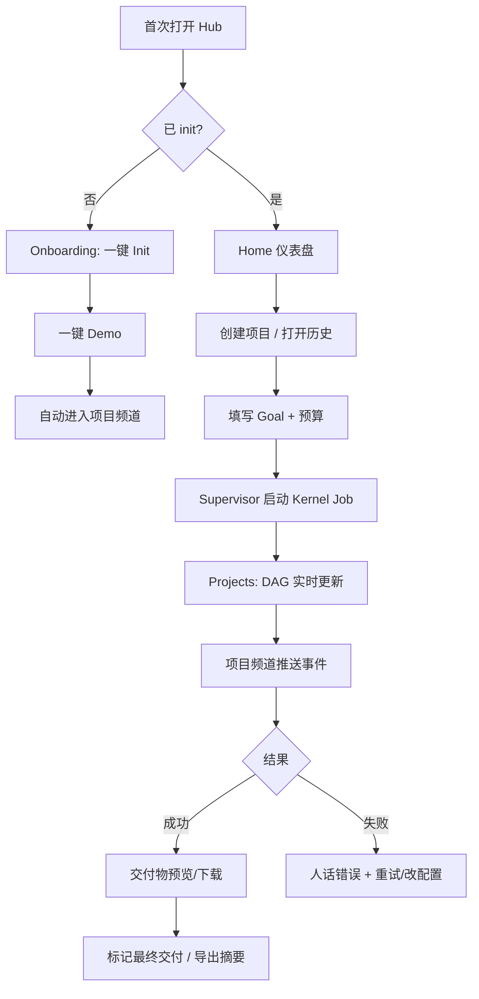

# myteam 升级需求规格书

> **文档类型**：产品需求 / 研发规格（PRD + 技术验收）  
> **编写角色**：项目负责人 · 产品专家 · 系统架构师  
> **编写日期**：2026-06-06  
> **代码基线**：分支 `upgrade/continued`  
> **状态**：**已归档** — 内容已合并至 [`myteam-upgrade-comprehensive-plan.md`](./myteam-upgrade-comprehensive-plan.md)  
> **受众**：main / developer / frontend 等研发 agent  
> **上游输入**：`docs/` 下 2026-06-06 各专项调研报告（见 §12）

> ⚠️ **请勿再以本文档为执行依据。** 研发 agent 请阅读 [`myteam-upgrade-comprehensive-plan.md`](./myteam-upgrade-comprehensive-plan.md)（上篇终态 + 下篇 R0–R4）。

---

## 1. 执行摘要

### 1.1 升级定位

myteam 已完成 **编排内核工业化**（Process / AgentPort / Gate / Store / Interaction 契约），当前瓶颈不在「能不能跑」，而在 **产品闭环、Hub 一体化、工程可信**。

本次升级的目标形态：

**从「带 Hub 的本地多 Agent 编排器」→「可长期运行、可追踪、可协作的 Agent Team Workspace」。**

升级原则：

1. **强化内核差异化**（确定性 DAG + Gate + 契约），不削弱为「聊天壳子」
2. **补齐产品闭环**（跑通 → 看见 → 理解 → 拿交付物 → 修失败）
3. **Hub 与内核一体化**（终端与浏览器双轨收敛为「Hub 为主、CLI 为辅」）
4. **工程先行**（测试/CI 可信后再大规模改 UI）

### 1.2 升级后一句话描述

用户打开 Hub，**5 分钟内完成初始化并跑通 Demo**；在浏览器内 **创建项目、填写 goal、启动编排、实时看 DAG 与进度、在项目频道追踪全链路事件、浏览/下载交付物、失败时获得可操作建议**；编排内核仍通过 **Interaction 契约 + Plan Gate + Gate** 保证确定性执行。

### 1.3 分阶段交付（总览）

| 阶段 | 主题 | 周期 | 交付物 |
|------|------|------|--------|
| **R0** | 工程可信底座 | 1–2 周 | CI 全绿、交付物 API 修复、SSE 测试稳定 |
| **R1** | 产品闭环（CLI + Hub 基础） | 2–3 周 | Demo 目录化、Hub 建项/启项、交付物闭环、友好错误 |
| **R2** | Agent Workspace 一体化 | 3–5 周 | WorkspaceEvent、项目频道、Job Supervisor、统一时间线 |
| **R3** | 体验与可视化升级 | 3–4 周 | DAG 图、UI 模块化、Onboarding、成本/Agent 可视化 |
| **R4** | 资源层与对外能力 | 按需 | 共享资源索引、Manifest、可选鉴权 |

---

## 2. 现状基线（综合调研结论）

### 2.1 已具备的核心资产（禁止回归）

| 资产 | 证据 | 研发约束 |
|------|------|----------|
| 三层边界（Kernel / Registry / Skill） | `process.py` 282 行 + 6 子模块 | 新能力不得破坏分层 |
| Interaction 契约（6 kind） | `contracts.py` + `submit_result` | 禁止 JSON 抢救路径 |
| Plan Gate 确定性校验 | `plan_gate.py` | DAG/agent/task_type 硬校验保留 |
| Adapter 隔离 | `backend/adapters/` | UI/Hub 不得引用 CLI 专有字段 |
| SQLite 真相库 | `store.py` | 状态以 Store 为准 |
| 断点续跑 / workspace GC | `task_pipeline` + `agent_port` | 崩溃恢复语义不得弱化 |
| `--init` / `--demo` | `run_kernel.py` | 保留并增强，不删除 |
| 用户文档 6 篇+ | quick-start / user-guide 等 | 与 Hub 行为保持一致 |

### 2.2 已部分完成但仍未闭环

| 项 | 现状 | 缺口 |
|----|------|------|
| 新用户路径 | CLI `--init`/`--demo` 可用 | Hub 不能独立完成；Home 空态无引导 |
| 交付物浏览 | 前端有 Deliverables 页 | API 回归失败（2 例）；下载/预览体验弱 |
| 项目可观测 | Obs API + Projects 四 tab | 无 DAG 图；Chat/Project/Obs 数据分裂 |
| 错误友好化 | run_kernel 部分改善 | Hub/API 仍偏技术堆栈 |
| Demo | 逻辑内嵌 `run_kernel` | 缺 `business/demo/` 目录化模板 |
| 测试 | 205 例 | 全量 pytest 挂起；无 CI |

### 2.3 成熟度评分（调研共识）

| 维度 | 当前 | 升级目标 |
|------|:----:|:--------:|
| 编排内核架构 | 4.5 | ≥4.5（保持） |
| 测试与 CI | 3.0 | ≥4.0 |
| 产品体验 | 2.5 | ≥4.0 |
| Hub / 前端工程 | 2.5 | ≥3.5 |
| 安全与运维 | 2.0 | ≥3.0（局域网场景） |

---

## 3. 升级后能力全景

### 3.1 用户侧能力矩阵

| 能力域 | 升级前 | 升级后 |
|--------|--------|--------|
| ** onboarding** | 读文档 + CLI | Hub 检测未 init → 引导 init/demo → 首次交付物 |
| **项目创建** | 仅 CLI `run_kernel` | Hub 填 goal/模式/预算 → 一键启动 |
| **编排执行** | 终端看日志 | Hub 实时 DAG + 进度 + SSE 事件 |
| **协作沟通** | DM/群聊与项目割裂 | 项目频道 + 统一时间线 + @mention |
| **交付物** | 翻文件系统 | 预览/下载/标记最终交付/版本对比 |
| **失败处理** | 堆栈/日志 | 人话原因 + 建议动作 + 跳转排查 |
| **Agent 管理** | 表格内联编辑 | 能力卡片 + 运行时状态 + 配置校验 |
| **成本管控** | 表格数字 | 图表 + 预算告警 |
| **长期运行** | 进程内存态 | Job Supervisor 持久化 + 取消/恢复 |

### 3.2 系统侧能力矩阵

| 能力域 | 升级后规格 |
|--------|------------|
| **WorkspaceEvent** | 聊天、任务、Gate、资源、Agent 状态统一事件模型；可查询、可 SSE、可投影 |
| **频道模型** | `direct/{agent}`、`channel/general`、`channel/project-{id}` + thread |
| **Job Supervisor** | job 表持久化；启动/取消/崩溃标记；Hub 重启可查询 |
| **资源索引** | file/context/skill/tool 统一元数据；prompt 可引用地址 |
| **Manifest** | `/.well-known/myteam.json` 暴露只读能力清单 |
| **事件处理链** | persistence → notification(SSE) → projection → audit |
| **友好错误** | 错误码 + 用户文案 + troubleshooting 链接 |
| **CI 门禁** | `pytest backend` <60s 全绿 |

### 3.3 内核增强（不破坏 invariant）

| 增强项 | 来源 | 说明 |
|--------|------|------|
| Interaction 内部结构化阶段 | MetaGPT 借鉴 B | `build_worker_prompt` 对 execute/review 加入收集→产出→自检引导 |
| 运行时递归展开 | MetaGPT 借鉴 C | `needs_review` 且范围过大时原地展开子 DAG（深度上限） |
| 有限并行（远期） | D12 评估 | 独立任务并发，Store 锁语义清晰后再做 |

**明确不做**：进程内 Agent、JSON 抢救、轮次驱动、全量 JSON 序列化、完整插件市场、DID/federation。

---

## 4. 升级后用户体验与效果

### 4.1 典型用户旅程（升级后）



### 4.2 量化成功标准

| 指标 | 基线 | R1 目标 | R2+R3 目标 |
|------|------|---------|------------|
| 新用户首次跑通 | 30–60 min | CLI <5 min | Hub <5 min（无终端） |
| 自助排查成功率 | ~0% | >60%（CLI） | >75%（Hub 含链接） |
| 跑完到看见交付物 | 需翻目录 | Hub 可浏览 | 预览+下载+标记 |
| 编排卖点可感知 | 列表为主 | 进度条+状态色 | DAG 图+时间线 |
| 测试回归 | 不可靠 | 逐模块绿 | CI 全绿 <60s |
| Hub 独立完成项目 | 否 | 创建+启动 | 创建+启动+频道协作 |

### 4.3 升级后的「产品感知」变化

| 用户类型 | 升级前感受 | 升级后感受 |
|----------|------------|------------|
| 技术用户 | 内核强但工具感 | 一个 Workspace 搞定聊天+编排+交付 |
| 产品/业务用户 | 门槛高、卖点看不见 | DAG/进度/交付物可见，失败能自助 |
| 团队管理者 | 难追踪多项目 | 项目列表+成本+历史+通知 |

---

## 5. 升级后页面与信息架构

### 5.1 全局导航（一级 Tab）

保留 6 个一级 Tab，调整语义与默认行为：

| Tab | 升级后职责 |
|-----|------------|
| **Home** | 统计卡片（含趋势微标）+ 项目网格 + **空态引导（Init/Demo/建项）** |
| **Chat** | 单 Agent DM；与项目事件可跳转关联 |
| **Groups** | 群组 + **@mention 下拉补全** + 发言人标识 |
| **Projects** | 项目列表 → 项目工作台（见 5.2） |
| **Agents** | Agent 名册 + 能力/状态/任务类型卡片 |
| **Settings** | Accordion 分组；CLI 与 Hub 配置关系说明 |

### 5.2 Projects 项目工作台（二级导航）

将现有四 tab 重组为 **项目上下文内的二级导航 + 面包屑**：

```
Projects > {project_name} > [概览 | DAG | 执行 | 交付 | 成本 | 时间线]
```

| 子页 | 升级后内容 |
|------|------------|
| **概览** | 状态、进度条、Fleet、预算摘要、快捷操作（取消/重试） |
| **DAG** | **SVG/Canvas 拓扑图**；节点着色（completed/running/failed/blocked）；点击进任务详情 |
| **执行** | 交互树；紧凑/展开切换；按状态过滤；SSE **2s 高亮**新事件 |
| **交付** | 文件树 + Markdown/文本预览 + 下载 + **最终交付标记** + 简单 diff |
| **成本** | 表格 + **柱状图/饼图**（纯 CSS/SVG）；预算告警条 |
| **时间线** | **WorkspaceEvent 统一视图**（chat + task + gate + deliverable + triage） |

### 5.3 项目频道（R2 新增入口）

- 项目启动时自动创建 `channel/project-{project_id}`
- 侧边栏在 Projects 上下文或 Groups 下可进入
- 自动流入：task 状态、Gate 结果、deliverable 就绪、triage、预算事件
- 支持 thread：任务讨论、review 挂线程

### 5.4 Home 空态（R1）

首次无项目时展示：

- 插图 + 文案：「欢迎使用 myteam Agent Team Workspace」
- 三按钮：**初始化 Agent** / **运行 Demo** / **创建项目**
- 底部链接：快速开始文档（Hub 内嵌或外链）

### 5.5 Agent 管理页（R3）

- 表格 → **卡片 + 抽屉编辑**（保存/取消确认）
- 列可隐藏；小屏无横滚
- 展示：backend、model、task_types、workspace 状态、runtime（idle/busy/error）、current task

### 5.6 视觉与设计系统（R3）

保留 **Arc 风深空紫** 品牌；增量改进：

- 亮色主题层次重构（暖白 + 饱和 indigo）
- 设计令牌补齐：`--font-weight-*`、`--z-index` 层级
- CSS 拆模块：`tokens.css` / `layout.css` / `components.css` / `pages.css`
- JS 按域拆分：`ui-core.js` / `chat.js` / `projects.js` / `agents.js` / `groups.js` / `settings.js`

**不做**：整站换框架/换设计语言（D9 范围内增量）。

---

## 6. 架构约束（研发不可违反）

以下 invariant 来自 `CLAUDE.md` / `framework-decisions.md`，升级实现中 **必须保持**：

1. **Adapter 隔离**：仅 `RunRequest` / `AgentEvent` 跨 CLI；parser 是唯一知悉 raw 格式处
2. **Interaction 契约**：6 kind；`submit_result` 本地校验；**无 JSON 抢救**
3. **Gate 同源**：down-link registry spec = check-link spec
4. **新 task_type 先进 templates.yaml**：不得仅在 Skill 层发明任务类型
5. **Store 为真相**：Hub/Obs 只读；文件为产物/cache
6. **内核不依赖 Hub**：`run_kernel` 可独立运行；Hub 为增强层
7. **D12 串行先行**：并行 DAG 仅作 R4 可选评估项，默认不启用

**双轨 Agent 配置说明**（须在 UI 帮助中可见）：

- Cursor Agent：`.cursor/rules/`、`CLAUDE.md`
- myteam 内核 Agent：`agents_registry.json`、`workspace-*/`

---

## 7. 分阶段需求清单

### R0 — 工程可信底座（阻塞项，必须先做）

#### R0-1 修复测试回归

| 项 | 规格 |
|----|------|
| **背景** | `pytest backend` 全量挂起；`test_observability_api.py` SSE >120s |
| **需求** | SSE 测试加 timeout/mock 终态；205 例 <60s 全绿 |
| **模块** | `backend/common/tests/test_observability_api.py`、`backend/hub/tests/` |
| **验收** | `PYTHONPATH=backend venv/bin/python3 -m pytest backend -q` 稳定通过 |

#### R0-2 修复交付物 API

| 项 | 规格 |
|----|------|
| **背景** | `test_deliverable_read`、`test_deliverable_file_read` 失败 |
| **需求** | 对齐 `get_task_deliverable_bundle` 与 API 路径；补集成测 |
| **模块** | `backend/hub/api/server.py`、`backend/common/store.py` |
| **验收** | 上述 2 例通过；Hub 可读取 demo 项目 deliverable |

#### R0-3 引入 CI

| 项 | 规格 |
|----|------|
| **需求** | GitHub Actions 或 `scripts/test.sh`；PR/本地提交必跑 |
| **验收** | CI 文档写入 `CLAUDE.md`；失败阻断合并（若用 CI） |

#### R0-4 FastAPI lifespan 迁移

| 项 | 规格 |
|----|------|
| **需求** | `@app.on_event("startup")` → lifespan；消除 DeprecationWarning |
| **模块** | `backend/hub/api/server.py` |
| **验收** | 启动无 deprecated 警告；auto-resume 行为不变 |

---

### R1 — 产品闭环（CLI + Hub 基础）

#### R1-1 Demo 目录化

| 项 | 规格 |
|----|------|
| **需求** | 新增 `business/demo/`：`goal.txt`、`agents_config.json`、`README.md`；`--demo` 读取该目录 |
| **约束** | demo 项目仍落 `business/tasks/project/demo-*`；仅 `one_shot`；与 project_id 互斥 |
| **验收** | 全新 checkout：`--init` → `--demo` <5min exit 0；deliverable 存在 |

#### R1-2 CLI 友好错误与进度

| 项 | 规格 |
|----|------|
| **需求** | `run_kernel` / `process` 按异常类型输出中文结构化提示（见 `product-improvement-plan.md` A3 表） |
| **需求** | 非 verbose 模式输出任务进度条与完成摘要 |
| **需求** | 错误写入 `run_event`，Obs API 可查询 |
| **验收** | 5 类常见错误无人话堆栈；完成时有 task 列表摘要 |

#### R1-3 Hub 内创建并启动项目

| 项 | 规格 |
|----|------|
| **需求** | Projects 列表页「新建项目」：goal、mode（one_shot/recurring）、budget、可选 backend |
| **需求** | 提交后调用 Supervisor 启动 kernel job（R1 可先用线程+持久 job 表最小实现） |
| **需求** | Home 空态三按钮：Init / Demo / 新建 |
| **API** | `POST /api/projects` 扩展或新增 `POST /api/projects/{id}/run` |
| **验收** | 不打开终端即可完成 demo 或自定义项目启动 |

#### R1-4 交付物闭环

| 项 | 规格 |
|----|------|
| **需求** | `GET /api/obs/projects/{id}/deliverables` 稳定；单文件读取/下载 |
| **需求** | Deliverables 页：Markdown 渲染、文本预览、下载按钮 |
| **需求** | 任务级 deliverable 与 project 聚合列表 |
| **验收** | demo 跑完后在 Hub 预览主报告；下载文件内容与磁盘一致 |

#### R1-5 Hub/API 友好错误

| 项 | 规格 |
|----|------|
| **需求** | API 错误响应含 `code`、`message`、`hint`、`doc_url`（链到 troubleshooting） |
| **验收** | 故意触发 workspace 缺失、配置错误时，Hub 展示可操作文案 |

---

### R2 — Agent Workspace 一体化

#### R2-1 WorkspaceEvent 模型

| 项 | 规格 |
|----|------|
| **需求** | Store 新增 `workspace_events` 表或视图；字段：`id,type,source,target,payload,metadata,visibility,timestamp,project_id,channel_id,thread_id` |
| **事件类型** | `chat.message.posted`、`agent.status.changed`、`project.created`、`project.task.updated`、`project.gate.completed`、`resource.file.uploaded` 等（见 OPENAgents 清单） |
| **策略** | **双写**：现有 chat/run_event 保留，同时投影到 WorkspaceEvent |
| **API** | `GET /api/workspace/events?project_id=&type=&limit=`；SSE `GET /api/workspace/events/stream` |
| **验收** | 项目页「时间线」tab 只读 WorkspaceEvent；不破坏 AgentEvent/Interaction 契约 |

#### R2-2 频道与线程

| 项 | 规格 |
|----|------|
| **需求** | 三类会话：`direct/{agent_id}`、`channel/general`、`channel/project-{project_id}` |
| **需求** | 支持 `thread_id` / `parent_id`；@mention 事件落库 |
| **需求** | 项目启动自动创建项目频道；task/gate/deliverable 自动发帖到频道 |
| **模块** | `group_manager.py`、`chat_service.py`、`store.py`、frontend Groups/Projects |
| **验收** | 项目频道可见完整执行摘要；Context Assembler 可引用频道历史 |

#### R2-3 Job Supervisor

| 项 | 规格 |
|----|------|
| **需求** | Store `jobs` 表：`job_id,project_id,status,pid,started_at,updated_at,cancel_requested,error` |
| **需求** | 启动/取消/崩溃标记；Hub 重启后查询 orphan；替代纯内存 `_KERNEL_RUNS` |
| **需求** | Agent runtime：`online|idle|busy|error|last_seen|current_task` |
| **验收** | Hub 重启后仍知上次 job 状态；取消项目后 Store 有记录；Agents 页显示 busy |

#### R2-4 事件处理器链

| 项 | 规格 |
|----|------|
| **需求** | 内置链：`persistence` → `notification(SSE)` → `projection` → `audit` |
| **约束** | 处理器失败不污染 kernel task 状态 |
| **验收** | 新增事件类型仅注册 handler，不改多处 SSE 逻辑 |

---

### R3 — 体验与可视化升级

#### R3-1 DAG 可视化组件

| 项 | 规格 |
|----|------|
| **需求** | Projects 子页 DAG：SVG 渲染节点与依赖边；状态着色；点击打开任务详情 |
| **数据** | `GET /api/obs/projects/{id}/tasks` + dependencies |
| **验收** | demo 项目可见至少 2 节点 DAG；failed 节点红色可点 |

#### R3-2 统一时间线 UI

| 项 | 规格 |
|----|------|
| **需求** | 项目工作台「时间线」tab；合并 chat/task/gate/deliverable；SSE 增量；新事件 2s 高亮 |
| **验收** | 单次 demo 运行可在时间线看到 created→task_updated→gate→deliverable 序列 |

#### R3-3 Onboarding 与 Home 升级

| 项 | 规格 |
|----|------|
| **需求** | 检测未 init（API）；Home 空态引导；Demo 一键（调用 R1-3） |
| **验收** | 新环境首次打开 Hub 可完成 init+demo 无文档外读 |

#### R3-4 Chat/Groups UX

| 项 | 规格 |
|----|------|
| **需求** | 消息三栏结构；轮次分割线与 token/耗时；@mention 下拉；群聊发言人色带 |
| **验收** | @ 输入时出现 agent 列表；群聊可区分发言人 |

#### R3-5 成本可视化

| 项 | 规格 |
|----|------|
| **需求** | Cost 子页柱状图（按 agent/task）+ 饼图；接近 budget 时告警样式 |
| **验收** | 有 token 数据的项目可见图表 |

#### R3-6 Agent 页与设置页

| 项 | 规格 |
|----|------|
| **需求** | Agent 抽屉编辑+确认；Settings Accordion；内嵌术语/help 链接 |
| **验收** | 误编辑可取消；Settings 无大面积空白卡片 |

#### R3-7 前端/CSS 模块化

| 项 | 规格 |
|----|------|
| **需求** | JS/CSS 按 §5.6 拆分；事件委托减少重复绑定 |
| **验收** | 单文件行数：JS 主文件 <800 行；CSS 单文件 <600 行（拆分后） |

#### R3-8 亮色主题重构

| 项 | 规格 |
|----|------|
| **需求** | 暖白层次 + 浅色毛玻璃阴影；主色 `#4f46e5` |
| **验收** | `[data-theme=light]` 变量 100% 覆盖关键路径 |

---

### R4 — 资源层与对外能力（按需）

#### R4-1 共享资源索引

| 项 | 规格 |
|----|------|
| **需求** | `resource/file|context|skill|tool` 元数据；与 deliverables/KB/skills 双写兼容 |
| **API** | `GET /api/resources?project_id=&type=` |
| **验收** | 项目资源列表含 deliverable 与上传文件 |

#### R4-2 项目文件上传

| 项 | 规格 |
|----|------|
| **需求** | Hub 上传挂 project/channel/task；注入 worker prompt 引用 |
| **验收** | 上传文件出现在频道+资源列表；agent 任务可引用 |

#### R4-3 Workspace Manifest

| 项 | 规格 |
|----|------|
| **需求** | `GET /.well-known/myteam.json`：workspace、API version、backends、agents、task_types、skills、SSE endpoints、auth mode |
| **约束** | 只读；不暴露密钥与敏感路径 |
| **验收** | 外部脚本可读 manifest 发现 API |

#### R4-4 可选鉴权

| 项 | 规格 |
|----|------|
| **需求** | 环境变量 `MYTEAM_API_TOKEN`；Header `Authorization: Bearer` |
| **需求** | 默认 bind `127.0.0.1`；`0.0.0.0` opt-in 文档警告 |
| **验收** | 开启 token 后无 token 请求 401 |

#### R4-5 Interaction 结构化 prompt（MetaGPT B）

| 项 | 规格 |
|----|------|
| **需求** | `build_worker_prompt` 对 execute/review 增加收集→产出→自检章节 |
| **验收** | 集成测或 snapshot 测 prompt 含三段结构；行为不变 |

#### R4-6 运行时 Plan 展开（MetaGPT C）

| 项 | 规格 |
|----|------|
| **需求** | `needs_review` 且范围过大时 `PlanExpander.expand_at_runtime`；深度上限 |
| **验收** | 单测覆盖展开后 Gate 仍校验；深度超限走 triage |

---

## 8. API 与数据契约补充

### 8.1 新增/扩展 API 一览

| 方法 | 路径 | 阶段 | 说明 |
|------|------|------|------|
| POST | `/api/projects` | R1 | 创建项目（goal, mode, budget） |
| POST | `/api/projects/{id}/run` | R1 | 启动 kernel job |
| POST | `/api/projects/{id}/cancel` | R2 | 取消 job |
| GET | `/api/jobs/{id}` | R2 | 查询 job 状态 |
| GET | `/api/obs/projects/{id}/deliverables` | R1 | 交付物列表 |
| GET | `/api/obs/projects/{id}/deliverables/{path}` | R1 | 单文件内容 |
| GET | `/api/workspace/events` | R2 | 事件查询 |
| GET | `/api/workspace/events/stream` | R2 | SSE |
| GET | `/api/resources` | R4 | 资源索引 |
| POST | `/api/projects/{id}/files` | R4 | 上传 |
| GET | `/.well-known/myteam.json` | R4 | Manifest |

### 8.2 错误响应统一形状

```json
{
  "error": {
    "code": "WORKSPACE_NOT_FOUND",
    "message": "找不到 agent「researcher」的工作空间",
    "hint": "请执行 run_kernel --init 或 Hub 首页「初始化 Agent」",
    "doc_url": "/docs/troubleshooting.html#workspace-not-found"
  }
}
```

---

## 9. 研发分工建议

| 角色/agent | 主要负责 |
|------------|----------|
| **developer（后端）** | R0、R2 Supervisor、WorkspaceEvent、API、store 拆分 |
| **main（协调）** | task_plan 相关、PlanExpander 运行时展开、验收编排 |
| **frontend** | R1 Hub 建项、R3 全 UI、DAG 组件、模块化 |
| **文档 agent** | 与实现同步更新 quick-start / user-guide / troubleshooting |

**建议执行顺序**：

```
R0（全员阻塞） → R1-1/R1-2 并行 → R1-3/R1-4/R1-5 → R2-1/R2-3 并行 → R2-2/R2-4 → R3-* 按优先级 → R4 按需
```

---

## 10. 总体验收标准（Definition of Done）

升级 **R1+R2+R3 核心范围** 完成后，必须满足：

### 10.1 自动化

- [ ] `pytest backend` 全绿，耗时 <60s
- [ ] CI（或等效脚本）在提交前可一键运行

### 10.2 新用户 Demo

- [ ] 全新 checkout：Hub 首页 → Init → Demo → **5 分钟内** completed
- [ ] 全程可不打开终端（CLI 仍可用作高级入口）

### 10.3 产品闭环

- [ ] Hub 创建自定义项目并启动
- [ ] 运行中可见进度与 DAG（R3）
- [ ] 完成后 Deliverables 预览+下载
- [ ] 项目频道/时间线可见主要事件（R2）
- [ ] 故意制造失败时，Hub 显示人话原因+建议

### 10.4 架构不变

- [ ] 无 JSON 抢救路径；Gate 同源；Adapter 隔离审查通过
- [ ] `run_kernel` 不依赖 Hub 仍可独立跑项目

### 10.5 文档

- [ ] quick-start 与 Hub 行为一致
- [ ] glossary 含 WorkspaceEvent / Job / Channel 新术语

---

## 11. 风险与依赖

| 风险 | 缓解 |
|------|------|
| 前端单体难增量 | R3-7 先拆文件再做大 UI |
| WorkspaceEvent 范围膨胀 | 先双写投影，不替换 kernel 表结构 |
| Demo 超时 >5min | goal 仅用 research+strategy 两任务；budget 限制 |
| Supervisor 与 Process 竞态 | 单项目单 job 锁；取消通过 Store 标志 |
| 并行 DAG 引入竞态 | 保持 R4 可选，默认 D12 串行 |

**外部依赖**：opencode/claude CLI 已安装登录；`MYTEAM_ROOT` 与 `PYTHONPATH` 正确。

---

## 12. 参考文档索引

| 文档 | 贡献内容 |
|------|----------|
| [product-assessment-report.md](./product-assessment-report.md) | 产品成熟度、Phase A/B/C 优先级 |
| [system-assessment-report.md](./system-assessment-report.md) | 工程短板、测试 P0、路线图 Phase 1–4 |
| [product-improvement-plan.md](./product-improvement-plan.md) | A1–B2 详细验收条目 |
| [user-perspective-product-analysis.md](./user-perspective-product-analysis.md) | 用户旅程、P0–P2 缺口 |
| [ui-design-assessment-and-upgrade-plan.md](./ui-design-assessment-and-upgrade-plan.md) | 分模块 UX、设计系统、DAG 优先级 |
| [metagpt-comparison-analysis.md](./metagpt-comparison-analysis.md) | 内核增强 B/C，禁止借鉴项 |
| [OPENAGENTS_MYTEAM_UPGRADE_CHECKLIST.md](./OPENAGENTS_MYTEAM_UPGRADE_CHECKLIST.md) | Workspace 对标 Milestone 1–5 |
| [myteam-upgrade-comprehensive-plan.md](./myteam-upgrade-comprehensive-plan.md) | **唯一入口**（取代本文档） |
| [refactor-baseline.md](./refactor-baseline.md) | 内核 refactor 验收 |
| [ARCHITECTURE.md](./ARCHITECTURE.md) | 系统 invariant |
| [framework-decisions.md](./framework-decisions.md) | D1–D19 决策 |

---

## 13. 研发 agent 执行说明

1. **请改用 [`myteam-upgrade-comprehensive-plan.md`](./myteam-upgrade-comprehensive-plan.md)**；本文档仅作历史参考。
2. **按 R0→R1→R2→R3 顺序**：未完成 R0 不得合并大规模 Hub 功能。
3. **每项需求提交时附带**：变更说明 + 对应验收项勾选 + 测试结果。
4. **文档同步**：用户可见行为变化时更新 `quick-start.md` / `user-guide.md` / `troubleshooting.md`。
5. **不做清单外扩展**：「暂不建议做」见 OPENAgents 清单（DID、 federation、插件市场等）。

---

*本文档已归档。请使用 [`myteam-upgrade-comprehensive-plan.md`](./myteam-upgrade-comprehensive-plan.md) 作为唯一入口。*
