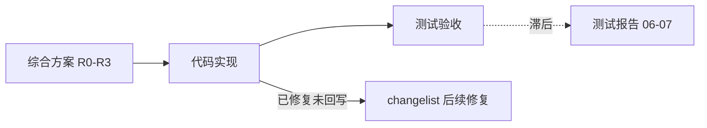

# myteam 升级项目 — 整体分析报告

> **文档类型**：项目管理 / 三方一致性评审（需求 · 研发 · 测试）  
> **编写角色**：项目负责人 · 产品专家 · 系统架构师  
> **编写日期**：2026-06-07  
> **代码基线**：分支 `upgrade/continued`  
> **分析依据**：comprehensive-plan、design-spec、changelist、test-plan/record/results、当前代码抽样验证

---

## 1. 执行摘要

### 1.1 总评

| 维度 | 结论 | 说明 |
|------|------|------|
| 需求 ↔ 研发 | **基本一致（约 83%）** | R0–R3 核心能力已实现；R4 未动；部分 R1/R3 为「部分完成」 |
| 研发 ↔ 测试 | **存在时间差** | 测试报告（06-07）早于 changelist 后续修复；当前 pytest **227 passed**（文档仍写 205） |
| 是否符合终态预期 | **部分符合** | 工程底座达标；产品闭环「能跑、能看」基本到位；「5 分钟 Hub Demo 闭环」仍依赖 CLI 环境 |

### 1.2 一句话结论

**方向一致、主干已对齐，但文档滞后于代码，阶段门禁尚未全部达标。**

本次升级 **没有跑偏** — 需求、研发、测试的大方向一致，R0–R2 可认为交付合格；不符合预期的主要是 R3 工程债、Job 双轨、E2E Demo 未验，以及测试文档落后于代码。

---

## 2. 分析范围与方法

### 2.1 文档基线

| 文档 | 角色 | 状态 |
|------|------|------|
| [`myteam-upgrade-comprehensive-plan.md`](./myteam-upgrade-comprehensive-plan.md) | **单一执行依据**（需求 + 验收） | 终稿 |
| [`myteam-upgrade-design-spec.md`](./myteam-upgrade-design-spec.md) | 设计实现规格（R0–R4） | v1.2 |
| [`changelist-upgrade-implementation.md`](./changelist-upgrade-implementation.md) | 研发变更清单 | 持续更新 |
| [`myteam-upgrade-test-plan.md`](./myteam-upgrade-test-plan.md) | 测试策略与用例 | 06-06/07 |
| [`myteam-upgrade-test-record.md`](./myteam-upgrade-test-record.md) | 测试执行记录 | 06-07 |
| [`myteam-upgrade-test-results.md`](./myteam-upgrade-test-results.md) | 质量评估报告 | 06-07 |
| [`OPENAGENTS_MYTEAM_UPGRADE_CHECKLIST.md`](./OPENAGENTS_MYTEAM_UPGRADE_CHECKLIST.md) | OpenAgents 借鉴清单 | 参考 |
| [`myteam-upgrade-requirements.md`](./myteam-upgrade-requirements.md) | 旧版 PRD | **已归档**，勿作执行依据 |

### 2.2 代码验证（2026-06-07）

```bash
export PYTHONPATH="$PWD/backend"
venv/bin/python3 -m pytest backend -q --tb=no
# 结果：227 passed, 1 warning in 8.82s
```

| 抽样项 | 结果 |
|--------|------|
| `frontend/app.js` | 3602 行（规格目标 <800） |
| `frontend/style.css` | 1544 行（规格目标 <600） |
| `backend/common/tests/test_r2_features.py` | 197 行（R2 单测已补） |
| `business/demo/README.md` | 存在（886B） |
| `.github/workflows/test.yml` | 存在 |
| `mark-final` / 版本对比 API | 代码中未找到 |

---

## 3. 需求线分析

### 3.1 升级定位（共识）

myteam 已完成 **编排内核工业化**（Process / AgentPort / Gate / Store / Interaction 契约），当前瓶颈不在「能不能跑」，而在 **产品闭环、Hub 一体化、工程可信**。

目标形态：

**从「带 Hub 的本地多 Agent 编排器」→「可长期运行、可追踪、可协作的 Agent Team Workspace」。**

升级原则四方一致：

1. 强化内核差异化（确定性 DAG + Gate + 契约）
2. 补齐产品闭环（跑通 → 看见 → 理解 → 拿交付物 → 修失败）
3. Hub 与内核一体化（Hub 为主、CLI 为辅）
4. 工程先行（测试/CI 可信后再大规模改 UI）

### 3.2 分阶段交付对照

| 阶段 | 主题 | 需求状态 | 说明 |
|------|------|:--------:|------|
| **R0** | 工程可信底座 | ✅ 完成 | CI、pytest 全绿、SSE/deliverable 修复、lifespan 迁移 |
| **R1** | 产品闭环 | ⚠️ 基本完成 | Demo 目录化、Hub 建项/启项、友好错误；交付物 mark-final/版本对比未做 |
| **R2** | Agent Workspace 一体化 | ⚠️ 基本完成 | WorkspaceEvent、Channels、Job Supervisor、EventPipeline；启动路径仍双轨 |
| **R3** | 体验与可视化 | ⚠️ 功能完成、工程未完成 | DAG/时间线/成本/Agent/亮色主题有；前端模块化未达标 |
| **R4** | 资源层与对外能力 | ❌ 未开始 | 按计划可后置 |

### 3.3 需求覆盖统计

| 阶段 | 需求总数 | 已实现 | 部分实现 | 未实现 | 覆盖率 |
|------|:--------:|:------:|:--------:|:------:|:------:|
| R0 | 4 | 4 | 0 | 0 | **100%** |
| R1 | 5 | 4 | 1 | 0 | **80%** |
| R2 | 5 | 4 | 1 | 0 | **80%** |
| R3 | 9 | 7 | 1 | 1 | **78%** |
| **合计** | **23** | **19** | **3** | **1** | **83%** |

### 3.4 与终态仍有差距的能力

| 能力 | 需求来源 | 当前状态 |
|------|----------|----------|
| 交付物 mark-final / 版本对比 | R1-4、§3.1 交付物 | ❌ 无对应 API |
| 前端模块化 | R3-7 | ⚠️ 仅拆出 `tokens.css` |
| Job 单一真相 | R2-3、OPENAGENTS P0 | ⚠️ `JobSupervisor` + `_KERNEL_RUNS` 双轨 |
| Hub 5 分钟 Demo 闭环 | §1.2 一句话描述 | ⚠️ E2E 因 CLI 未配未验证 |
| 资源索引 / Manifest | R4 | ❌ 未开始 |

---

## 4. 研发线分析

### 4.1 已交付核心资产（禁止回归 — 已保持）

| 资产 | 证据 | 状态 |
|------|------|:----:|
| 三层边界（Kernel / Registry / Skill） | `process.py` + 6 子模块 | ✅ |
| Interaction 契约（6 kind） | `contracts.py` + `submit_result` | ✅ |
| Plan Gate 确定性校验 | `plan_gate.py` | ✅ |
| Adapter 隔离 | `backend/adapters/` | ✅ |
| SQLite 真相库 | `store.py` | ✅ |
| 断点续跑 / workspace GC | `task_pipeline` + `agent_port` | ✅ |
| `--init` / `--demo` | `run_kernel.py` | ✅ |

### 4.2 分阶段研发交付明细

#### R0 — 工程可信底座 ✅

| 项 | 文件/模块 | 状态 |
|----|-----------|:----:|
| SSE 测试 timeout 修复 | `test_observability_api.py` | ✅ |
| deliverable API 修复 | `test_projects_api.py`、`observability_api.py` | ✅ |
| CI 脚本 | `scripts/test.sh` | ✅ |
| GitHub Actions | `.github/workflows/test.yml` | ✅ |
| FastAPI lifespan 迁移 | `hub/api/server.py` | ✅ |

#### R1 — 产品闭环 ⚠️

| 项 | 状态 | 备注 |
|----|:----:|------|
| Demo 目录化 | ✅ | `business/demo/goal.txt` + `agents_config.json` + `README.md` |
| CLI 友好错误 | ✅ | `run_kernel.py:_friendly_traceback` 5 类异常 |
| Hub Init/Demo/建项 | ✅ | `POST /api/init`、`/demo`、`/projects/run` |
| 交付物浏览/预览/下载 | ✅ | 聚合 API + 前端文件树 |
| mark-final / 版本对比 | ❌ | changelist 标完成，实际未实现 |
| Hub 友好错误 | ✅ | `APIError` + `ERROR_CODES` + exception_handler |

#### R2 — Agent Workspace 一体化 ⚠️

| 项 | 状态 | 备注 |
|----|:----:|------|
| WorkspaceEvent 表 + CRUD | ✅ | `store.py` |
| ProjectionRunner（16+ kind 映射） | ✅ | `workspace_events.py` |
| WorkspaceEvent API + SSE | ✅ | `GET /api/workspace/events`、`/stream` |
| Channels API | ✅ | channels/messages CRUD + @mention |
| Job 表 + agent_runtime 表 | ✅ | `store.py` |
| JobSupervisor | ✅ | `job_supervisor.py` + lifespan orphan 扫描 |
| EventPipeline | ✅ | `event_handler.py` |
| 启动路径完全迁移 Supervisor | ❌ | `server.py` 仍用 `_KERNEL_RUNS` 内存 dict |

#### R3 — 体验与可视化 ⚠️

| 项 | 状态 | 备注 |
|----|:----:|------|
| DAG 图 | ✅ | `dag-renderer.js` + 6 tab + `selectProject` 接线 |
| 时间线 UI | ✅ | `timeline.js` + SSE 增量 |
| Onboarding | ⚠️ | 空态三按钮 + `/api/status`；庆祝态 toast 已加 |
| Chat/Groups UX | ✅ | @mention、thinking 折叠、上下文指示器 |
| 成本可视化 | ✅ | budgetBar + SVG 柱状图 |
| Agent/设置页 | ✅ | 卡片 + 抽屉 + CLI 检测 |
| 亮色主题 | ✅ | `[data-theme=light]` 完整覆盖 |
| 删除项目 | ✅ | DELETE + APIError + 前端二次确认 |
| 前端模块化 | ❌ | `app.js` 3602 行、`style.css` 1544 行，远超规格 |

#### R4 — 资源层 ❌

未开始（符合计划）。

### 4.3 研发自报 vs 实测偏差

[`changelist-upgrade-implementation.md`](./changelist-upgrade-implementation.md) 存在两处 **过度乐观** 标注：

| 项 | changelist 标注 | 实测 |
|----|-----------------|------|
| R1-4 交付物闭环 | ✅ 完成 | ⚠️ 缺 mark-final、版本对比 |
| R3-7 前端模块化 | ✅ 完成 | ❌ 仅 `tokens.css` 拆分 |

---

## 5. 测试线分析

### 5.1 自动化测试 — 符合 R0 预期 ✅

| 指标 | 目标 | 首轮（06-06） | 测试报告（06-07） | **当前实测** |
|------|------|:-------------:|:-----------------:|:------------:|
| pytest 通过数 | 全绿 | 205 | 205 | **227** |
| 耗时 | <60s | 8.46s | 8.28s | **8.82s** |
| CI | 有 | scripts/test.sh | + GitHub Actions | ✅ 均有 |

新增 `test_r2_features.py`（197 行）覆盖 workspace_event、ProjectionRunner、EventPipeline、job CRUD 等，**测试报告 S1-003 已在代码侧修复，文档未同步**。

### 5.2 手工/差异验收 — 88% 通过（报告值，可能偏低）

| 阶段 | 计划用例 | 通过 | 失败 | 阻塞 | 通过率 |
|------|:--------:|:----:|:----:|:----:|:------:|
| R0 | 6 | 6 | 0 | 0 | 100% |
| R1 | 10 | 8 | 1 | 1 | 80% |
| R2 | 11 | 10 | 1 | 0 | 91% |
| R3 | 14 | 12 | 1 | 1 | 86% |
| **合计** | **41** | **36** | **3** | **2** | **88%** |

### 5.3 阶段门禁对照

| 门禁 | 条件 | 测试文档状态 | **当前判断** |
|------|------|:------------:|:------------:|
| R0→R1 | pytest 全绿 <60s | ✅ | ✅ 仍成立 |
| R1→R2 | Hub Demo 跑通 + 交付物可预览 | ❌ | ⚠️ API/前端可验；E2E Demo 因 CLI 未配 task_plan 失败 |
| R2→R3 | WorkspaceEvent API + job 可取消 | ⚠️ | ⚠️ API 有；Supervisor 与 `_KERNEL_RUNS` 双轨 |
| R3→R4 | §14.5 页面清单可演示 | ❌ | ✅ DAG/时间线 tab 已接线（S0-001 已修；**测试文档过期**） |

### 5.4 缺陷状态汇总

| 严重等级 | 首轮 | 已修复 | 剩余 | 说明 |
|:--------:|:----:|:------:|:----:|------|
| S0 阻塞 | 1 | 1 | **0** | DAG/时间线接线 ✅ |
| S1 严重 | 3 | 2+ | **0~1** | Job Supervisor ✅；R2 单测 ✅（报告未更新） |
| S2 一般 | 4 | 3+ | **1~2** | mark-final 仍缺；Demo README 已补 |
| S3 体验 | 2 | 1 | **1** | 前端模块化未完成 |
| S4 建议 | 2 | 0~1 | **1~2** | Demo E2E 环境；庆祝态已部分补 |

### 5.5 测试结论

测试报告给出 **「有条件通过」** — 合理。

若按 **2026-06-07 当前代码** 重跑差异验收，预计通过率 **>88%**，但仍会剩：mark-final、前端模块化、Demo E2E（CLI）、Job 路径完全迁移。

---

## 6. 三方一致性分析

### 6.1 关系图



### 6.2 一致项 ✅

- 阶段划分 R0–R4 三方统一
- 内核 invariant 未被破坏（Adapter 隔离、Interaction 契约、Plan Gate、无 JSON 抢救）
- R2 事件模型/API 设计与实现基本一致
- 测试策略「先工程后 UI」已执行
- OpenAgents 借鉴方向与 comprehensive-plan 一致（Workspace 事件、频道、Job Supervisor）

### 6.3 不一致项 ⚠️

| 类型 | 描述 | 影响 |
|------|------|------|
| **文档滞后** | 测试三件套未反映 227 用例、R2 单测、Demo README、DAG 接线、庆祝态 | 决策可能被过期红项误导 |
| **自报偏高** | changelist 把 R1-4/R3-7 标「完成」 | 与规格/测试不符 |
| **设计实现偏差** | Job 管理：设计要 Supervisor 为唯一真相，实现仍 `_KERNEL_RUNS` 双轨 | Hub 重启后运行态可能不一致 |
| **E2E 未验** | 产品成功标准「5 分钟 Hub Demo」未在测试环境端到端验证 | 产品闭环门禁未正式通过 |
| **接口路径差异** | 设计 `POST /api/projects` + `POST /api/projects/{id}/run`；实现为单路由 `POST /api/projects/run` | 功能覆盖，契约不同 |

---

## 7. 成熟度评分

对照 [`myteam-upgrade-comprehensive-plan.md`](./myteam-upgrade-comprehensive-plan.md) §2.3：

| 维度 | 升级前 | 升级目标 | 首轮评估 | 测试报告 | **当前估计** | 判断 |
|------|:------:|:--------:|:--------:|:--------:|:------------:|------|
| 编排内核架构 | 4.5 | ≥4.5 | 4.5 | 4.5 | **4.5** | ✅ 保持 |
| 测试与 CI | 3.0 | ≥4.0 | 3.5 | 4.0 | **4.0** | ✅ 达标 |
| 产品体验 | 2.5 | ≥4.0 | 3.0 | 3.5 | **~3.5** | ⬆️ 未达终态 |
| Hub/前端工程 | 2.5 | ≥3.5 | 2.8 | 2.8 | **~2.8** | ❌ 模块化拖累 |
| 安全与运维 | 2.0 | ≥3.0 | 2.5 | 3.0 | **~3.0** | ✅ 局域网场景基本够 |

---

## 8. 是否符合预期 — 分层结论

### 8.1 工程升级预期（R0 + 内核不回归）

**✅ 符合，略超预期**

- pytest 227 全绿 ~8.8s
- CI（本地脚本 + GitHub Actions）到位
- R2 核心功能单测已补
- 原生 bug（SSE use-after-close、deliverable API）已修

### 8.2 产品终态预期（Agent Team Workspace）

**⚠️ 部分符合**

| 已达成 | 未达成 |
|--------|--------|
| Hub 建项/启项/空态引导 | 5 分钟无终端 Demo 闭环（E2E 未验） |
| DAG 实时可视化 | 交付物 mark-final / 版本对比 |
| 统一时间线 UI | Job 启动路径完全 Supervisor 化 |
| 项目频道 + WorkspaceEvent | 前端可维护性（模块化） |
| 友好错误格式（核心 API） | R4 资源层 |

---

## 9. 风险与剩余项

| 风险 | 等级 | 说明 | 缓解 |
|------|:----:|------|------|
| 测试文档过期 | 中 | 红项可能已修复但未回写 | 刷新 test-plan/record/results |
| Demo E2E 无法跑通 | 中 | CLI（opencode/claude）未完整配置 | 配好 CLI 后重验 R1→R2 门禁 |
| `_KERNEL_RUNS` 未完全迁移 | 低~中 | 与 JobSupervisor 双轨 | 迁移 `POST /api/projects/run` |
| 无 mark-final | 低 | 非 MVP 阻塞 | 后续迭代 |
| 前端模块化未完成 | 低 | 不影响功能，影响维护 | 专门重构 sprint |
| R2/R3 回归覆盖仍偏薄 | 低~中 | 虽有 test_r2_features，R3 前端无自动化 | 补集成/E2E 测试 |

---

## 10. 建议行动项

| 优先级 | 事项 | 负责方向 | 理由 |
|:------:|------|----------|------|
| **P0** | 同步刷新测试三件套（plan/record/results） | 测试 | 消除文档与代码失真 |
| **P0** | 配置 CLI 后跑通 Hub Demo E2E | 测试 + 运维 | R1→R2 正式门禁 |
| **P1** | `POST /api/projects/run` 迁移至 JobSupervisor，弃用 `_KERNEL_RUNS` | 后端 | 设计与实现一致 |
| **P2** | 交付物 mark-final API（版本对比可后置） | 后端 + 前端 | 补齐 R1-4 规格缺口 |
| **P3** | `app.js` / `style.css` 拆分至 layout/components/pages | 前端 | R3-7 工程债 |
| **按需** | R4 资源索引 / Manifest | 全栈 | 不阻塞 R1–R3 上线 |

---

## 11. 上线建议

### 结论：**可内测 / 局域网演示；正式「产品终态」上线仍需 P0–P1 收尾**

| 场景 | 建议 |
|------|------|
| 内核/后端回归 | ✅ 可依赖 CI + 227 pytest |
| Hub 功能演示（DAG/时间线/建项/交付物浏览） | ✅ 可演示 |
| 无 CLI 环境的新用户 Demo | ❌ 不建议对外承诺 |
| 长期运行 / Hub 重启后 job 状态 | ⚠️ 需完成 Supervisor 迁移后再承诺 |

---

## 12. 附录：关键文件索引

| 类别 | 路径 |
|------|------|
| 需求终稿 | `docs/myteam-upgrade-comprehensive-plan.md` |
| 设计规格 | `docs/myteam-upgrade-design-spec.md` |
| 研发变更 | `docs/changelist-upgrade-implementation.md` |
| 测试方案 | `docs/myteam-upgrade-test-plan.md` |
| 测试记录 | `docs/myteam-upgrade-test-record.md` |
| 测试结果 | `docs/myteam-upgrade-test-results.md` |
| WorkspaceEvent | `backend/common/workspace_events.py` |
| Job Supervisor | `backend/common/job_supervisor.py` |
| Hub API | `backend/hub/api/server.py` |
| DAG / 时间线 | `frontend/dag-renderer.js`、`frontend/timeline.js` |
| R2 单测 | `backend/common/tests/test_r2_features.py` |
| CI | `scripts/test.sh`、`.github/workflows/test.yml` |

---

*本报告由 Cursor 侧项目负责人基于 2026-06-07 代码与文档交叉验证生成。后续代码或测试变更后，建议更新 §2.2 实测数据与 §5 测试结论。*
