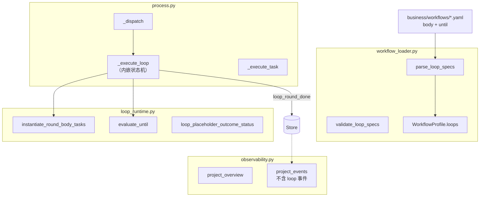
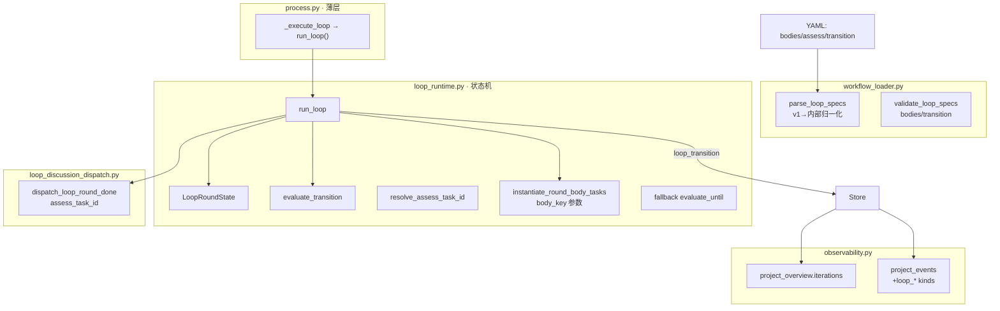
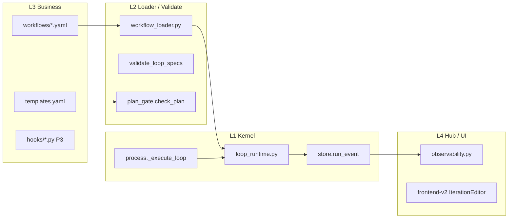
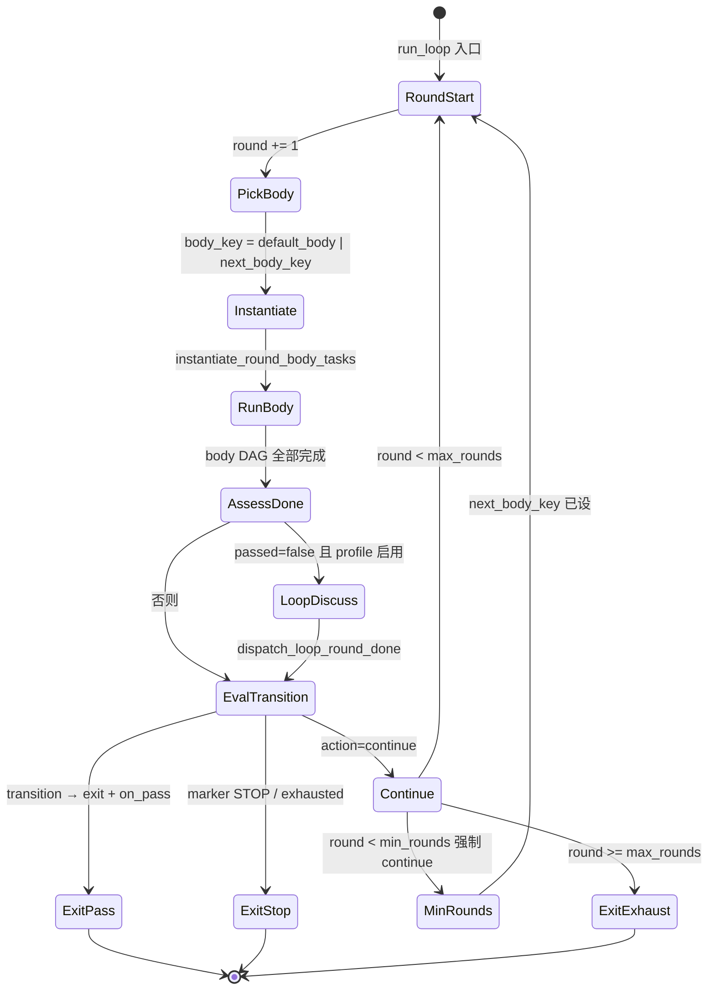
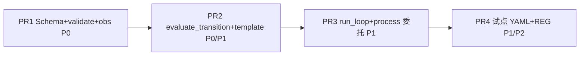

# 通用 Workflow 迭代 v2 — 架构实施方案

> **版本**：2026-06-14  
> **状态**：待评审  
> **上游真源**：[`00-总方案-通用Workflow迭代V2.md`](./00-总方案-通用Workflow迭代V2.md)  
> **读者**：架构师、后端 Lead、Hub/前端对接人

---

## 1. 执行摘要

本方案将 **R-Loop v1**（`body` + `until` OR 语义）演进为 **LoopSpec v2**（`bodies` + `assess` + `transition`），核心状态机从 `process._execute_loop` **下沉**至 `loop_runtime.run_loop()`，Process 层仅保留薄委托。v1 YAML **行为 100% 不变**；v2 能力通过配置增量启用，不引入 loop 内 LLM 重规划。

**关键约束**（来自 `FRAMEWORK_BOUNDARY.md`）：

- Kernel 只懂 DAG、轮次、marker 解析、`run_event`；业务语义留在 `business/workflows/`。
- `process.py` 改动须走 **FRAMEWORK-FREEZE Owner 批准**（ADR-005）。
- Hub `validate_workflow` 为 schema 唯一真源，避免前后端漂移。

---

## 2. 现状 vs 目标架构

### 2.1 现状（R-Loop v1）



**痛点**：`_execute_loop` 硬编码 `work`/`review` task id；无 body 分支；`until` 与 assess 语义混用；可观测层未暴露 iteration 维度。

### 2.2 目标（LoopSpec v2）



**收益**：状态机可单测；多 body 分支无需改 Process；assess 为一等公民；Resume 靠确定性 task id + `run_event` 重建状态。

---

## 3. 分层职责



| 层 | 路径 | v2 新增职责 |
|----|------|-------------|
| Kernel | `loop_runtime.py` | `run_loop()`、`LoopRoundState`、`evaluate_transition()`、`resolve_assess_inputs()` |
| Kernel | `process.py` | 构造 `RunLoopDeps`，调用 `run_loop()`，不写分支逻辑 |
| Loader | `workflow_loader.py` | v1 `body`→`bodies.default` 归一化；`roster_from_tasks` 遍历所有 bodies |
| Business | `business/workflows/` | 声明 assess marker、transition 规则、多 body 模板 |
| Hub | `observability.py` | `iterations[]`、`_FEED_KINDS` 扩展 |

---

## 4. Loop 状态机



**Resume（ADR-006）**：从 `run_event` `{project_id}:loop:{loop_id}` 读取最近 `loop_round_done` / `loop_transition`，结合 store 中已存在 `*-r{N}-*` task id 重建 `LoopRoundState(round, body_key)`。

---

## 5. 架构决策（ADR）与权衡

| ADR | 决策 | 权衡 / 备选 | 拒绝理由 |
|-----|------|-------------|----------|
| ADR-001 | Marker 协议为主；JSON assess 仅窄口扩展 | JSON 结构化更易机读 | Agent 交付物已是 Markdown 主路径；JSON 增加 Gate 与模板分叉 |
| ADR-002 | 分支用 `bodies` + `next_body`；禁止 loop 内 full `task_plan` | LLM 动态重规划更灵活 | 非确定性、难 Resume、破坏 FRAMEWORK-FREEZE |
| ADR-003 | Assess = body 内一步或 `assess.ref` 指向 body 任务 | 独立 assess 子图 | 与现有 work-review 结构一致，plan_gate 可展开 |
| ADR-004 | `loop_discussion` 在 assess 之后、transition 之前 | 讨论后再 assess | 讨论依赖 review/assess 交付物；与 `assess.ref` 解耦 hardcoded id |
| ADR-005 | 状态机下沉 `run_loop()`；`_execute_loop` 薄委托 | 保持 Process 内聚 | Process 已 680+ 行；单测需隔离；**须 Freeze Owner 签字** |
| ADR-006 | Resume 靠确定性 task id + `run_event` | 专用 loop_state 表 | Store schema 封板；task id 模式 `{loop_id}-r{n}-{body_id}` 已稳定 |

**开放问题（总方案 §12）落地**：

- `min_rounds` 与 assess 首轮 STOP 冲突 → **强制 continue 至 `min_rounds`**（P1）。
- Branch 完成后占位节点 → **auto-complete**，meta `loop_state=branched`（P2）。

---

## 6. LoopSpec v2 数据类规格

```python
@dataclass
class AssessInputSpec:
    kind: str                          # goal | phase.deliverable | ops_log | ...
    phase: str = ""                    # kind=phase.deliverable 时
    table: str = ""                    # kind=ops_log 时
    optional: bool = False

@dataclass
class AssessSpec:
    ref: str                           # body 内相对 id，如 "assess" | "review"
    inputs: list[AssessInputSpec] = field(default_factory=list)
    kind: str = "task"                 # task | hook（P3）

@dataclass
class TransitionRule:
    when: str                          # deliverable_marker | exhausted | gate_passed
    task: str = ""                     # body 内相对 id
    marker: str = ""
    action: str = ""                     # exit | continue
    outcome: str = ""                    # complete | needs_review（exit 时）
    next_body: str = ""                  # continue 时

@dataclass
class LoopSpec:
    id: str
    max_rounds: int = 5
    min_rounds: int = 1                  # P1
    default_body: str = "default"
    on_pass: str = "complete"
    on_exhaust: str = "needs_review"
    description: str = ""

    # v1 互斥字段（二选一）
    body: list[dict] = field(default_factory=list)
    until: list[dict] = field(default_factory=list)

    # v2 字段
    bodies: dict[str, list[dict]] = field(default_factory=dict)
    assess: Optional[AssessSpec] = None
    transition: list[TransitionRule] = field(default_factory=list)
    fallback_until: list[dict] = field(default_factory=list)  # v1 until 别名

    @property
    def is_v2(self) -> bool:
        return bool(self.bodies)

    def normalized_bodies(self) -> dict[str, list[dict]]:
        """v1: {default: body}; v2: bodies"""
        ...
```

**解析规则**（`parse_loop_specs`）：

1. 若存在 `bodies` → v2；禁止同时出现非空 `body`。
2. 若仅 `body` → 归一化为 `bodies["default"]`，`until` → `fallback_until`，合成默认 `transition`（`deliverable_marker` OR 规则）。
3. `default_body` 必须存在于 `bodies` 键集。

---

## 7. `run_loop()` API 草图

```python
@dataclass
class LoopRoundState:
    round: int = 0
    body_key: str = "default"
    next_body_key: Optional[str] = None
    rounds_used: int = 0

@dataclass
class RunLoopDeps:
    """由 Process 注入，避免 loop_runtime 依赖 Process 类。"""
    execute_task: Callable[[str, dict], tuple[TaskOutcome, Optional[str]]]
    persist_tasks: Callable[[str, list[dict]], None]
    append_run_event: Callable[[str, str, dict], None]
    update_task_meta: Callable[[str, str, str, dict], None]
    set_task_status: Callable[[str, str, str], None]
    on_loop_round_done: Optional[Callable[..., None]] = None
    store: Store

def run_loop(
    project_id: str,
    placeholder: dict,
    spec: LoopSpec,
    *,
    deps: RunLoopDeps,
    initial_state: Optional[LoopRoundState] = None,
    goal_prefix: str = "",
) -> TaskOutcome:
    """
    主循环：
      1. state = initial_state or reconstruct_from_events()
      2. while round <= max_rounds:
           body_key = state.next_body_key or state.body_key or spec.default_body
           round_tasks = instantiate_round_body_tasks(spec, round, body_key=body_key, ...)
           deps.persist_tasks(...)
           run body DAG via deps.execute_task
           assess_tid = resolve_assess_task_id(spec, round, body_key)
           if v2: passed, action, next_body = evaluate_transition(...)
           else: passed = evaluate_until(spec, ...)  # fallback
           emit loop_round_assess / loop_transition / loop_round_done
           if action == exit: return placeholder outcome
           if round < min_rounds and action would stop: force continue
           state.next_body_key = next_body
      return on_exhaust outcome
    """
```

**新增函数**（`loop_runtime.py`）：

| 函数 | 职责 |
|------|------|
| `evaluate_transition()` | 有序匹配 `transition[]`；返回 `(action, outcome, next_body, matched_rule)` |
| `resolve_assess_task_id()` | `assess.ref` → `{loop_id}-r{round}-{ref}` |
| `resolve_assess_inputs()` | P1：按 `AssessInputSpec.kind` 注入 description 片段（只解析 kind，不读业务表语义） |
| `reconstruct_loop_state()` | 从 `run_event` + store tasks 恢复 `LoopRoundState` |
| `synthesize_v1_transition()` | v1 `until` → 内部 `TransitionRule` 列表（加载期一次） |

**`process._execute_loop` 改后形态**（~30 行）：

```python
def _execute_loop(self, project_id: str, placeholder: dict) -> TaskOutcome:
    spec = self._loops_by_id.get(placeholder.get("loop"))
    if spec is None:
        return TaskOutcome(placeholder["id"], "failed", "未知 loop")
    deps = RunLoopDeps(
        execute_task=self._execute_task,
        persist_tasks=self._persist_tasks,
        ...
        on_loop_round_done=self._hooks.on_loop_round_done if self._hooks else None,
        store=self.store,
    )
    return run_loop(project_id, placeholder, spec, deps=deps, goal_prefix=...)
```

---

## 8. 文件级变更地图

| 文件 | 函数 / 结构 | 阶段 | 变更要点 |
|------|-------------|------|----------|
| `backend/common/loop_runtime.py` | `LoopSpec` 及子 dataclass | P0 | 扩展字段；`is_v2`、`normalized_bodies()` |
| | `parse_loop_specs()` | P0 | v1/v2 分流；归一化 |
| | `validate_loop_specs()` | P0 | bodies 键引用；transition task/marker；`expand_loop_body_for_validation` × 所有 body × rounds |
| | `instantiate_round_body_tasks()` | P2 | 新增 `body_key: str` 参数 |
| | `evaluate_transition()` | P1 | 新增 |
| | `resolve_assess_task_id()` | P1 | 新增 |
| | `run_loop()` | P1 | 新增；承载状态机 |
| | `evaluate_until()` | P0 | 保留；v2 作 fallback |
| `backend/common/process.py` | `_execute_loop()` | P1 | 薄委托 `run_loop()`；**Freeze 审批** |
| `backend/common/workflow_loader.py` | `roster_from_tasks()` | P0 | 遍历 `spec.bodies.values()` |
| | `validate_workflow()` | P0 | 无逻辑变更，调用链自动覆盖 |
| `backend/common/loop_discussion_dispatch.py` | `dispatch_loop_round_done()` | P1 | 参数 `assess_task_id`；`review_task_id` 兼容别名 |
| `backend/common/kernel_project_hooks.py` | `_on_loop_round_done()` | P1 | 传 `assess_task_id=resolve_assess_task_id(...)` |
| `backend/common/observability.py` | `_FEED_KINDS` | P0 | 加入 `loop_round_done`, `loop_finished`, `loop_round_assess`, `loop_transition`, `branch_selected` |
| | `project_overview()` | P0 | 新增 `iterations[]` 聚合 |
| | `_build_iterations()` | P0 | 新增；扫 `run_event` + loop 占位 task meta |
| `business/templates/templates.yaml` | `iteration-assess` | P0 | 新 task_type |
| `business/workflows/_examples/iteration-v2-fixture.yaml` | — | P0 | 契约样例 |
| `business/workflows/产品规划方案.yaml` | `loops[].bodies` | P1 | 等价迁移，见 §9 |
| `business/workflows/GEO持续优化-迭代.yaml` | — | P2 | 多 body 试点 |
| `docs/DESIGN-WORKFLOW-LOOPS.md` | — | P0 | 状态从草案→部分实现 |

**测试新增**：

- `test_loop_runtime.py`：`parse` / `evaluate_transition` / `run_loop` 单测
- `test_process_loops.py`：v1 三用例回归 + v2 assess/branch
- `reg_iteration_assess.py`、`reg_geo_iteration.py`

---

## 9. `产品规划方案.yaml` 迁移与向后兼容

### 9.1 v1 运行时（P0–P0 末）

**零变更**。当前 YAML 仅含 `body` + `until`，`parse_loop_specs` 行为与今日一致。

### 9.2 v2 等价迁移（P1）

将现有结构映射为显式 v2，**语义不变**：

```yaml
loops:
  - id: ch3_quality_round
    max_rounds: 5
    min_rounds: 1
    default_body: default
    on_pass: complete
    on_exhaust: needs_review
    bodies:
      default:
        - id: work
          # ... 保持现有 work 块
        - id: review          # assess.ref 指向 review
          # ... 保持现有 review 块
    assess:
      ref: review
      inputs:
        - kind: goal
        - kind: phase.deliverable
          phase: work
    transition:
      - when: deliverable_marker
        task: review
        marker: "REVIEW: PASS"
        action: exit
        outcome: complete
      - when: deliverable_marker
        task: review
        marker: "REVIEW: FAIL"
        action: continue
        next_body: default      # 同 body 再跑一轮（与 v1 等价）
      - when: exhausted
        action: exit
        outcome: needs_review
```

**兼容保证**：

| 检查项 | 断言 |
|--------|------|
| `reg_discuss_loop.py` CHECK_ONLY | P1 后仍 PASS |
| `test_process_loops.py` v1 用例 | 不归一化 YAML 时也 PASS（loader 内部归一化） |
| task id 模式 | 仍为 `ch3_quality_round-r{n}-work/review` |
| `loop_discussion_profile` | `work-review-alignment` 不变；hook 读 `review_task_id` |

### 9.3 回滚策略

保留 git 中 v1 形 YAML 分支；`parse_loop_specs` 同时接受 `body` 与 `bodies`，加载期归一化，无需双份运行时逻辑。

---

## 10. Hub 可观测契约

### 10.1 `run_event` 种类

| kind | interaction_id | payload 字段 | 阶段 |
|------|----------------|--------------|------|
| `loop_round_done` | `{pid}:loop:{loop_id}` | `round`, `passed`, `placeholder`, `body_key` | 已有；P0 加 `body_key` |
| `loop_finished` | 同上 | `state`（passed\|exhausted\|stopped）, `rounds_used` | 已有 |
| `loop_round_assess` | 同上 | `round`, `assess_task_id`, `markers_found[]` | P1 |
| `loop_transition` | 同上 | `round`, `action`, `outcome`, `next_body`, `rule_index` | P1 |
| `branch_selected` | 同上 | `round`, `from_body`, `to_body` | P2 |

### 10.2 `project_overview.iterations[]`

```json
{
  "iterations": [
    {
      "loop_id": "ch3_quality_round",
      "placeholder_task_id": "t-ch3-plan",
      "state": "running",
      "current_round": 2,
      "max_rounds": 5,
      "body_key": "default",
      "last_assess_marker": "REVIEW: FAIL",
      "rounds_used": 2,
      "placeholder_status": "in_progress"
    }
  ]
}
```

**聚合规则**：对每个 `tasks[].loop` 占位 task，扫描 `{pid}:loop:{loop_id}` 事件；`state` 由最近 `loop_finished` 或占位 task status 推导。

### 10.3 `_FEED_KINDS` 扩展（P0）

在 `observability.py` 将上述五种 `loop_*` kind 加入 `_FEED_KINDS`，使 `project_events()` 时间线可见。前端 `IterationProgressCard` 消费同一 payload 形状。

---

## 11. `process.py` 变更 — FRAMEWORK-FREEZE 审批清单

依据 `FRAMEWORK-FREEZE.md` §1 与总方案 ADR-005，以下 **全部满足** 方可合并 `process.py` diff：

| # | 检查项 | 证据要求 |
|---|--------|----------|
| F1 | 变更范围仅 `_execute_loop` 及 `RunLoopDeps` 构造 | `git diff process.py` 无 `_dispatch` / `_execute_task` 逻辑变更 |
| F2 | 无 LLM 调用、无 JSON rescue、无 Gate 绕过 | 代码审查 + grep `llm`/`json.loads` |
| F3 | v1 行为回归 | `test_process_loops.py` 全绿；`产品规划方案.yaml` 未改时行为一致 |
| F4 | 新增逻辑在 `loop_runtime.run_loop` 单测覆盖 | `test_loop_runtime.py` 覆盖率 ≥ 新增分支 80% |
| F5 | `run_event` 契约向后兼容 | 现有 `loop_round_done` payload 字段不删除，仅追加 |
| F6 | Store schema 无变更 | 无 migration 脚本 |
| F7 | 全量 pytest 基线 | `pytest backend -q` ≥ 封板数 |
| F8 | Owner 书面批准 | PR 描述附 Freeze Owner 签字或 issue 链接 |

**不解冻**：`task_pipeline.py`、`gate.py`、`submit_result.py`、`AgentPort`。

---

## 12. 分阶段门禁（P0–P3）

### P0 — Schema + 可观测 + 模板（无运行时行为变化）

| 门禁 | 标准 |
|------|------|
| G0-1 | `parse_loop_specs` 接受 v2 YAML；v1 加载结果字节级等价 |
| G0-2 | `validate_loop_specs` 拒绝 `body`+`bodies` 共存、非法 `transition.task` |
| G0-3 | `_FEED_KINDS` + `project_overview.iterations[]` 对空项目不报错 |
| G0-4 | `iteration-assess` 注册于 `templates.yaml` |
| G0-5 | `pytest backend` 全绿；`reg_discuss_loop.py` CHECK_ONLY 绿 |

### P1 — Assess + Transition 运行时

| 门禁 | 标准 |
|------|------|
| G1-1 | `run_loop()` 替代 `_execute_loop` 内联逻辑；F1–F8 清单通过 |
| G1-2 | assess STOP 首轮 + `min_rounds=2` → 强制第 2 轮 |
| G1-3 | `REVIEW: PASS` 首轮 exit；`REVIEW: FAIL` 多轮直至 PASS 或 exhaust |
| G1-4 | `loop_round_assess` / `loop_transition` 事件写入并可被 overview 读取 |
| G1-5 | `产品规划方案.yaml` v2 等价迁移；`reg_discuss_loop` + `reg_iteration_assess` 绿 |

### P2 — Bodies 分支 + 试点

| 门禁 | 标准 |
|------|------|
| G2-1 | `next_body: patch` 切换 body 模板；`branch_selected` 事件 |
| G2-2 | `expand_loop_body_for_validation` 展开所有 branch × max_rounds |
| G2-3 | `GEO持续优化-迭代.yaml` LIVE：≥1 次 branch，最终 placeholder `completed` |
| G2-4 | `reg_geo_iteration.py` CHECK_ONLY 绿 |

### P3 — Hook 窄口（可选）

| 门禁 | 标准 |
|------|------|
| G3-1 | `assess.kind: hook` 调用 `business/hooks/*.assess_loop_round()` |
| G3-2 | Hook 返回 `{passed, transition_id}`；**禁止** `tasks[]` |
| G3-3 | 无 hook 时回退 marker transition |

---

## 13. PR 拆分与依赖



| PR | 文件焦点 | 阻塞关系 |
|----|----------|----------|
| PR1 | `loop_runtime.parse/validate`, `observability`, `templates.yaml` | 无 |
| PR2 | `evaluate_transition`, `iteration-assess`, fixture yaml | PR1 |
| PR3 | `run_loop`, `process._execute_loop`, `loop_discussion_dispatch` | PR2；**Freeze 审批** |
| PR4 | `产品规划方案.yaml`, GEO 试点, REG 脚本, 文档 | PR3 |

---

## 14. 风险缓解

| 风险 | 缓解 |
|------|------|
| Process diff 过大 | 严格 F1；状态机只在 `loop_runtime` 增长 |
| 前后端 schema 漂移 | Hub `write_workflow_raw` → `validate_workflow` 强制校验 |
| 非确定性 assess | 仅 marker + Gate 存在性；hook 只返回预声明 `transition_id` |
| Resume 断裂 | 确定性 task id + `reconstruct_loop_state` 单测 |

---

## P0 架构门禁记录

> **日期**：2026-06-14  
> **执行**：P0 架构门禁（方案 vs 代码，**开发变更前**）  
> **结论**：§2.1「现状（R-Loop v1）」与代码一致；§2.2「目标（LoopSpec v2）」及 §12 P0 门禁 **均未实现**。可进入 P0 研发（PR1：Schema + 可观测 + 模板）。

**ADR**：已新建 [`docs/decisions/002-workflow-iteration-v2.md`](../decisions/002-workflow-iteration-v2.md)（汇总 ADR-001…006）。

### 与代码对齐项（现状描述准确）

| 项 | 代码证据 |
|----|----------|
| v1 `LoopSpec`（`body` + `until`） | `loop_runtime.py`：`LoopSpec` 仅含 `body`/`until`；`parse_loop_specs` 要求非空 `body`+`until` |
| v1 状态机在 Process 内 | `process.py` `_execute_loop` ~80 行内联轮次循环，未调用 `run_loop()` |
| `evaluate_until` OR 语义 | `loop_runtime.evaluate_until`：`deliverable_marker` / `gate_passed` / `task_status` / `review_passed` |
| 硬编码 `work`/`review` | `_execute_loop` 中 `seed_patch_baseline`/`on_loop_round_done` 使用 `loop_body_task_id(..., "work"|"review")` |
| loop run_event 已写入 | `_execute_loop` 写入 `loop_round_done`、`loop_finished`（payload 无 `body_key`） |
| Hub 未收录 loop 事件 | `observability._FEED_KINDS` 无 `loop_*` kinds → `project_events` 过滤掉上述事件 |

### P0 门禁差距（G0-1 … G0-5）

| 门禁 | 方案要求 | 代码现状 | 差距 |
|------|----------|----------|------|
| **G0-1** | `parse_loop_specs` 接受 v2 YAML；v1 归一化内部表示 | 仅 v1；无 `bodies`/`assess`/`transition`/`min_rounds`/`default_body`/`fallback_until`/`is_v2`/`normalized_bodies()` | ❌ 未实现 |
| **G0-2** | `validate_loop_specs` 拒绝 `body`+`bodies` 共存、非法 `transition.task` | 仅校验 v1 `body` 内依赖与 `until` 引用 | ❌ 未实现 |
| **G0-3** | `_FEED_KINDS` 含五种 `loop_*`；`project_overview.iterations[]` | `_FEED_KINDS` 无 loop kinds；无 `iterations`/`_build_iterations` | ❌ 未实现 |
| **G0-4** | `iteration-assess` 注册于 `templates.yaml` | 仅有 `section-review` 等；无 `iteration-assess` | ❌ 未实现 |
| **G0-5** | `pytest backend` + `reg_discuss_loop.py` CHECK_ONLY 绿 | v1 基线测试存在（`test_loop_runtime.py`）；无 v2 解析/校验用例；fixture yaml 缺失 | ⚠️ v1 基线可跑；v2 验收项未覆盖 |

### 关联文件差距（P0 变更地图 §8）

| 文件 | 差距摘要 |
|------|----------|
| `loop_runtime.py` | 无 v2 dataclass 扩展；`expand_loop_body_for_validation` 未展开多 `bodies` |
| `workflow_loader.py` | `roster_from_tasks` 只遍历 `spec.body`，未遍历 `spec.bodies` |
| `business/workflows/_examples/iteration-v2-fixture.yaml` | 文件不存在 |
| `docs/DESIGN-WORKFLOW-LOOPS.md` | 未标记 v2「部分实现」（文档项，非运行时） |

### P1+ 项（本门禁仅记录，非 P0 阻塞）

- `run_loop()`、`LoopRoundState`、`evaluate_transition()`、`resolve_assess_task_id()` — 不存在
- `process._execute_loop` 薄委托 — 未开始（ADR-005 / Freeze F1–F8）
- `loop_round_assess` / `loop_transition` / `branch_selected` 事件 — 未写入
- `instantiate_round_body_tasks(..., body_key=)` — 无 `body_key` 参数

---

## P1/P2 成果评审记录 (2026-06-14)

> **日期**：2026-06-14  
> **执行**：P0+P1+P2 交付物 vs `00-总方案` / 本方案 / ADR-001…006（**只读代码审查**）  
> **范围**：`loop_runtime.py`、`process._execute_loop`、`observability.py`、`frontend-v2` workflow 组件、试点 YAML、REG 脚本  
> **结论（Gate Verdict）**：**PASS WITH NOTES**

P0 与 P1 **内核路径已落地**（Schema、薄委托、`run_loop`、assess/transition 运行时、Hub 可观测、试点 A 迁移）；P2 **多 body 试点与前端深度编辑未完成**。v1 行为回归路径保留（v1 YAML 归一化 + `evaluate_until` fallback）。不建议以「P2 全绿」作为合并条件，但 **P1 冻结签字可批准**（见 § Freeze sign-off）。

### Gate Verdict

| 阶段 | 门禁 | 结论 | 说明 |
|------|------|------|------|
| P0 | G0-1 … G0-5 | **PASS** | v2 解析/校验、fixture、`iteration-assess`、`_FEED_KINDS`（4/5 kinds）、`iterations[]` 已实现 |
| P1 | G1-1 … G1-5 | **PASS WITH NOTES** | `run_loop` 替代内联状态机；试点 A v2 迁移；缺 `resolve_assess_inputs`、`reconstruct_loop_state`、discussion `assess_task_id` 正式参数、P1 集成测 |
| P2 | G2-1 … G2-4 | **FAIL** | 无 `GEO持续优化-迭代.yaml`、`reg_geo_iteration.py`；无 `branch_selected` 事件；前端无 Body/Transition 编辑器 |

### ADR 合规评分

| ADR | 决策摘要 | 分数 | 合规证据 | 剩余差距 |
|-----|----------|------|----------|----------|
| **ADR-001** | Marker 协议为主 | **8/10** | `evaluate_transition` 按 `deliverable_marker` 有序匹配；`iteration-assess` 模板要求末行 marker | 无 `markers_found[]` 可观测字段；`ITERATION: BRANCH <key>` 须显式 transition 规则，无动态解析 |
| **ADR-002** | `bodies` + `next_body`；禁止 loop 内 `task_plan` | **6/10** | `instantiate_round_body_tasks(..., body_key=)`；`run_loop` 在 `next_body` 时切换 body | 无 `branch_selected` run_event；无 GEO 试点 YAML；`loop_state=branched` meta 未实现 |
| **ADR-003** | Assess = body 内一步 / `assess.ref` | **8/10** | `resolve_assess_task_id()`；`assess.ref` 校验；`iteration-assess` 已注册 | **`resolve_assess_inputs()` 未实现** — `assess.inputs` 声明式注入未接线 |
| **ADR-004** | `loop_discussion` 在 assess 后、transition 前 | **6/10** | `run_loop` 顺序：body DAG → `evaluate_transition` → `on_loop_round_done` → `loop_round_done` | `dispatch_loop_round_done` 仍仅 `review_task_id` 参数名；讨论文案仍 work/review 语义 |
| **ADR-005** | 状态机下沉 `run_loop()`；Process 薄委托 | **9/10** | `process._execute_loop` ~26 行构造 `RunLoopDeps` 并委托；无 LLM/新 Gate 逻辑 | Freeze **F8 书面 Owner 签字** 未附于 PR；`run_loop` 单测未覆盖 `min_rounds` 强制 continue |
| **ADR-006** | Resume 靠 task id + `run_event` | **3/10** | 确定性 task id 模式稳定；事件已写入 | **`reconstruct_loop_state()` 不存在**；`run_loop` 无 `initial_state`；`resume()` 不重建 loop 轮次/body |

**加权合规（P0–P2 范围）**：约 **7.0/10** — 配置与运行时主干达标，Resume / P2 分支可观测 / assess 输入注入为主要债务。

### Delivered vs Planned 矩阵

| 能力 / 交付物 | 计划阶段 | 状态 | 代码 / 配置证据 |
|---------------|----------|------|-----------------|
| `LoopSpec` v2 字段 + `parse_loop_specs` 归一化 | P0 | ✅ | `loop_runtime.LoopSpec` / `parse_loop_specs` |
| `validate_loop_specs`（bodies/transition/互斥） | P0 | ✅ | `validate_loop_specs` |
| `expand_loop_body_for_validation` 多 branch × rounds | P2 | ⚠️ | 遍历 `bodies` × `max_rounds`；**单测 `@skip` P2** |
| `iteration-assess` + fixture yaml | P0 | ✅ | `templates.yaml`；`_examples/iteration-v2-fixture.yaml` |
| `_FEED_KINDS` loop 事件 | P0 | ⚠️ | 含 `loop_round_done/finished/round_assess/transition`；**缺 `branch_selected`** |
| `project_overview.iterations[]` | P0 | ⚠️ | `_build_iterations` 存在；**`loop_round_done` payload 未写 `body_key`**，overview 常回落 `default` |
| `evaluate_transition()` | P1 | ✅ | `loop_runtime.evaluate_transition` |
| `run_loop()` + `LoopRoundState` | P1 | ✅ | `run_loop`；state 为函数内局部变量，未导出重建 API |
| `_apply_min_rounds_guard` | P1 | ✅ | 首轮 STOP + `min_rounds>1` 强制 continue |
| `process._execute_loop` 薄委托 | P1 | ✅ | `process.py` L334–359 |
| `loop_round_assess` / `loop_transition` 事件 | P1 | ⚠️ | 已写入；payload 与 §10.1 契约部分偏差（缺 `assess_task_id`、`rule_index`） |
| `resolve_assess_inputs()` | P1 | ❌ | 未找到实现 |
| `reconstruct_loop_state()` | P1/P2 | ❌ | 未找到实现 |
| `loop_discussion` → `assess_task_id` | P1 | ⚠️ | hook 回调传 `assess_tid` 至第 6 位（兼容 `review_task_id`） |
| `产品规划方案.yaml` v2 等价迁移 | P1 | ✅ | `bodies` + `assess` + `transition` + `fallback_until` |
| `GEO持续优化-迭代.yaml` | P2 | ❌ | 文件不存在 |
| `reg_iteration_assess.py` | P1 | ✅ | `scripts/regression/reg_iteration_assess.py` |
| `reg_geo_iteration.py` | P2 | ❌ | 文件不存在 |
| `test_process_loops.py` v1 三用例 | P1 | ✅ | 仍使用 v1 `body`+`until` loop |
| P1 v2 集成测（assess STOP/CONTINUE、min_rounds） | P1 | ❌ | `test_process_loops` 无 v2 用例 |
| Frontend `IterationProgressCard` | P0 | ❌ | 无独立组件；`ProjectExecTree` / `ProjectActivityFeed` 部分消费 loop 事件 |
| Frontend `AssessStepEditor` / `TransitionEditor` / `BodyTemplateManager` | P1/P2 | ❌ | `LoopEditorPanel` 仅 `min_rounds`、`assess.ref` 与 transition **只读计数**；仍编辑 v1 `body`+`until` |
| `roster_from_tasks` 遍历所有 bodies | P0 | ✅ | `iter_loop_body_tasks` |
| `DESIGN-WORKFLOW-LOOPS.md` v2 状态更新 | P0 | ❌ | 文档债务 |

### 风险与技术债务（含在途工作后仍残留）

1. **Resume 断裂（ADR-006）**：无 `reconstruct_loop_state`；暂停/恢复后 loop 可能从 round 1 / `default_body` 重跑，与已物化 `*-r{N}-*` task 冲突风险。
2. **Assess 输入声明未接线（ADR-003）**：YAML `assess.inputs`（goal、phase.deliverable、ops_log）不影响运行时 description，场景须手写注入。
3. **Hub 契约漂移**：`loop_round_done` 缺 `body_key`；无 `branch_selected`；`iterations[].last_assess_marker` 依赖未写入的 task meta。
4. **P2 试点空缺**：无 GEO 迭代 workflow / REG，多 body 分支仅单测级 `next_body` 路径，无 LIVE 证据。
5. **Frontend schema 漂移**：编辑器序列化仍以 `body`+`until` 为主；v2 `bodies`/`transition` 编辑与 Hub validate 真源未对齐。
6. **Discussion API 语义债**：`loop_discussion_dispatch` 未更名 `assess_task_id`；非 work/review body id 时群通报字段易误导。
7. **校验覆盖**：`validate_loop_specs` 的 `transition.task` 仅对照 **default_body** 内 id，非 default branch 的 assess 引用可能漏检。
8. **文档**：`DESIGN-WORKFLOW-LOOPS.md` 未标记「部分实现」；本方案 §2.1 现状图已过时（仍描述 v1 内嵌状态机）。

### Freeze sign-off — `process.py`（ADR-005）

依据 §11 F1–F8 清单，对 **P1 范围** `process._execute_loop` 变更审查：

| # | 检查项 | P1 审查结果 |
|---|--------|-------------|
| F1 | 变更范围仅 `_execute_loop` + `RunLoopDeps` | ✅ 符合；diff 为薄委托 |
| F2 | 无 LLM / JSON rescue / Gate 绕过 | ✅ `_execute_loop` 无此类调用 |
| F3 | v1 行为回归 | ✅ `test_process_loops.py` 三用例保留 v1 loop |
| F4 | `run_loop` 单测覆盖 | ⚠️ `evaluate_transition` 有单测；`run_loop` / `min_rounds` 无直接单测 |
| F5 | `run_event` 向后兼容 | ⚠️ 字段追加为主；`loop_round_done` 应补 `body_key` |
| F6 | Store schema 无变更 | ✅ |
| F7 | 全量 pytest 基线 | ⚠️ 评审环境未执行；测试文件已扩展 v2 解析用例 |
| F8 | Owner 书面批准 | ⚠️ 流程项 — 建议 PR 附签字 |

**推荐**：**APPROVED FOR P1**（ADR-005）— 允许合并当前 `process._execute_loop` 薄委托形态；**不解冻** `task_pipeline` / `gate` / `submit_result` / `AgentPort`。P2 若需扩展 Process 回调形状，须重新走 Freeze 清单。

### 建议后续关闭顺序（非阻塞 P1 冻结）

1. `loop_round_done` payload 追加 `body_key`；分支时 emit `branch_selected`（或文档明确 `loop_transition` 取代）。
2. `reconstruct_loop_state()` + `run_loop(initial_state=…)` + `resume()` 接线。
3. `resolve_assess_inputs()` 最小实现（goal + phase.deliverable）。
4. `GEO持续优化-迭代.yaml` + `reg_geo_iteration.py` + 取消 `test_expand_loop_body_for_validation_all_branches` skip。
5. Frontend：`bodies` / `transition` 编辑与 `IterationProgressCard`（或强化 `ProjectExecTree` 轮次/body 展示）。

---

## P1/P2 成果评审修订 (2026-06-14 · 研发 subagent 后)

> 上文 §「P1/P2 成果评审记录」在并行 subagent 中**先于**研发交付完成，部分结论已过时。本节为**修订真源**。

### 修订 Gate Verdict：**PASS WITH NOTES**（P1+P2 CHECK_ONLY 范围）

| 阶段 | 修订结论 | 说明 |
|------|----------|------|
| P0 | **PASS** | 不变 |
| P1 | **PASS** | `resolve_assess_inputs`、`reconstruct_loop_state`、`run_loop(initial_state)`、v2 集成测、`AssessStepEditor`/`TransitionEditor`/`IterationProgressCard` 已交付 |
| P2 | **PASS (CHECK_ONLY)** | `GEO持续优化-迭代.yaml`、`reg_geo_iteration.py` loader 绿；`branch_selected` 事件已补发；LIVE Pilot B 仍阻塞 claude |

### 仍开放（非 CHECK_ONLY 阻塞）

- `resume()` 主路径是否自动调用 `reconstruct_loop_state` — 待联调验证
- `loop_state=branched` placeholder meta（P2 开放问题）
- `DESIGN-WORKFLOW-LOOPS.md` 状态段更新
- LIVE Pilot A/B + artifact KPI REG
- Freeze **F8** 书面 Owner 签字（流程项）

---

*本文档随 `00-总方案` 迭代；实施偏差须回写本节并 bump 版本号。*
