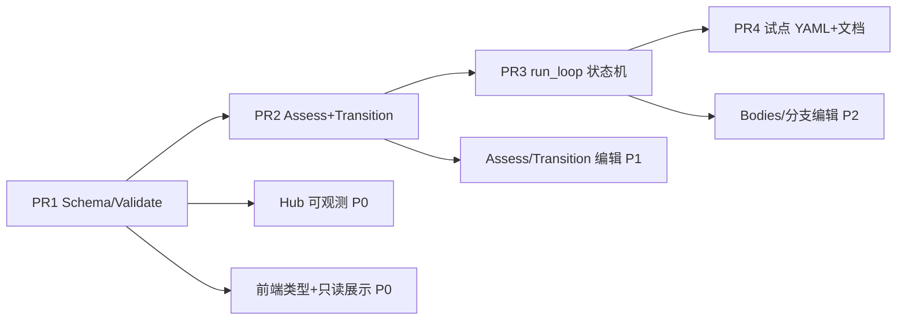

# 通用 Workflow 迭代 v2 — 研发实施方案

> **版本**：2026-06-14  
> **上游真源**：[`00-总方案-通用Workflow迭代V2.md`](./00-总方案-通用Workflow迭代V2.md)  
> **读者**：后端、前端、业务配置、Hub、QA  
> **Owner**：平台 / 编排内核

---

## 1. 现状盘点：已完成 vs 待办

### 1.1 已完成（可复用，勿回退）

| 模块 | 证据 | 说明 |
|------|------|------|
| **R-Loop v1 运行时** | `backend/common/loop_runtime.py` | `LoopSpec`（`body` + `until`）、`parse_loop_specs`、`evaluate_until`、`instantiate_round_body_tasks`、`validate_loop_specs` |
| **Process 集成** | `backend/common/process.py` `_execute_loop` | 多轮 body 执行、`loop_round_done` / `loop_finished` run_event、PATCH 基线复制 |
| **Loader 链路** | `backend/common/workflow_loader.py` | `load_workflow` → `parse_loop_specs` → `validate_loop_specs` |
| **试点 workflow v1** | `business/workflows/产品规划方案.yaml` v2.2 | `ch3_quality_round`：work→review + `REVIEW: PASS/FAIL` |
| **Loop 群讨论** | `loop_discussion_dispatch.py` | FAIL 后群对齐；hardcoded `work`/`review` task id |
| **v2 Loop 编辑器** | `frontend-v2/.../LoopEditorPanel.tsx` + `WorkflowEditor.tsx` | body 步骤、until 条件、`max_rounds`、on_pass/on_exhaust |
| **Recurring max_cycles** | `hub/api/routes/projects.py`、`project_launch.py`、`ProjectDetailPanel.tsx` | 启动参数 `max_cycles`；UI 展示「周期进度」 |
| **单元测试基线** | `test_loop_runtime.py`、`test_process_loops.py` | v1 解析、实例化、until 判定、产品规划加载 |
| **REG** | `scripts/regression/reg_discuss_loop.py` | 产品规划 discuss 路径 |

### 1.2 待办（本方案覆盖）

| 能力 | 差距 |
|------|------|
| LoopSpec v2 字段 | 无 `bodies` / `assess` / `transition` / `min_rounds` / `default_body` |
| 运行时状态机 | 无 `LoopRoundState`、无 `evaluate_transition`、无 body 分支切换 |
| Assess 一等公民 | 无 `iteration-assess` task_type；无声明式 `assess.inputs` 注入 |
| 可观测 | `_FEED_KINDS` 未收录 `loop_round_done` 等；`project_overview` 无 `iterations[]` |
| 前端 v2 编辑 | 无 bodies / assess / transition 编辑器；无 `IterationProgressCard` |
| 试点 B | 无 `GEO持续优化-迭代.yaml` |

---

## 2. PR 依赖关系



- **PR1** 为硬前置：Loader 与 Hub validate 须先认识 v2 schema，否则后续 YAML 无法落盘。
- **PR2** 与 **PR3** 可同一人连续交付，但 PR3 集成测试依赖 PR2 的 `evaluate_transition`。
- **PR4** 纯配置，可在 PR3 合并后并行文档与 LIVE 验证。
- **Hub / 前端** 与 Backend PR 交错：P0 可观测可与 PR1 同 PR；完整编辑 UI 跟 PR2/PR3。

---

## 3. PR1 — Schema + Parse + Validate（~285 LOC）

**目标**：扩展数据模型与校验，**零运行时行为变化**；v1 workflow 100% 兼容。

### 3.1 Backend

| 文件 | 任务 | 验收 | Owner |
|------|------|------|-------|
| `backend/common/loop_runtime.py` | 扩展 `LoopSpec`：`bodies: dict[str,list]`、`assess`、`transition`、`min_rounds`、`default_body`、`fallback_until`；v1 `body`/`until` 保留 | dataclass 字段齐全；mypy/pytest 绿 | 内核 |
| `backend/common/loop_runtime.py` | 重写 `parse_loop_specs` v2（见 §7.1）；v1 路径归一化为内部 `{default: body}` | `产品规划方案.yaml` 解析结果与现网一致 | 内核 |
| `backend/common/loop_runtime.py` | `validate_loop_specs`：v1/v2 互斥校验；`transition[].next_body` 引用 `bodies` 键；`assess.ref` 存在于当前 body | 非法 YAML 抛 `ValueError` 且信息可定位 | 内核 |
| `backend/common/loop_runtime.py` | `expand_loop_body_for_validation`：展开 `bodies` × `max_rounds`（P0 仅 default body 亦可） | plan_gate 覆盖全部 branch 模板 | 内核 |
| `backend/common/tests/test_loop_runtime.py` | 新增 v2 fixture 解析、互斥、引用失败用例 | `pytest` 全绿 | QA |

### 3.2 Hub

| 文件 | 任务 | 验收 | Owner |
|------|------|------|-------|
| `backend/common/observability.py` | `_FEED_KINDS` 增加 `loop_round_done`、`loop_finished`（为后续 `loop_transition` 预留） | `project_events` 可见 loop 里程碑 | Hub |
| `backend/common/observability.py` | `project_overview` 增加 `iterations[]` 占位（从 placeholder task meta / run_event 聚合） | API 返回结构稳定，v1 项目为空数组 | Hub |

### 3.3 Frontend（P0 增量）

| 文件 | 任务 | 验收 | Owner |
|------|------|------|-------|
| `frontend-v2/.../loopHelpers.ts` | 扩展 `LoopSpec` TS 类型（`bodies`/`assess`/`transition` 可选） | 编译通过；旧 workflow 加载不报错 | 前端 |
| `frontend-v2/.../ProjectExecTree.tsx` | 渲染 `loop_round_done` / `loop_finished` 事件 | 产品规划 run 可在执行树看到轮次 | 前端 |

### 3.4 Business

| 文件 | 任务 | 验收 | Owner |
|------|------|------|-------|
| `business/workflows/_examples/iteration-v2-fixture.yaml` | 最小 v2 fixture（见 §8.1） | `load_workflow` 通过 validate | 业务配置 |
| `docs/DESIGN-WORKFLOW-LOOPS.md` | 更新 v2 schema 章节与状态 | 与总方案一致 | 文档 |

---

## 4. PR2 — iteration-assess + evaluate_transition（~225 LOC）

**目标**：实现 transition 判定函数与新 task_type；**仍不切换** `_execute_loop` 主路径（可用 feature flag 或单测直调）。

### 4.1 Backend

| 文件 | 任务 | 验收 | Owner |
|------|------|------|-------|
| `backend/common/loop_runtime.py` | 实现 `evaluate_transition()`（见 §7.2） | 单测覆盖 PASS/STOP/CONTINUE/BRANCH/exhausted/min_rounds | 内核 |
| `backend/common/loop_runtime.py` | `resolve_assess_task_id(spec, round, body_key)` | assess.ref 解析为 `{loop}-r{n}-{ref}` | 内核 |
| `backend/common/loop_runtime.py` | `resolve_assess_inputs()`：解析 `assess.inputs` kind（goal、phase.deliverable、ops_log） | 单测 mock store；不调用 LLM | 内核 |
| `backend/common/tests/test_loop_runtime.py` | transition 规则有序匹配、v1 `REVIEW: PASS` 别名 | 矩阵用例 ≥8 | QA |

### 4.2 Business

| 文件 | 任务 | 验收 | Owner |
|------|------|------|-------|
| `business/templates/templates.yaml` | 注册 `iteration-assess`（见 §7.3） | Manage 页可见；gate 校验 marker 存在 | 业务配置 |

### 4.3 Frontend

| 文件 | 任务 | 验收 | Owner |
|------|------|------|-------|
| `frontend-v2/.../AssessStepEditor.tsx`（新建） | 编辑 `assess.ref` + `inputs[]` | 保存后 YAML 合法 | 前端 |
| `frontend-v2/.../TransitionEditor.tsx`（新建，基础版） | marker 规则：exit/continue + outcome/next_body | 与 `loopHelpers` 序列化对齐 | 前端 |

---

## 5. PR3 — _execute_loop v2 状态机 + 事件 + REG（~360 LOC）

**目标**：运行时切换至 assess→transition 状态机；**ADR-005** 薄委托 `run_loop()`（须 Freeze Owner 签字）。

### 5.1 Backend

| 文件 | 任务 | 验收 | Owner |
|------|------|------|-------|
| `backend/common/loop_runtime.py` | `@dataclass LoopRoundState`；`run_loop(store, spec, ctx)` 状态机 | v1 spec 走 legacy 分支，行为不变 | 内核 |
| `backend/common/loop_runtime.py` | `instantiate_round_body_tasks(spec, round, body_key=)` | 按 `body_key` 取 `bodies[key]` 或 v1 `body` | 内核 |
| `backend/common/process.py` | `_execute_loop` 薄委托；emit `loop_round_assess`、`loop_transition` | diff 可控（<80 行净增） | 内核 |
| `backend/common/loop_discussion_dispatch.py` | 参数化 `assess_task_id`（替代 hardcoded review） | `reg_discuss_loop.py` 仍绿 | 内核 |
| `backend/common/kernel_project_hooks.py` | hook 签名扩展 assess_task_id | 向后兼容默认值 | 内核 |
| `backend/common/tests/test_process_loops.py` | v1 三用例 + assess STOP 首轮 exit + CONTINUE 多轮 | pytest 绿 | QA |
| `scripts/regression/reg_iteration_assess.py`（新建） | CHECK_ONLY；fixture workflow | CI 可挂 `--suite unit` 旁路 | QA |

**开放问题 P1 实现**：`min_rounds` 与 assess 首轮 `ITERATION: STOP` 冲突时，**强制 continue 至 min_rounds**。

### 5.2 Hub

| 文件 | 任务 | 验收 | Owner |
|------|------|------|-------|
| `backend/common/observability.py` | `_FEED_KINDS` + `loop_round_assess`、`loop_transition`；`iterations[]` 填充 round/body/marker | ProjectDetail SSE 实时更新 | Hub |

### 5.3 Frontend

| 文件 | 任务 | 验收 | Owner |
|------|------|------|-------|
| `frontend-v2/.../IterationProgressCard.tsx`（新建） | 展示 round/body/assess marker/transition 结果 | 对接 `overview.iterations` | 前端 |
| `frontend-v2/.../ProjectDetailPanel.tsx` | loop 占位节点旁挂 IterationProgressCard | 与 recurring「周期」文案不混淆 | 前端 |

---

## 6. PR4 — 试点 YAML + 文档

| 文件 | 任务 | 验收 | Owner |
|------|------|------|-------|
| `business/workflows/产品规划方案.yaml` | v2 等价迁移：`bodies.default` 显式化 + `transition` 声明 `REVIEW: PASS/FAIL` | 行为等价；`reg_discuss_loop.py` 绿 | 业务配置 |
| `business/workflows/GEO持续优化-迭代.yaml`（新建） | 试点 B（见 §8.2） | `reg_geo_iteration.py` CHECK_ONLY | 业务配置 |
| `scripts/regression/reg_geo_iteration.py`（新建） | GEO 分支 r1 FAIL→patch body；r2 PASS | P2 门禁 | QA |
| `docs/0614/03-测试与回归方案.md` | 交叉引用 REG 矩阵 | 文档齐套 | 文档 |

**P2 开放问题**：branch 完成后占位节点 **auto-complete**，meta `loop_state=branched`。

### 6.1 Frontend（P2）

| 文件 | 任务 | 验收 | Owner |
|------|------|------|-------|
| `frontend-v2/.../BodyTemplateManager.tsx`（新建） | 多 body 键编辑、default_body 选择 | 保存合法 v2 YAML | 前端 |
| `frontend-v2/.../LoopEditorPanel.tsx` | v1/v2 模式切换；v2 嵌入 Body/Assess/Transition 子面板 | 产品规划编辑回归 | 前端 |
| `frontend-v2/.../WorkflowEditor.tsx` | DAG 轮次分组展示（只读预览） | 多 body 结构可辨识 | 前端 |

---

## 7. 关键代码草图

### 7.1 `parse_loop_specs` v2（归一化）

```python
@dataclass
class LoopSpec:
    id: str
    max_rounds: int = 5
    min_rounds: int = 1
    default_body: str = "default"
    # v1 兼容
    body: list[dict] = field(default_factory=list)
    until: list[dict] = field(default_factory=list)
    # v2
    bodies: dict[str, list[dict]] = field(default_factory=dict)
    assess: dict | None = None
    transition: list[dict] = field(default_factory=list)
    fallback_until: list[dict] = field(default_factory=list)
    on_pass: str = "complete"
    on_exhaust: str = "needs_review"
    description: str = ""

def parse_loop_specs(raw_loops) -> list[LoopSpec]:
    ...
    has_v2 = bool(item.get("bodies"))
    has_v1 = bool(item.get("body"))
    if has_v2 and has_v1:
        raise ValueError(f"loop「{lid}」bodies 与 body 互斥")
    if has_v2:
        bodies = {k: [dict(t) for t in v] for k, v in item["bodies"].items()}
        transition = list(item.get("transition") or [])
        assess = item.get("assess")
        # v1 兼容：若无 transition 则用 fallback_until 合成
        fallback = list(item.get("fallback_until") or item.get("until") or [])
    else:
        bodies = {"default": [dict(b) for b in item["body"]]}
        transition = []
        assess = None
        fallback = list(item.get("until") or [])
    out.append(LoopSpec(
        id=lid, max_rounds=max_rounds, min_rounds=min_rounds,
        default_body=str(item.get("default_body") or "default"),
        body=item.get("body") or [], until=item.get("until") or [],
        bodies=bodies, assess=assess, transition=transition,
        fallback_until=fallback, ...
    ))
```

### 7.2 `evaluate_transition`

```python
@dataclass
class TransitionResult:
    action: str          # "exit" | "continue"
    outcome: str | None  # on_pass / needs_review / ...
    next_body: str | None
    matched_rule: int | None

def evaluate_transition(
    spec: LoopSpec,
    *,
    round_num: int,
    body_key: str,
    project_id: str,
    round_outcomes: dict[str, TaskOutcome],
    body_task_types: dict[str, str],
    store: Store,
) -> TransitionResult:
    rules = spec.transition or _legacy_until_as_transition(spec.fallback_until)
    for idx, rule in enumerate(rules):
        when = rule.get("when")
        if when == "deliverable_marker":
            tid = resolve_assess_task_id(spec, round_num, body_key, rule.get("task"))
            marker = rule.get("marker", "")
            text = _read_deliverable(project_id, tid, body_task_types.get(tid, ""))
            if marker and marker in text:
                return TransitionResult(
                    action=rule.get("action", "exit"),
                    outcome=rule.get("outcome"),
                    next_body=rule.get("next_body"),
                    matched_rule=idx,
                )
        elif when == "exhausted" and round_num >= spec.max_rounds:
            return TransitionResult("exit", spec.on_exhaust, None, idx)
    # fallback: v1 until OR 语义
    if evaluate_until(spec, round_num, round_outcomes, store, project_id, body_task_types):
        return TransitionResult("exit", spec.on_pass, None, None)
    return TransitionResult("continue", None, None, None)
```

**min_rounds 守卫**（在 `run_loop` 调用处）：

```python
if result.action == "exit" and round_num < spec.min_rounds:
    result = TransitionResult("continue", None, spec.default_body, None)
```

### 7.3 `iteration-assess` 模板片段

```yaml
iteration-assess:
  delivery_profile: light_v1
  display_name: 迭代评估
  outcome_kind: artifact
  deliverable_template:
    required_heading_level: 2
    sections:
      - name: 评估对象
        description: 本轮被评估的交付物与上下文
        required: true
      - name: 评估结论
        description: 有效 / 无效 / 无法判断；末行须含 ITERATION marker
        required: true
      - name: 发现摘要
        required: true
      - name: 下一步建议
        required: true
  check_rules:
    required_sections: [评估对象, 评估结论, 发现摘要, 下一步建议]
    must_include_one_of:
      - "ITERATION: PASS"
      - "ITERATION: STOP"
      - "ITERATION: CONTINUE"
      - "REVIEW: PASS"
      - "REVIEW: FAIL"
    min_length: 120
  acceptance_criteria:
    - 结论末行必须为声明式 marker，供内核 transition 解析
    - 禁止仅用自然语言暗示继续/停止而无 marker
```

---

## 8. 示例 Workflow 纲要

### 8.1 `business/workflows/_examples/iteration-v2-fixture.yaml`

```yaml
id: iteration-v2-fixture
version: "1.0"
description: PR1–PR3 回归用最小 v2 loop
options:
  review_enabled: false
loops:
  - id: demo
    max_rounds: 3
    min_rounds: 1
    default_body: default
    bodies:
      default:
        - { id: work, agent: research, task_type: research, dependencies: [] }
        - { id: assess, agent: main, task_type: iteration-assess, dependencies: [work] }
    assess:
      ref: assess
      inputs:
        - { kind: goal }
        - { kind: phase.deliverable, phase: work }
    transition:
      - { when: deliverable_marker, task: assess, marker: "ITERATION: PASS", action: exit, outcome: complete }
      - { when: deliverable_marker, task: assess, marker: "ITERATION: STOP", action: exit }
      - { when: deliverable_marker, task: assess, marker: "ITERATION: CONTINUE", action: continue }
      - { when: exhausted, action: exit, outcome: needs_review }
tasks:
  - { id: t-demo, name: 迭代演示, loop: demo, dependencies: [] }
```

### 8.2 `business/workflows/GEO持续优化-迭代.yaml`（纲要）

```yaml
id: GEO持续优化-迭代
version: "1.0"
description: GEO 内容持续优化 — audit→revise→verify + patch 分支
loops:
  - id: geo_wave
    max_rounds: 6
    default_body: audit
    bodies:
      audit:    # 首轮：全站审计
        - { id: audit, agent: seo, task_type: geo-audit, dependencies: [] }
        - { id: assess, agent: main, task_type: iteration-assess, dependencies: [audit] }
      patch:    # FAIL 后：定点修订
        - { id: revise, agent: content, task_type: geo-revise, dependencies: [] }
        - { id: verify, agent: seo, task_type: geo-verify, dependencies: [revise] }
        - { id: assess, agent: main, task_type: iteration-assess, dependencies: [verify] }
    assess:
      ref: assess
      inputs:
        - { kind: goal }
        - { kind: phase.deliverable, phase: audit }  # body 内相对 phase
        - { kind: ops_log, table: publish_log, optional: true }
    transition:
      - { when: deliverable_marker, task: assess, marker: "ITERATION: PASS", action: exit, outcome: complete }
      - { when: deliverable_marker, task: assess, marker: "REVIEW: FAIL", action: continue, next_body: patch }
      - { when: deliverable_marker, task: assess, marker: "ITERATION: BRANCH patch", action: continue, next_body: patch }
      - { when: exhausted, action: exit, outcome: needs_review }
tasks:
  - { id: t-geo-loop, name: GEO 迭代波次, loop: geo_wave, dependencies: [t-prep-keywords] }
  - { id: t-prep-keywords, name: 关键词基线, agent: research, task_type: research, dependencies: [] }
```

---

## 9. 分轨工作量估算（人日）

| 轨道 | PR1 | PR2 | PR3 | PR4 | 合计 |
|------|-----|-----|-----|-----|------|
| **Backend** | 3 | 2.5 | 4 | 0.5 | **10** |
| **Hub** | 1 | 0 | 1 | 0 | **2** |
| **Frontend** | 1 | 2 | 2 | 3 | **8** |
| **Business 配置** | 0.5 | 0.5 | 0 | 2 | **3** |
| **QA / REG** | 1 | 1 | 2 | 1.5 | **5.5** |
| **合计** | 6.5 | 6 | 9.5 | 7 | **~29 人日** |

按 2 后端 + 1 前端并行，**日历约 4–5 周**（对齐总方案 P0–P2 各 2 周，含联调缓冲）。

---

## 10. 分轨职责摘要

### Backend（内核 Owner）

- `loop_runtime.py`：schema、parse、validate、`evaluate_transition`、`run_loop` 状态机
- `process.py`：薄委托；事件发射；min_rounds 守卫
- `loop_discussion_dispatch`：assess_task_id 参数化
- 测试：`test_loop_runtime.py`、`test_process_loops.py`、REG 脚本

### Frontend（v2 Owner）

- 类型扩展 → Assess/Transition/Body 编辑 → IterationProgressCard → DAG 轮次预览
- 文案：**「周期」= recurring**；**「轮次」= iteration loop**

### Business 配置（场景 Owner）

- `templates.yaml`：`iteration-assess`
- `_examples/iteration-v2-fixture.yaml`、试点迁移与 GEO 新建
- 各场景 `transition` marker 与 hook（P3 可选）声明

### Hub（可观测 Owner）

- `observability.py`：`_FEED_KINDS`、`iterations[]`、`project_events` 聚合
- `observability_api.py`：无路由变更，随 common 升级自动受益
- `routes/projects.py`：**已完成** `max_cycles`；本迭代无 API 破坏性变更

---

## 11. 合并与发布检查清单

- [ ] `pytest backend/common/tests/test_loop*.py` 全绿
- [ ] `reg_discuss_loop.py` + `reg_iteration_assess.py` CHECK_ONLY
- [ ] v1 `产品规划方案.yaml` 加载行为回归（PR1 前后一致）
- [ ] Hub `GET /api/obs/projects/{id}/overview` 含 `iterations`
- [ ] frontend-v2 Workflow 编辑保存 → Hub `load_workflow` validate 通过
- [ ] Freeze Owner 批准 `process._execute_loop` 委托 diff（ADR-005）
- [ ] LIVE 试跑见 `04-真实环境验证方案.md`

---

*本文档随 `docs/0614` 实施进度回写；字段或 PR 边界变更须同步 `00-总方案` 版本号。*
