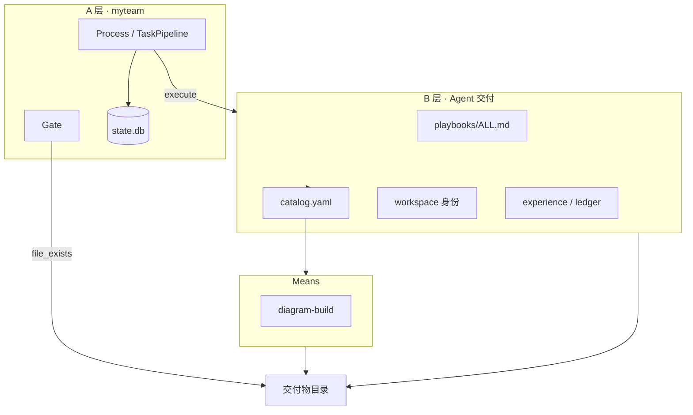

# Agent 单兵交付 · 设计说明

> 版本：2026-06-10 · Sprint 1 落地  
> 与 [`ARCHITECTURE.md`](./ARCHITECTURE.md)（A 层内核）互补，本文定义 **B 层** 与 A 的组合方式。

---

## 1. 两个可组合的能力块

| 块 | 职责 | 主要路径 |
|----|------|----------|
| **A · myteam 项目协作** | 拆任务、DAG、派单、Gate、重试、状态、观测 | `backend/common/`、`business/workflows/`、`business/templates/` |
| **B · Agent 单兵交付** | ALL 过程、catalog 自选 means、身份、经验 | `business/playbooks/`、`business/means/`、`business/experience/`、`business/workspaces/` |

**组合接口**：`execute` 派单 + 交付物目录 + `templates.yaml` Gate 规则。

**Means**（如 diagram-build）是 B 层插件，不是第三块。

### Agent 扩展原则

- **每个方向一个 agent**（product、arch、developer…），先少后多。
- **业务差异用 task_type**（如 `product-research` vs `arch-research`），不靠同一 task_type 绑多个 agent。
- 将来若要「多 product 并行讨论」，再 **加 agent + workflow**，不在现阶段堆 roster。

---

## 2. 架构图



---

## 3. 单步 ALL 流程

```text
scaffold_process.sh
  → align.md → plan.md（catalog 自选 means）
  → 执行 means → verify.log
  → ledger.entry.yaml + trace.manifest.yaml
  → submit_result → Gate
```

---

## 4. 目录对照

```text
business/
  playbooks/           # B：ALL 总 playbook + 通用过程模板
    ALL.md
    templates/
    scripts/scaffold_process.sh
  means/               # B：可插拔小工具
    diagram-build/
  skills/
    catalog.yaml       # B：means + router 索引
    <task_type>/SKILL.md   # B：router（非 means 本体）
  experience/          # B：ledger schema
  workflows/           # A：只写对象/输入/产出（禁止 【Skill】）
  templates/           # A：task_type + Gate + prompt 壳 + prompt_injections
  workspaces/          # B：Agent 身份
backend/common/        # A：内核（FRAMEWORK-FREEZE）
```

---

## 5. delivery_profile（R1 已落地）

| profile | 过程文件 | 适用 task_type |
|---------|----------|----------------|
| `none` | 无 | `research` 等旧类型 |
| `light_v1` | align + verify | requirements、strategy、product-research… |
| `all_v1` | 完整 ALL | diagram-build、deck-build |

配置：`business/templates/delivery_profiles.yaml`  
绑定：每个 task_type 在 `templates.yaml` 声明 `delivery_profile`（1 对 1，不随 agent 变）。

**内核闭环（单兵作战能力）**：

| 环节 | 模块 | 行为 |
|------|------|------|
| execute 前 | `deliverable_guarantee.scaffold_process_artifacts` | attempt 1 按 profile 复制 align/plan/ledger 模板、touch verify.log |
| execute 提示 | `PromptComposer` + `experience.append_experience_hints` | 注入过程指引 + 同类 task_type 历史 ledger |
| Gate | `gate.check_process_artifacts` | 校验 align/plan 已去模板注释、verify.log 有自检记录 |
| 成功后 | `experience.promote_ledger_to_memory` | all_v1 任务将 ledger.entry.yaml 写入 KB |

过程校验规则在 `delivery_profiles.yaml` 的 `process_checks`，非 Python 硬编码。

## 6. Sprint 路线图

| Sprint | 内容 | 状态 |
|--------|------|------|
| **R1** | delivery_profiles + Registry 合并 + PromptComposer | ✅ |
| **1** | means、playbooks、catalog | ✅ |
| **2** | arch-research task_type（agent 仍只有一个 arch） | ✅ |
| **扩展原则** | 每个方向一个 agent；差异用 **task_type** 表达；多 agent 同方向以后再加 | — |
| **3** | 过程 scaffold + Gate 过程校验 + ledger→memory | ✅ |
| **R-Loop** | Workflow 条件循环（Work–Review until） | 📋 [DESIGN-WORKFLOW-LOOPS.md](./DESIGN-WORKFLOW-LOOPS.md) |

---

## 6. 验收

- [x] `bash business/means/diagram-build/scripts/run_smoke.sh` PASS
- [x] `产品独立交付.yaml` 无 `【Skill】`
- [ ] 全部 workflow 无 `【Skill】`（`scripts/lint_workflows_no_skill.sh`，Sprint 2 清理其余 yaml）
- [x] Gate `diagram-build` 含 ALL 过程 file_exists

---

## 7. Prompt 注入（A 通用机制 + 可配置内容）

| 层 | 职责 |
|----|------|
| **内核** | `prompt_injections.py` + `append_prompt_injections()` — 按 kind/when/task_type 拼块 |
| **配置** | `business/templates/prompt_injections.yaml` — 注入什么文案 |

`when` 支持：`always`、`has_skill_router`（存在 `skills/<task_type>/SKILL.md` 时）。

新增 B 层指引：**只改 yaml**，不改 `agent_transport.py`。

---

## 8. 相关文档

- [ARCHITECTURE.md](./ARCHITECTURE.md)
- [FRAMEWORK-FREEZE.md](./FRAMEWORK-FREEZE.md)
- [business/playbooks/ALL.md](../business/playbooks/ALL.md)
- [business/means/README.md](../business/means/README.md)
