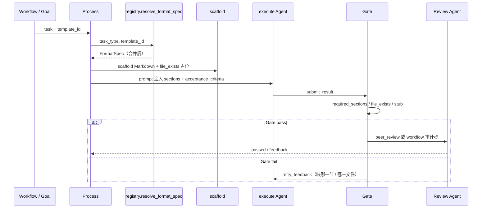

# 交付模板实例化 · 设计草案

> 版本：2026-06-10 · **已评审签字**  
> 状态：**P1 已实现**（Hub 模板 UI 待 P2）  
> 关联：[DESIGN-AGENT-DELIVERY.md](./DESIGN-AGENT-DELIVERY.md) · [framework-decisions.md](./framework-decisions.md) D14/D15 · [FRAMEWORK-FREEZE.md](./FRAMEWORK-FREEZE.md)

---

## 1. 背景

### 1.1 共识模型（产品侧）

以「需求文档制作」为例，期望分工如下：

| 层 | 职责 | 判什么 |
|----|------|--------|
| **任务类** | 「需求文档制作」是一类工作 | 不是某个具体章节目录 |
| **模板** | 不同项目选用不同目录 / 章节 / 附件 | 第一章概述、第二章系统架构、须附架构图… |
| **Gate** | 客观、可重复 | 模板每一项是否有对应内容 / 文件 |
| **Review** | 主观、专业 | 内容质量、逻辑、深度、一致性 |

这与内核 D14 一致：**Gate = 契约 + 格式 + 完整性；质量 = Agent 自评 + Review**。

### 1.2 现状缺口

| 现状 | 问题 |
|------|------|
| 一个 `task_type` ↔ `templates.yaml` 里**固定一套**章节 | 无法「同类任务、不同模板」 |
| `product-planning` 写死 11 个 TDS 专章 | 领域模板误挂在通用类型上 |
| `section-authoring` 5 节通用壳 | 对，但缺「项目级目录」注入 Gate 的能力 |
| Gate 验 H2 标题 + `file_exists` | 能验「有没有架构图文件」，须写进模板契约 |
| Review | 内核 `peer_review` + workflow 审计步，已有，缺与模板 `acceptance_criteria` 的统一绑定 |

---

## 2. 目标与非目标

### 2.1 目标

1. **任务类（task_type）** 表达稳定的工作种类（需求、方案编制、章节审计…）。
2. **交付模板（template_id）** 表达可复用的目录 / 章节 / 附件契约，按项目或 Goal 选用。
3. **Gate** 只验「当前选用的模板」里的结构性条目（章节、文件、非 stub）。
4. **Review** 必须按**当前模板**：逐章验内容质量、附件（图）质量、全文前后一致。
5. **向后兼容**：未指定 `template_id` 时，行为与今日 `templates.yaml` 完全一致。

### 2.2 非目标（本 RFC 不做）

- Gate 做语义理解（「概述是否讲清楚」）。
- 自动从 Word 目录 OCR 生成模板。
- 替换 Skill Pack；模板管**结构契约**，Skill 管**怎么写好**。
- 解冻 `Gate` 核心判定逻辑（仅扩展 **spec 解析入口**）。

---

## 3. 概念模型

```text
                    ┌─────────────────────────────────────┐
                    │  Goal / workflow                      │
                    │  template_id: prd-standard            │
                    └─────────────────┬───────────────────┘
                                      │
         task_type（类）              │         delivery_template.yaml
         agent / delivery_profile     │         章节 + check_rules + acceptance
              │                        ▼
              │              ┌───────────────────┐
              └─────────────►│ 选中哪个模板       │
                             │ Gate 就验哪个结构  │
                             └─────────┬─────────┘
                                       │
              execute Agent ◄────────┤ scaffold + prompt 来自模板
                   │                   │
                   ▼                   ▼
                 Gate ──pass──► Review（逐章质量 + 图 + 全文一致）
                   │
                 fail → retry
```

**关键原则（定稿）**

- **task_type**：名字不改；只管 Agent 能力、`delivery_profile`、`outcome_kind`。
- **template_id**：选中哪个模板，**Gate / scaffold / Review 清单** 就以该 YAML 为准——无继承、无拼接。
- **Gate**：模板里写的结构（章节、文件、长度等），客观可验。
- **Review**：模板里每一章的**内容质量**、**图**、**全文一致性**；必须读模板的 `sections` + `acceptance_criteria`。

---

## 4. 三层职责（精确定界）

### 4.1 任务类 `task_type`

注册在 `business/templates/templates.yaml`，提供：

| 字段 | 用途 |
|------|------|
| `display_name` | UI / prompt 展示 |
| `delivery_profile` | 过程产物（align / verify.log） |
| `outcome_kind` | artifact / action / code_project |
| `deliverable_template.sections` | **默认**章节（无 template_id 时用） |
| `check_rules` | **默认** Gate 规则 |

任务类宜 **粗**：5～7 个通用节，或仅 1 个「正文 + 自检」壳（如 `section-authoring`）。

### 4.2 交付模板 `template_id`

存放在 `business/delivery_templates/<template_id>.yaml`（见 §5）。

表达 **可复用、可版本化** 的目录契约，例如：

- `prd-standard` — 标准 PRD（背景、范围、架构、用户故事…）
- `prd-lite` — 轻量需求说明（3 节）
- `tds-ch3-product-planning` — 可信数据空间第三章 11 节专版

### 4.3 Gate 验什么（模板条目 → 规则）

| 模板条目 | Gate 规则 | 示例 |
|----------|-----------|------|
| 必需章节 H2 | `required_sections` + `section_level` | `## 系统架构` 存在 |
| 章节最低篇幅（可选） | `section_min_chars`（Phase 2） | 概述 ≥ 200 字 |
| 必备附件 | `file_exists` | `architecture.png` |
| 正文引用占位 | `must_include`（显式开启） | `【图：系统架构图】` |
| 整篇非空 | `stub_floor` / `min_length` | 非「待补充」 |
| 发布证据 | `evidence_url` | action 型任务 |

**不验**：架构是否合理、需求是否完整、图是否美观 → **Review**。

### 4.4 Review 验什么（定稿）

Review **不负责**「章节标题在不在」（那是 Gate）；Review **必须**：

| 维度 | 说明 | 依据 |
|------|------|------|
| **逐章内容质量** | 模板中每一章是否写到位、可执行、非空话 | 模板 `sections[].description` + `acceptance_criteria` |
| **附件 / 图** | 模板要求的图是否存在、是否清晰、是否与引用章节一致 | 模板 `check_rules.file_exists` + acceptance 中图文一致条款 |
| **全文一致** | 术语统一、前后不矛盾、范围与架构/流程自洽 | 模板 `acceptance_criteria` + 标准 Review Skill |
| **结论** | 放行 / 需修订 + 可执行修改项 | workflow 审计步或 `peer_review` |

实现时 Review prompt **必须注入**：

1. 模板完整 `sections` 列表（章名 + description）
2. 模板 `acceptance_criteria`
3. 模板 `check_rules.file_exists`（若有图/附件）
4. 上游材料路径（来自 Goal / task description）

Review 输出须按章反馈（建议结构）：

```markdown
## 评审范围
（template_id + 章节目录）

## 逐章评审
| 章节 | 质量 | 问题 |
| 背景与目标 | PASS/FAIL | … |

## 附件评审
| 文件 | 与正文一致 | 问题 |
| architecture.png | PASS/FAIL | … |

## 全文一致性
（术语、范围、架构、流程是否自洽）

## 审计结论
放行 / 需修订

## 修订要求
（逐条可执行；放行则写「无」）
```

---

## 5. 交付模板 Schema（v1 草案）

### 5.1 文件位置

```text
business/delivery_templates/
  _examples/                    # RFC 示例（评审用）
    prd-standard.yaml
    prd-lite.yaml
    tds-ch3-product-planning.yaml
  prd-standard.yaml             # 正式模板（实现后）
  ...
```

### 5.2 YAML 结构

```yaml
id: prd-standard
version: "1.0"
display_name: 标准 PRD
description: 适用于中大型功能的需求文档

deliverable_template:
  required_heading_level: 2
  sections:
    - name: 背景与目标
      description: 业务背景、目标用户、成功指标
      required: true
    - name: 范围
      description: In Scope / Out of Scope
      required: true
    - name: 系统架构
      description: 逻辑架构说明；须与架构图一致
      required: true
    - name: 用户故事与验收标准
      required: true
    - name: 方案方向
      required: true
    - name: 风险与依赖
      required: true
  structure:
    - H1 为需求文档主标题
    - 验收标准用表格

# Gate 契约（映射到 FormatSpec.check_rules）
check_rules:
  required_sections:
    - 背景与目标
    - 范围
    - 系统架构
    - 用户故事与验收标准
    - 方案方向
    - 风险与依赖
  file_exists:
    - architecture.png          # 模板明确要求架构图文件
  must_include:
    - Out of Scope
  min_length: 800

# Review 用（Gate 不验语义，Review 读此列表）
acceptance_criteria:
  - 背景与目标含可量化成功指标
  - 系统架构文字与 architecture.png 一致
  - 用户故事覆盖主路径且验收标准可测试
  - Out of Scope 明确排除项
  - 全文术语一致，范围 / 架构 / 流程无矛盾
```

### 5.3 解析规则 `resolve_format_spec(task_type, template_id?)`

**规则极简**：

```python
def resolve_format_spec(task_type: str, template_id: str | None) -> FormatSpec:
    base = get_spec(task_type)           # delivery_profile / outcome_kind 来源
    if not template_id:
        return base                      # 今日行为
    tpl = load_delivery_template(template_id)
    return FormatSpec(
        task_type=task_type,
        delivery_profile=base.delivery_profile,
        outcome_kind=base.outcome_kind,
        # 以下全部来自模板 YAML，不与 base 拼接
        required_sections=tpl.check_rules.required_sections,
        sections=tpl.deliverable_template.sections,
        file_exists=tpl.check_rules.file_exists,
        acceptance_criteria=tpl.acceptance_criteria,
        ...
    )
```

| 来源 | 字段 |
|------|------|
| **仅 task_type** | `delivery_profile`、`outcome_kind`、Agent 能力绑定 |
| **仅 template**（有 template_id 时） | 章节、Gate 规则、acceptance、scaffold、Review 清单 |
| **无 template_id** | 全部来自 task_type 默认（与 today 相同） |

### 5.4 模板选用优先级

```text
1. task.template_id         （workflow YAML 任务级）
2. Goal 中的 template_id      （发起项目时）
3. delivery_templates 中标记 default_for: <task_type> 的模板
4. templates.yaml 中 task_type 默认（今日行为）
```

Goal 示例：

```markdown
## 项目目标
完善《XX 平台》需求文档 v2。

- template_id: prd-standard
- 材料：business/inputs/xx-platform/context.md
- 架构图输出：architecture.png（与「系统架构」节同目录）
```

---

## 6. 运行时数据流



### 6.1 与 workflow loop 的关系

| 环 | 职责 |
|----|------|
| 单轮内 Gate retry | 补缺失章节 / 附件（格式层） |
| loop body：编制 → 审计 | 编制用 `template_id`；审计用 `section-review` 类 + **同一 template 的 acceptance_criteria** |
| loop until: `gate_passed` | 审计步 Gate 通过（结构 OK + 结论「放行」） |

---

## 7. 示例对照（看效果）

### 7.1 同一任务类、两种模板

| 条目 | `prd-lite` | `prd-standard` |
|------|------------|----------------|
| task_type | `requirements` | `requirements` |
| 章节数 | 3 | 6 |
| 架构图 | 不要求 | `architecture.png` 必须存在 |
| Gate min_length | 400 | 800 |
| 适用 | 小改动、内部对齐 | 对外 PRD、评审基线 |

### 7.2 方案章节：通用 vs 专版

| 条目 | `section-authoring`（无 template_id） | `tds-ch3-product-planning` |
|------|--------------------------------------|----------------------------|
| task_type | `section-authoring` | `section-authoring` 或 `product-planning` |
| Gate 章节 | 章节对象、正文、依据、变更、自检 | 产品架构、核心能力…共 11 节 |
| 细节来源 | Goal 写「完善第三章」 | 模板写死 TDS 目录 |
| Review | 对照 Goal + 通用 acceptance | 对照 TDS 材料 + 11 节 acceptance |

### 7.3 架构图怎么验

**方式 A — 同任务附件（推荐 PRD）**

```yaml
check_rules:
  file_exists: [architecture.png]
```

Gate 验文件存在；Review 验图与「系统架构」文字一致。

**方式 B — 独立子任务**

```yaml
# workflow
- id: task-arch-diagram
  task_type: diagram-build
  dependencies: [task-req-doc]
```

`diagram-build` 自有 Gate（`diagram.drawio` + `diagram.png`）。需求文档模板只要求正文引用图路径。

---

## 8. 配置面改动（实现时）

| 位置 | 改动 |
|------|------|
| `business/delivery_templates/*.yaml` | 新增模板库 |
| `common/registry.py` | `resolve_format_spec(task_type, template_id?)` |
| `common/deliverable_guarantee.py` | scaffold 用合并 spec |
| `common/prompt_templates.py` | 注入模板 sections + acceptance |
| `common/gate.py` | **不改规则**，只改 spec 来源 |
| `business/workflows/*.yaml` | 可选 `template_id:` per task |
| Goal / 项目创建 UI | 可选模板下拉 |
| Hub 管理 Tab | 模板列表只读预览（Phase 3） |

### 8.1 workflow 任务项扩展

```yaml
tasks:
  - id: task-req
    name: 需求文档编制
    agent: product
    task_type: requirements
    template_id: prd-standard    # 新增，可选
    dependencies: []
```

校验：`template_id` 存在且 `extends_task_type` 与 `task_type` 兼容。

---

## 9. 迁移策略

| 现有 | 迁移后 |
|------|--------|
| `requirements` 默认 5 节 | 保留为 task_type 默认；`prd-standard` 作为显式超集模板 |
| `product-planning` 11 节 | 迁到 `tds-ch3-product-planning.yaml`；`product-planning` 瘦身为 4～5 节通用壳或标记 deprecated |
| `section-authoring` | 保持通用壳；项目专章目录走 template_id |
| 无 template_id 的旧项目 | 零变更 |

---

## 10. 实现分期

| 阶段 | 交付 | 内核改动 |
|------|------|----------|
| **P0 设计** | 本文 + `_examples/*.yaml` | 无 |
| **P1 解析+运行时** | `load_delivery_template` + `resolve_format_spec` + Goal/workflow `template_id` + Gate/scaffold/prompt/Review 全走模板 | 中 |
| **P2 产品面** | Hub 模板列表、预览、workflow 编辑器 template 下拉 | 前端 |
| **P3 清理** | `product-planning` 专版迁到 delivery_templates | 模板 YAML 迁移 |

---

## 11. 评审结论（定稿 · 2026-06-10）

| # | 结论 |
|---|------|
| 1 | **task_type 名字不改** |
| 2 | **选中哪个模板，Gate 就验哪个模板里的结构**；无继承、无 extends、无与默认壳拼接 |
| 3 | **模板可预置可自制**，放到 `business/delivery_templates/` 即可 |
| 4 | **Review 必须**读模板，并验：每章内容质量、图/附件、全文前后一致 |

### 11.1 自制模板

```text
business/delivery_templates/
  prd-standard.yaml       # 预置
  my-team-prd-v2.yaml     # 自制，格式相同
```

Goal 或 workflow 指定 `template_id: my-team-prd-v2` 即可。  
**模板 YAML 即唯一真相**：几章、要不要图、`min_length` 多少 — Gate 与 Review 都从这里来。

### 11.2 Review 与 Gate 分工（再强调）

| | Gate | Review |
|---|------|--------|
| 章节有没有 | ✅ | — |
| 图文件在不在 | ✅ | — |
| 每章写得好不好 | — | ✅ |
| 图对不对、和文字是否一致 | — | ✅ |
| 全文是否自洽 | — | ✅ |

---

## 12. 附录：示例模板文件

见：

- [`business/delivery_templates/_examples/prd-standard.yaml`](../business/delivery_templates/_examples/prd-standard.yaml)
- [`business/delivery_templates/_examples/prd-lite.yaml`](../business/delivery_templates/_examples/prd-lite.yaml)
- [`business/delivery_templates/_examples/tds-ch3-product-planning.yaml`](../business/delivery_templates/_examples/tds-ch3-product-planning.yaml)

可视化概览：[delivery-template-model.canvas.tsx](/Users/kuanghualong/.cursor/projects/Users-kuanghualong-Project-Cursor/canvases/delivery-template-model.canvas.tsx)（可在 IDE 侧边打开）
