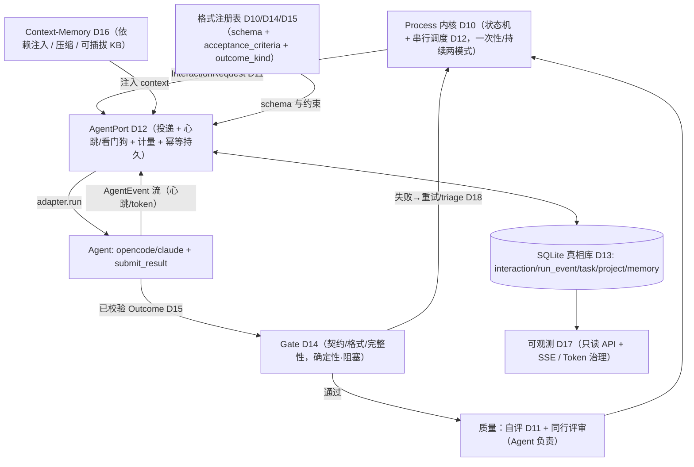

# 工业级 Agent Team 框架 — 设计决策记录

> 本文档记录我们就「工业级 agent team 交互框架」逐步确定的设计决策。
> 维护方式：**每确定一件事，就在「已确定的决策」末尾追加一条**；尚未定论的留在「待讨论的问题」。
> 这是决策日志，不是实现方案；具体实现细节在确定后另行展开。

---

## 北极星目标（North Star）

- **框架控制**：标准流程 + 输出格式（契约）。
- **Agent 控制**：任务的执行方式、成果物的实质内容、以及对质量的负责（自评 + 同行评审）。
- 一句话：**框架是铁轨（流程+格式），Agent 是火车头（动力+质量）。**

---

## 当前进展与工作约定（Status & Working Agreement）

> 新接手者先读本节，再读决策与代码地图。

- **阶段**：**设计阶段完成（D1–D18）。抽象层五件套全部落地为可测试模块（Phase 1–7），全仓 137 例测试绿。** Phase 8 已完成真机端到端验证（单次 + 三任务 DAG）与 Hub 只读可观测接线（非破坏性）；余下仅 **旧引擎下线**（破坏性切换，需明确授权）。
- **抽象层 → 新模块（全部位于 `skill/team/common/`，均可单测，旧引擎未动可回退）**：
  - Interaction 契约 → `contracts.py`（+ `submit_result.py`）
  - 存储真相 → `store.py`
  - AgentPort → `agent_port.py`
  - Gate + 格式注册表 → `gate.py` + `registry.py`
  - Process 单内核 → `process.py`（one_shot/recurring + 失败语义 + triage）
  - Context-Memory → `memory.py`（+ process 上游摘要注入）
  - 可观测 + Token 治理 → `observability.py`
  - AgentPort 真实传输 → `opencode_transport.py`（Phase 8 step 1）
  - Hub 只读可观测接线 → `backend/hub/api/observability_api.py`（Phase 8 step 2）
- **已决**：D1–D18（见下）。**抽象层五件套已闭合**：`Interaction`(D11) / `AgentPort`(D12) / `Gate`(D14) / `Process`(D10) / `Context-Memory`(D16)；支撑：存储(D13)、Outcome(D15)、可观测(D17)、失败语义(D18)。见上方「架构全景」。
- **已落地代码**：
  - Phase 1：`skill/team/common/contracts.py`（Pydantic 信封 + Outcome）、`submit_result.py`（校验后原子写，拒绝不抢救）、`tests/test_contracts.py`（14 例）。JSON 抢救置于迁移开关 `INTERACTION_CONTRACTS=1` 之后（默认关，可回退）：`notify_agent._write_response_file`、`executor.state_execute_task`。
  - Phase 2：`skill/team/common/store.py`（SQLite：project/task/interaction/run_event/memory + 只读导出视图 + task_data.json 一次性导入器 + CLI）、`tests/test_store.py`（8 例）。DB 落 `tasks/state.db`（已 gitignore）。
  - Phase 3：`skill/team/common/agent_port.py`（同步阻塞 + 串行 `run()`；注入式 Transport；两段式看门狗 soft/hard_idle；interaction_id 幂等 + 派发前清旧文件 + `reconcile_on_start` 启动对账 GC）、`tests/test_agent_port.py`（6 例：happy/卡死/无响应/重试/残留拒绝/对账）。
  - Phase 4：`registry.py`（格式注册表单一出处）、`gate.py`（契约 + 格式/完整性 + action 证据；min_length→防 stub、must_include 默认关；按 kind 取规则）、`tests/test_gate.py`（12 例）。
  - Phase 5：`process.py`（单内核：拓扑串行 DAG + execute 门禁重试 + needs_review 不阻塞 + failed 传播 blocked + 重试耗尽 `kind=triage` 委托 Main + 项目级 completed/partially_failed/failed/paused/aborted）、`contracts.py` 增 `triage` kind、`tests/test_process.py`（8 例）。
  - Phase 6：`memory.py`（`kb://` 可插拔后端，默认 SQLite；gbrain 仅留接口）、process 注入直接上游「摘要+引用」到 `context.upstream`（摘要由 agent 经响应 notes 写、存 task.meta）、`tests/test_memory.py`（3 例）。
  - Phase 7：`observability.py`（只读 API 形状：project_overview/task_detail/timeline/fleet_status/cost + 存活判定 liveness + 预算治理 check_budget 方案丙）、process 接 token 预算暂停、`tests/test_observability.py`（6 例）。
- **新依赖**：`pydantic>=2`、`PyYAML>=6`（已写入 `requirements.txt`，venv 已安装）。
- **Phase 8（go-live 收尾，进行中）**：
  1. ✅ **AgentPort 真实 Transport**：`common/opencode_transport.py`（`AdapterTransport` 驱动 `backend/adapters/opencode`，把 `AgentEvent` 流转发到 `ctx.emit` 作心跳；提示词约束 agent 用 `submit_result` 写回；适配器可注入便于测试/换 claude）。AgentPort 增 `cancel_event` 暴露 + `step_finish` token 计量（D17）。已加全栈集成测试 `test_integration.py`（Process→AgentPort→AdapterTransport(fake opencode)→Gate→Store→Observability 跑通一个 DAG）。
  2. ✅ **真实 opencode 跑通验证**：真机端到端跑通——单次 execute（17s）+ 三任务 DAG `research(researcher)→seo-plan(seo)→strategy(product)`（190s，含 `team_config` 决策、注册表驱动门禁一次通过、D16 上游摘要注入 t2/t3、D18 needs_review 不阻塞、跨任务 token 聚合 56k、可观测总览）。真机发现并修复 opencode 累计 token 计量 bug（`step_finish.tokens.total` + sum→max，见 `agent_port._extract_tokens`）。
  3. ✅ **可观测接线**：`backend/hub/api/observability_api.py`（只读 `/api/obs/...` 路由：overview/cost/fleet/task_detail/timeline + `run_event` SSE 增量推送，复用 Hub SSE 约定），`server.py` `include_router` 接入；`tests/test_observability_api.py`（TestClient 6 例）。**非破坏性**：新内核写、Hub 读同一 SQLite 真相库；运行中 Hub 需重启才生效。
  4. ⏳ **下线（破坏性，验证后）**：删旧 `task-executor`/`continuous-executor` 双引擎、弃用 `notify-telegram`、删 `quality_gate` 的 gbrain 死回退、统一 config/path、更新 `ARCHITECTURE.md`、移除迁移开关 `INTERACTION_CONTRACTS`。
- **测试**：全仓 **137 例绿**（含全栈集成 1 例 + Hub 可观测路由 6 例）。
- **工作约定（改动纪律）**：
  1. **先讨论后实现**：每个 Open 问题确认后才落代码。
  2. **保留不重写**（D1）：在现有 `backend/` + `skill/team/` 上加固。
  3. **机制进代码、能力做 skill**（D2）。
  4. **外科手术式改动**：每行改动都能追溯到一条决策；不顺手「改进」无关代码。
  5. **每确定一事，追加到「已确定的决策」末尾**；被吸收的 Open 项就地更新。
  6. **UI 重设计推迟**到前端数据契约稳定之后（D9）。

---

## 代码现状地图（Codebase Map）

> 新 agent 用这张图定位，不必从零重新探索。

**两个子系统**：

- **Hub / 交互层（`backend/`）**——运行时，已较成熟：
  - API 入口：`backend/hub/api/server.py`（FastAPI）；路径唯一来源 `backend/hub/paths.py`。
  - 适配器抽象：`backend/adapter/`（`events.py` 事件模型、`protocol.py` 接口、`registry.py`、`sse.py`）。
  - CLI 实例：`backend/adapters/opencode/`（`adapter.py` 子进程跑 `opencode run --dir ... -f rules`、`parser.py`）；`backend/adapters/claude/` 为 stub（待做）。
  - 领域逻辑：`backend/base/`（`agent_chat.py`、`agent_factory.py`、`agent_identity.py`、`group_manager.py`）。
  - 前端：`frontend/`（`index.html` / `app.js` / `style.css` / `markdown.js`）。
- **协作引擎 / 编排（`skill/team/`）**——机制被打包成 skill（D2 要逐步上移）：
  - 状态机引擎：`skill/team/task-executor/scripts/executor.py`（`INIT→TEAM_CONFIG→TASK_PLAN→ADD_TASKS→DISPATCH_LOOP→COMPLETE`）。
  - 持续项目引擎：`skill/team/continuous-executor/scripts/engine.py`（与上者重复，O7 待统一）。
  - 公共模块：`skill/team/common/`（`validator.py`、`quality_gate.py`、`cross_review.py`、`graph_gate.py`、`deliverable_merger.py`、`task_data_store.py`、`response_finder.py`、`resume_engine.py`、`paths.py`、`config.py`、`agent_registry.py`）。
  - Agent IO：`skill/team/agent-notify/scripts/notify_agent.py`；传输桥：`skill/team/bridge/myteam_notify.py`（HTTP 调 Hub）。
  - 其余 skill：`task-queue`、`task-dispatch`、`project-data`、`project-init`、`task-cleanup`、`task-resume`、`publish-post` 等。
  - 格式模板：`templates/templates.yaml`。
- **运行态数据**：项目数据 `tasks/{project_id}/task_data.json`；agent 工作区 `workspaces/workspace-{agent_id}/`（含 `.trigger/`、`.response/`、`deliverables/`、`IDENTITY.md` 等）。
- **配置**：`config/agents_config.json`（per-agent backend/model/workspace）、`agents_registry.json`、`system_config.json`、`skill_config.json`、`groups.json`。

**已知脆弱性证据（D1 的「短板」指向这些具体位置）**：

- **契约松**：`skill/team/agent-notify/scripts/notify_agent.py` 的 `_write_response_file`（约 468–551 行，全角引号/围栏/平衡括号/`raw_response` 兜底等 JSON 抢救）；`executor.py` 的 `state_execute_task`（约 1136–1168 行，`raw_response`/`runId` 正则补丁）。
- **格式定义分散**：`executor.state_task_plan` 硬编码 task_type→章节提示（约 388–399 行）+ `templates/templates.yaml` + `validator.py` 默认值 + `quality_gate.py`。
- **质量/格式混淆**：`quality_gate.py` 的 `check()` 同时做格式校验与内容判断（`min_length`/`must_include`/`evidence_url`）。
- **重复与薄测试**：双引擎重复；全仓仅 4 个 `test_*.py`。

---

## 抽象层 ↔ 现有模块 映射（Glossary）

> 5 个抽象各自由哪些现有文件「演化/吸收」而来。左=目标抽象，右=现状落点。

- **Interaction（交互契约）** ← 目前隐式散落：`team_config/task_plan/evaluate/execute/review` 的请求与响应 JSON 形状定义在 `executor.py`，由 `common/validator.py` 临时校验。**目标**：抽出统一信封 + Pydantic 模型（如新文件 `skill/team/common/contracts.py` 或上移到 `backend/`）。
- **AgentPort（Agent 端口）** ← `skill/team/bridge/myteam_notify.py` + `skill/team/agent-notify/scripts/notify_agent.py` + Hub `/api/agents/{id}/notify` + `backend/adapter` + `backend/adapters/opencode`。**目标**：统一为「投递 Interaction → 取回合法结果 + 心跳 + 计量 + 幂等/持久化」（D7/D8）。
- **Gate（门禁）** ← `common/validator.py` + `common/quality_gate.py` + `common/cross_review.py` + `common/graph_gate.py`。**目标**：统一 `check(产出物,上下文)->结果` 可插拔；格式与质量分离（O5）。
- **Process（流程）** ← `task-executor/scripts/executor.py`（+ `continuous-executor/scripts/engine.py`）+ `task-queue` + `task-dispatch`。**目标**：声明式「Step + Gate」状态机，单内核 + 配置差异（O7）。
- **Context-Memory（上下文/记忆）** ← 目前未成抽象，散落在 `tasks/*/task_data.json` + `deliverables/` + `common/deliverable_merger.py` + gbrain KB（`quality_gate` 读取）+ continuous-executor 的「轮次继承」。**目标**：统一信息传递/压缩/知识库（D6、O9）。

---

## 架构全景（设计阶段产物，D1–D18 汇总）

抽象层五件套 + 支撑层的协作关系：

**一句话小结**：Process 内核按 DAG 串行驱动；每一步以统一 **Interaction 契约**（D11）经 **AgentPort**（D12）投递给 CLITAgent，Agent 用 `submit_result` 回传 **schema 校验过的 Outcome**（D15）；框架用**确定性 Gate**（D14）只判格式/完整性，质量交 Agent 自评 + 同行评审；所有状态/事件落 **SQLite**（D13）作为唯一真相，驱动**可观测**（D17）；**Context-Memory**（D16）负责跨任务信息传递与记忆；失败语义清晰（D18）。机制全在 `backend/` 代码、能力留 skill（D2/D10）。

---

## 已确定的决策

### D1 — 保留并加固现有系统，不推倒重写
- **决策**：现有 `backend/`（Hub + 适配器层）与 `skill/team/`（协作引擎）约 70% 可用，方向正确，采取「加固 + 重构」而非「重写」。
- **理由 / 证据**：
  - 适配器层把多 CLI 归一成统一 `AgentEvent`/SSE，设计良好（`docs/ARCHITECTURE.md`）。
  - 门禁是「零 LLM 的确定性逻辑」，符合「框架管格式」的定位（`skill/team/common/quality_gate.py`、`validator.py` 的 DAG 环检测）。
  - 真正的短板是「契约松」「格式定义分散」「质量与格式混淆」「缺可观测」「重复与薄测试」，这些是可加固项，不构成重写理由。

### D2 — 机制 / 能力二分（本框架的核心划分）
- **决策**：把「协作」拆成两类，归属相反：
  - **机制类（基础设施）**：状态机、Interaction 契约与校验、门禁、调度/队列、重试、运行记录。→ **落为工程代码**。
  - **能力类（Agent 本领）**：各角色专业技能、`submit_result`、对接/通知等。→ **做成 skill**。
- **判定规则**：**机制进工程代码，能力做 skill。**
- **理由**：工业级框架的通行做法是「内核是稳定代码，扩展点才是插件/配置」（对照 Temporal / Airflow / LangGraph）。当前把引擎本身打包成 skill 并用 subprocess 互调，正是脆弱性的根源。

### D3 — 抽象层 = 四个核心接口，中间缝是 Interaction 契约
- **决策**：框架抽象层由以下接口构成，机制与能力之间**只通过 Interaction 契约通信**：
  - **Interaction（交互单元）**：把今天分散的 `team_config / task_plan / evaluate / execute / review` 统一为同一抽象——框架委托 Agent 一次「决策或产出」，输入 = 意图 + 数据 + 期望结果 schema，输出 = 被校验过的结果。
  - **AgentPort（Agent 端口）**：抽象「把一次 Interaction 投递给某 Agent 并取回合法结果」，隐藏传输方式（HTTP / 文件 / CLI）。
  - **Gate（门禁）**：抽象 `check(产出物, 上下文) -> 结果`；格式校验、完整性、同行评审都是其实现，可插拔。
  - **Process（流程）**：由「若干 Step + 若干 Gate」声明式拼成的状态机，与具体业务/任务类型无关。
- **推论**：opencode/claude、task_type 格式、telegram 通知等，全部退化为这些接口背后的「插件/配置」。

### D4 — Agent 执行模型暂维持现状（细节推迟）
- **决策**：执行任务继续走 **CLI 适配器模型（opencode / claude）**，不改为「裸调 LLM」。
- **暂缓项（后期再定，不影响抽象层讨论）**：claude 适配器的落地、是否为轻量决策步骤加「直连 LLM 快路径」、具体模型与 task_type 格式细节。
- **理由**：CLI agent 自带工具与文件系统，能产出可校验的交付物并调用 skill；per-agent 的 `backend/model/workspace` 配置已支持多后端混搭（`config/agents_config.json`、`backend/adapters/opencode/adapter.py`）。

### D5 — 交付物泛化为 Outcome（支持「执行具体任务」而非只产文档）
- **决策**：把「交付物 deliverable」泛化为 **Outcome = Artifact ∪ Action**：
  - **Artifact**：产出文件（如 `*.md` 文档/方案）。
  - **Action**：执行真实动作（发布、改系统、跑代码等），产出 **动作 + 证据**（URL / 截图 / 副作用）。
- **Gate 配套**：动作型任务的门禁校验**真实证据**而非 `.md`。
- **理由 / 伏笔**：系统已埋下动作型任务的雏形——`skill/team/publish-post`、`quality_gate.py` 的 `evidence_url`（真实访问已发布页核对标题）。工业级的体现是**对真实副作用做闭环验证**。

### D6 — 抽象层补第 5 个接口：Context / Memory（统一信息传递、上下文压缩、知识库）
- **决策**：在 D3 的四件套基础上补 **Context / Memory** 接口，抽象层变为五件套：
  `Interaction / AgentPort / Gate / Process / **Context-Memory**`。
- **它统一承载三件本质同源的事**：
  - **项目信息传递（短期上下文）**：按 DAG 依赖，由框架把上游任务产出的摘要/引用**显式注入**到下游 Interaction，而非让 agent 自己满目录翻 `deliverables/`。
  - **上下文治理（压缩）**：框架决定每个任务给 agent 注入多少上下文，只给相关上游 + 对历史做摘要压缩。
  - **长期记忆（知识库）**：沉淀标准、过往成果、可复用结论，供跨任务/跨周期检索注入（对接现有 gbrain collaboration KB、continuous-executor 的「轮次继承」）。

### D7 — 存活性判定：事件心跳 + 看门狗（取代固定总超时）
- **决策**：判断 agent「在执行」还是「卡死」，依据**事件心跳**而非总时长。
  - 适配器流式产出的 `step_start / text / tool_use / step_finish`（`backend/adapter/events.py`）即天然心跳。
  - 看门狗规则：**超过 N 秒无任何事件 = 疑似卡死**；只要有事件流动就视为存活。
- **效果**：长任务不被误杀，真卡死秒级发现。`AgentPort` 负责把心跳暴露给 `Process`。

### D8 — 工业机制统一归位到 AgentPort
- **决策**：取消(cancel)、超时、token 计量、错误归一、幂等、持久化/崩溃恢复等**工业机制统一沉到 `AgentPort`**；单 agent 对话与团队协作层**共用**，单 agent 不另造机制、保持薄。
  - 对应解决：`.trigger/.response` 异常中断问题 → 在 AgentPort 之上补**原子写 + 明确任务状态机(pending/running/done/failed) + 幂等 + 从状态存储恢复**（durable execution），`.trigger/.response` 降级为实现细节。
- **token 花费**：暂并入「可观测 + AgentPort 计量」，按 任务/agent/项目 累计并支持预算告警/降级；若后续要把「成本治理」提升为一等公民，再单独立项。

### D9 — 前端形态与重设计时机（推迟执行）
- **分发形态**：保持 **API-first，前端可替换**（后端已是 HTTP/SSE，换客户端零改后端）。
- **目标形态**：**桌面应用**（优先 **Tauri**，体积小、便于打包移植到新环境）；近期可低成本 **PWA 化**作为过渡。
- **重要约束**：手机/桌面 app 本质是「连接到运行着 Hub 的机器的客户端」——真正干活的 Hub（含 opencode/claude CLI + `workspaces/` 文件系统）仍在服务器/桌面，不进 app 内。
- **视觉方向**：**Discord 风格**（暗色基调；强调色 blurple；布局映射：左导航=项目/工作区，频道列=项目群+agent 私聊，主区=对话流，右侧成员栏=agent 列表+执行状态）。
- **时机（关键）**：UI 高保真重设计**推迟到「前端数据契约稳定」之后**——即 Interaction 契约（O2）+ 可观测事件格式（O6）+ AgentPort 心跳/agent 状态（D7）确定之后再做，避免返工。

### D10 — O1 结果：机制/能力归属裁定 + 内核须支持两种协作模式
- **A. 机制 → 上移为工程代码（`backend/` 内核）**：
  - **Process**：`task-executor/executor.py`、`continuous-executor/engine.py`（合并为单内核）、`task-queue`、`task-dispatch`。
  - **Gate**：`common/validator.py`、`quality_gate.py`、`cross_review.py`、`graph_gate.py`。
  - **AgentPort**：`agent-notify/notify_agent.py`（删除 JSON 抢救逻辑）、`bridge/myteam_notify.py`、`common/response_finder.py`、`group_notify.py`、`notify_handshake.py`、`notify_format.py`。
  - **状态/恢复**：`common/task_data_store.py`、`resume_engine.py`、`deliverable_merger.py`、`project-data`、`project-init`、`task-cleanup`、`task-resume`。
  - **基础设施**：`common/paths.py`（并入 `backend/hub/paths.py`）、`config.py`、`logger.py`、`agent_registry.py`、`skill_settings.py`、`agent_auth.py`。
  - **可观测**：`task-monitor/task_monitor.py`。
- **B. 能力 → 保留为 skill**：`publish-post`（动作技能）；（未来）`submit_result`；各 workspace 内的角色专业技能。
- **C. 取消（不保留）**：`notify-telegram` **弃用、移出框架范围**；通知仅走 **myteam 项目群 + UI**（与 `CURSOR.md`「不使用 Telegram」一致）。
- **D. 格式契约（数据/配置，非 skill）**：`templates/templates.yaml` 上移为框架拥有的「**格式注册表**」，由 Process 下发、Gate 校验，单一出处。
- **关键要求 — 内核须同时支持两种协作模式（顺带定调 O7）**：
  - **一次性团队协作（one-shot）**：项目跑完即 `COMPLETE`（现 `task-executor` 形态）。
  - **持续性团队协作（recurring）**：周期迭代、轮次继承、效果评估（现 `continuous-executor` 形态）。
  - 二者统一为**单一 Process 内核 + 模式配置**，而非两套引擎。
- **边界项（暂挂到相关 Open，未阻塞 D10）**：
  - `cross_review` 的审核 checklist 是否抽成可配置数据 → 并入 **O5**。
  - `task-monitor` 的「定期监控 + 是否补派/升级人工」编排归属（框架代码 vs 监控 agent）→ 并入 **O6/O8**。
  - 通报文案是否模板化 → 次要，暂归机制。

### D11 — O2 结果：Interaction 统一契约
- **形态**：单一 `InteractionRequest` / `InteractionResponse` 信封，用 `kind` 做**辨识联合**（`team_config | task_plan | evaluate | execute | review`，可扩展）。框架↔Agent **只交换这一对结构**。
- **Request 关键字段**：`interaction_id`（幂等/关联，D8）、`schema_version`、`kind`、`project_id/task_id/agent_id`、`intent`（人类可读意图）、`input`（kind 专属载荷）、`context`（D6 注入：上游产出摘要/引用 + 记忆引用）、`response_schema`（指向 schema 注册表的引用，如 `execute.result@1.0`）、`constraints`（从格式注册表取：章节/字数/`outcome_kind`）、`deadline_sec`、`retry_feedback`。
- **Response 关键字段**：`interaction_id`（回显）、`schema_version`、`kind`、`status`（`ok|needs_retry|failed`）、`result`（kind 专属）、`quality`（Agent 自评）、`meta`（model/tokens 计量，D8）、`notes`。
- **各 kind 的 result**：`team_config`→`{agents}`；`task_plan`→`{tasks[...]}`；`evaluate`→`{should_split,reason,sub_tasks}`；`execute`→`{outcome}`（**Outcome = Artifact 文件 | Action 动作+证据**，D5）；`review`→`{passed,feedback,checklist}`。
- **决策（3 个分叉，均按推荐定）**：
  1. **粒度**：单信封 + `kind` 辨识联合（体现统一抽象）。
  2. **quality 自评**：`execute`/`review` **强制必填**（落实「质量归 Agent」）；`team_config/task_plan/evaluate` 纯决策不要求。
  3. **schema 注册表位置**：**结构进代码**（Pydantic 模型 + 导出 JSON Schema 给 Agent），**内容约束进配置**（格式注册表，源自 `templates.yaml` 上移，D10）。即「结构进代码、内容约束进配置」。
- **配套机制**：`response_schema` 用**引用**指向注册表；`submit_result` 工具在 **Agent 侧按引用本地校验后才写回**，框架侧用**同一注册表再校验** → 从根上**消灭 JSON 抢救**（D1）。**传输无关**（投递方式属 O3）。**版本演进**：`schema_version` 显式带版本，加可选字段=向后兼容，破坏性改动=大版本且注册表保留旧版。

### D12 — O3 结果：AgentPort 投递/取回机制（串行）
- **定位**：Process 与 AgentPort **同处 `backend/` 一个进程**，AgentPort 能观测适配器 `AgentEvent` 流（为 D7 心跳 / D8 计量提供数据源）。
- **调用风格（关键，已与并行权衡后定）**：**同步阻塞 `run(InteractionRequest) -> InteractionResponse`，串行调度——同一时刻只跑一个 interaction**。
  - 理由：**降低复杂度、易控制、出问题易恢复**（简单优先）。
  - 并发暂定 = 1；**DAG 并行推迟**。但 interaction 记录/store 的结构按「未来可调并发上限」的形状设计，避免日后返工——现在不实现并行（不过度构建）。
- **投递**：`InteractionRequest` 写成 workspace 内的**请求文件**（替代今天的 `.trigger`），供 CLI agent 读；**文件是缓存/传输，不是真相**。
- **取回（混合式）**：事件流负责「存活 + 计量」；**最终结果由 `submit_result` 工具在 Agent 侧按 `response_schema` 本地校验后原子写** `.response`；AgentPort 见到合法响应即返回。→ 消灭 JSON 抢救（D1）。
- **存活 / 看门狗（D7，两段式）**：收到**首个事件即视为「已送达 + 存活」**（取消独立 ACK 往返）；`soft_idle`（默认 120s 无任何事件）= 疑似卡死，标记 + 告警；`hard_idle`（默认 300s）= 取消（adapter 已支持 cancel）+ 重试。阈值进配置。
- **幂等 / 持久 / 残留治理（D8，回答「文件残留」问题）**：**真相在 interaction 记录（store，落 O4）**：`{interaction_id, status, attempt, backend, last_event_at, response_ref}`。
  - 文件按 `interaction_id`（+attempt）命名；响应须 `interaction_id` 匹配且 mtime 晚于请求才被采纳 → 残留文件从构造上不被误用。
  - **派发前清旧文件** + **启动时与 store 对账 GC** 残留；**原子写**（临时文件 + rename）+ 响应内 `status=done` 作为「是否最终」的闸；可选 TTL。

### D13 — O4 结果：状态与数据存储（SQLite 运行态 + 文件产物 + JSON 配置）
- **运行态状态库 = SQLite**（`sqlite3` 标准库，**零新依赖**；单 `.db` 文件与 JSON 一样可移植，配合 D9）。
  - 理由：**ACID 无半截写**（易恢复/易控制，正是用户所求）、**可查询**、**append 便宜**、WAL 并发安全（为未来留，当前仍串行 D12）。
- **表（初版）**：
  - `interaction`：`{interaction_id, kind, project_id, task_id, agent_id, backend, status, attempt, started_at, last_event_at, response_ref, tokens}`（D8/D12：幂等/恢复/GC/计量）。
  - `run_event`：`{interaction_id, seq, kind, payload, ts}`（O6 时间线 + D7 心跳源；`last_event_at` 冗余到 `interaction` 行，看门狗读取便宜）。
  - `task` / `project`：DAG + 状态，**成为真相**；「改状态 + 建 interaction」可在**同一事务**完成。
- **人类产物仍是文件**：`deliverables/*.md`、`evidence/` 截图等（agent 产出、要可读可 diff）。
- **静态配置仍是 JSON**：`agents_config.json`、`system_config.json` 等（人手编辑、极少写）。
- **透明性**：提供**只读 JSON 导出/镜像**（按项目把状态导成 JSON 供查看/调试/搬迁）；`task_data.json` **退为该导出视图，不再是真相**。
- **迁移**：新内核用 SQLite；对现有 `task_data.json` 按需提供一次性导入器。

### D14 — O5 结果：Gate 抽象（框架确定性门禁 + Agent 质量机制）
- **原则**：框架门禁 = **客观/确定性/可复现/阻塞**，只判**契约 + 格式 + 完整性**；**质量（好坏）归 Agent**（自评 + 同行评审），框架不判。门禁目的 = 堵住「偷懒/格式跑偏/糊弄/伪造动作」的客观漏洞，**不保证成果好不好**。
- **三类门禁**：
  1. **契约门禁**（确定性·阻塞）：响应符合 `response_schema`（D11）。
  2. **格式/完整性门禁**（确定性·阻塞）：对照格式注册表——必需章节 / 标题层级 / `file_exists`；Action 型校验证据（URL 形态 + 截图存在，实时核对被反爬拦截则「无法核实」不硬失败）。
  3. **质量（非框架门禁）**：自评（D11，记录、默认不阻塞）+ 同行评审（`cross_review`，按验收标准判实质）。
- **混血检查归类**：`min_length` → 降为「**防 stub 下限**」（非空非占位），不当质量指标；`must_include` → **移出确定性门禁、默认关**，仅结构性契约 token 例外。
- **验收标准统一**：每个 `task_type` 一份 **`acceptance_criteria`**（注册表），**自评 + 同行评审共用**，取代今天 `cross_review` 的硬编码通用 checklist。→ **了结 D10 的 checklist 边界项**。
- **Process 串联（execute）**：契约门禁 → 格式/完整性门禁 → 记录自评 → 同行评审（若配 reviewer）→ done。确定性门禁失败 = 带**结构化失败项**退回重试（有限次）。
- **策略（均可配置）**：自评偏低 / `known_gaps` 非空 → **默认只上报展示**，可配置升级为强制评审；评审超时 → **默认非阻塞**（needs_review），可配置改阻塞。

### D15 — O10 结果：Outcome / Action 设计
- **统一结构**（`execute.result.outcome`）：`kind`（`artifact|action`）+ `artifact{path, format, title}` +（action 专属）`evidence{action_type, target, url, screenshots[], external_id, performed_at}`。
  - **一个 task_type 只有一个主 `kind`**，不引入混合类型；action 型的 `artifact` 字段放**动作记录文档**，`evidence` 放硬证据。
- **分类入注册表**：`task_type` 声明 `outcome_kind`；artifact 类（research/strategy/prd/code-deliverable/...）、action 类（publish-post/...）。
- **门禁按 kind 取规则**（D14）：artifact → `required_sections` / 标题层级 / `file_exists`；action → 证据规则 `{host_contains, url_must_match, screenshot_field, verify_title}` + 记录文档必需章节。→ **正式收编**现有 `quality_gate.evidence_url` 配置 + `publish-post` 模板。
- **action 重试/幂等 = 方案 A**：**幂等责任在动作 skill**（发布前查重 / 用 `external_id` 去重），框架照常按 `interaction_id` 重试，**不为 action 特殊照顾**；外部副作用的不重复由 skill 保证。

### D16 — O9 结果：Context-Memory（五件套最后一块）
- **第 1 层 · 短期上下文 / 信息传递**：框架按 **DAG** 把**直接上游** `outcome` 的「**摘要 + 引用**」注入 `InteractionRequest.context.upstream`（D11）；**非全文、非全历史**；摘要由产出 agent 在 `submit_result` 时写、存 SQLite 记录。判责：拼装/注入 = **框架机制**；摘要内容 = agent。
- **第 2 层 · 上下文治理 / 压缩**：预算默认只给「直接依赖摘要 + 相关 KB 引用」（可配）；持续模式维护**滚动项目摘要**。**何时压缩 = 框架触发**（预算超限 / 轮次边界），**怎么压缩 = 委托 agent**（`kind=summarize`）。顺带降 token。
- **第 3 层 · 长期记忆 / KB（可插拔、可配置后端）**：
  - 抽象 = `kb://` 引用 + **可插拔后端接口**（`get(ref)` / `search(tags,text)` / `write(entry)`）。
  - **后端可配置**（`memory.backend`）：**默认 `sqlite`**（自包含、可移植、可检视、schema 自控）；**可选 `gbrain` 或其他**（接口已留，按需实现，不预先构建）。
  - SQLite 默认实现表：`memory { id, project_id, task_id, tags, title, content, created_at }`；检索初版用 **tags + 文本匹配**，语义/向量检索后续按需加。
  - **标准 / 验收标准不进 KB**（在格式注册表，单一出处）。
  - 判责：检索 = 框架确定性；**蒸馏入库 = agent 能力**，框架编排「何时写」。
- **清理**：重建 Gate（D14）时**删除 `quality_gate` 的 gbrain 死回退**，标准只读注册表（gbrain 在本环境从未真正落地，仅作 KB 可选后端之一）。

### D17 — O6 结果：可观测 + Token 治理
- **运行可视化**：框架暴露**只读 API + SSE 实时推送**，数据全来自 SQLite（D13）：
  - 项目总览（`project`/`task`：状态/DAG/进度）；任务详情（`interaction`：当前 interaction/重试/门禁/评审/outcome/自评）；
  - **实时时间线**（`run_event` 流；按 `last_event_at` 推「执行中/空闲/卡死」，D7）；Agent 舰队状态（派生）；成本（token 累计 per task/agent/project）。
  - 实时更新**复用 Hub 现有 SSE**；**UI 视觉设计按 D9 推迟**（本步只定 API 形状 + 驱动实时更新的事件）。
- **Token 治理**：
  - **计量**：`step_finish.tokens` → `interaction.tokens` → SQL 汇总到 任务/agent/项目。
  - **预算粒度**：**per-project 必备** + per-task / per-agent 可选。
  - **告警**：过阈值（默认 80%）→ 运行记录 + UI 告警（可选通知 main）。
  - **超限行为 = 方案丙**：到硬上限**默认暂停项目 + 上报 Main/人工**；降级手段（换更便宜模型 / 更激进压缩 D16 / 降 thinking）做成**可选开关，默认关**。

### D18 — O8 结果：失败/降级语义
- **两类异常分开**（对应 D14 格式/质量）：
  - **`failed`（客观失败，阻塞）**：确定性门禁重试耗尽 / 看门狗 hard-kill 仍失败 / 传输错误耗尽 → 任务 `failed`，依赖者标 `blocked`；**不再静默 needs_review 续跑**。
  - **`needs_review`（质量未确认，默认不阻塞）**：同行评审超时 / 自评偏低或 `known_gaps` 非空且非阻塞策略 → 「已交付 + 格式合法，但质量未确认」；默认**不阻塞依赖者、只上报**；可按 task_type 配为阻塞。
- **升级阶梯**：可重试失败 → 自动重试有限次（默认 3，可配）→ 耗尽 `failed` → 框架委托 **`kind=triage` 决策给 Main**（带改重试 / 改派 / 丢弃 / 中止），人可介入；项目级**全 completed 才 completed**，有不可恢复 failed → 项目 `failed`/`partially_failed` **显式暴露**。持续模式单任务 failed → 升级，按策略续/止。
- **暴露（接 D17）**：状态/转移/原因写 `run_event`/`interaction`；`failed`/`needs_review`/`blocked` UI 高亮 + 升级通知 Main/项目群。
- **状态机汇总**：
  - interaction：`pending → running → done | failed | cancelled | timed_out`
  - task：`pending → in_progress → completed | needs_review | failed | blocked`

---

## 待讨论的问题（Open）

> 下列问题尚未定论，按讨论顺序逐个确认后，迁移到「已确定的决策」。

- ~~**O1 机制/能力的边界细化**~~ **已定 → 见 D10**（A/B/D 采纳，C 取消，内核须支持一次性+持续性两种模式）。
- ~~**O2 Interaction 契约的具体形态**~~ **已定 → 见 D11**（单信封 + kind 辨识联合；结构进代码、约束进配置；submit_result 本地校验消灭 JSON 抢救）。
- ~~**O3 AgentPort 的投递/取回机制**~~ **已定 → 见 D12**（同步阻塞 + 串行；文件做缓存、store 做真相；混合取回；两段式看门狗；interaction_id 幂等 + 启动 GC）。
- ~~**O4 状态与数据存储**~~ **已定 → 见 D13**（SQLite 运行态：interaction/run_event/task/project 表；文件存人类产物；JSON 存静态配置；task_data.json 退为只读导出视图）。
- ~~**O5 质量 vs 格式分离后的协议**~~ **已定 → 见 D14**（三类门禁；min_length 降为防 stub、must_include 移出；acceptance_criteria 自评+评审共用；策略可配置）。
- ~~**O6 可观测**~~ **已定 → 见 D17**（只读 API + SSE；token 计量/预算/告警；超限按方案丙）。
- ~~**O7 单引擎 vs 双引擎**~~ **已定 → 见 D10**；剩余（两模式配置表达、轮次继承数据结构）= **实现细节，并入实现阶段**。
- ~~**O8 失败/降级语义**~~ **已定 → 见 D18**（failed 阻塞+升级 / needs_review 质量未确认不阻塞 / triage 委托 Main）。

> **Open 区已清空：设计阶段（D1–D18）完成。** 余下仅实现期细节，进入「实现阶段排期」。
- ~~**O9 Context/Memory 的具体设计**~~ **已定 → 见 D16**（三层：依赖注入摘要+引用 / 框架触发-agent 压缩 / 可插拔 KB 后端默认 SQLite）。
- ~~**O10 Outcome/Action 的具体设计**~~ **已定 → 见 D15**（outcome=kind+artifact+(action:evidence)；task_type 声明 outcome_kind；门禁按 kind；action 幂等责任在 skill）。

---

## 实现阶段计划（D1–D18 落地路线）

> 原则（接 Karpathy 指南）：**保留不重写**（D1）、**外科手术式改动**、**每阶段有可验证的成功标准**、**串行先行**（D12）。每个阶段独立可交付、可回滚。

- **Phase 0 · 摸底（决策门，不改逻辑）**
  - 做：用 `executor.py` + Hub 端到端跑通 1 个项目；记录 JSON 抢救、重试、超时、跳过门禁发生在哪。
  - 产出：现状脆弱点清单（findings note）。
  - 验证：能列出每处脆弱点对应的代码位置与触发条件。

- **Phase 1 · Interaction 契约 + submit_result（D11，消灭 JSON 抢救）**
  - 做：新增 `skill/team/common/contracts.py`（Pydantic：team_config/task_plan/evaluate/execute 信封）；新增 agent 调用的 **submit_result** 写 schema 校验过的 `.response`；`notify_agent.py` 与 `executor.py` 的 JSON 抢救启发式置于迁移开关后；`validator.py` 改为反序列化进契约模型校验。
  - 验证：契约一致性测试每信封通过；非法 JSON **被拒而非被修**；老路径开关可回退。

- **Phase 2 · SQLite 真相库（D13）**
  - 做：建 `interaction/run_event/task/project/memory` 表；运行态写库，`.trigger/.response` 退为缓存、文件存人类产物；`task_data.json` 退为只读导出视图。
  - 验证：杀进程后能从库恢复状态；导出视图与库一致。

- **Phase 3 · AgentPort（D12 + D7/D8）**
  - 做：投递 = 同步阻塞 + 串行；事件**心跳**驱动「执行中/卡死」判定；两段式看门狗（soft-nudge→hard-kill）；`interaction_id` 幂等 + 启动 GC 清残留临时文件。
  - 验证：注入卡死/超时/重复投递，状态机均正确恢复;无残留文件。

- **Phase 4 · Gate 分离 + 格式注册表（D14 + D15）**
  - 做：建**格式注册表**（task_type → schema + acceptance_criteria + outcome_kind），execute 触发与门禁**同读一处**；`quality_gate.py` 收敛为格式/完整性（min_length 降为防 stub、must_include 移出）；artifact/action 按 kind 取规则（收编 evidence_url + publish-post 模板）；execute 信封加 agent 自评字段;cross_review 超时策略显式可配。
  - 验证：同一 task_type 的"下发约束"与"门禁判定"出自同一注册表;action 任务证据校验生效。

- **Phase 5 · Process 单内核 + 失败语义（D10 + D18）**
  - 做：合并 task-executor / continuous-executor 为单内核 + 模式配置（一次性/持续）；落地 failed/needs_review/blocked + 重试耗尽委托 `kind=triage` 给 Main + 项目级显式失败。
  - 验证：两模式跑通；失败按阶梯升级，绝不静默半完成。

- **Phase 6 · Context-Memory（D16）**
  - 做：DAG 上游摘要+引用注入 `context.upstream`；预算/滚动摘要 + `kind=summarize` 压缩；`kb://` 可插拔后端（默认 SQLite，gbrain 仅留接口）；删 `quality_gate` 的 gbrain 死回退。
  - 验证：下游只拿到直接依赖摘要而非全文；KB 后端可配置切换。

- **Phase 7 · 可观测 + Token 治理（D17）**
  - 做：只读 API + 复用 Hub SSE 推 `run_event`；token 计量→任务/agent/项目；per-project 预算 + 告警；超限暂停+上报（方案丙）。
  - 验证：UI 时间线实时反映执行；超预算触发暂停与告警。

- **Phase 8 · 收尾**
  - 做：删旧双引擎/废弃 skill、统一 config/path 出处、更新 `docs/ARCHITECTURE.md`；补全状态机 happy-path 集成测试 + 每信封契约测试。
  - 验证：集成测试绿;无重复引擎/孤儿配置。

> 实现顺序遵循依赖：契约 → 存储 → 端口 → 门禁 → 流程 → 记忆 → 可观测 → 收尾。前期串行，未来并行（D12）按需开。

---

*文档创建：2026-06-01 · 随讨论持续追加*
