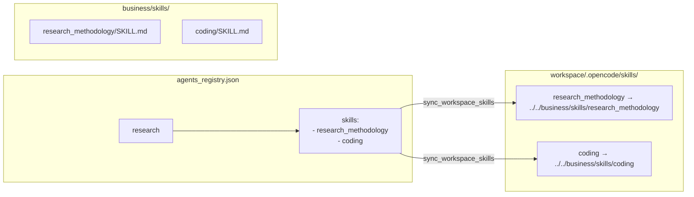

# myteam 总体设计方案

> **版本**：2026-07-04 v1  
> **定位**：工业级多 Agent AI 团队协作框架  
> **核心理念**：每个 Agent 在约定边界内高质量交付，通过 Workflow 编排协作完成任务  
> **此方案的实现 = myteam 项目的完成**

---

## 目录

1. [项目定位](#1-项目定位)
2. [核心架构](#2-核心架构)
3. [Workflow 系统](#3-workflow-系统)
4. [质量保证体系](#4-质量保证体系)
5. [Agent 执行机制](#5-agent-执行机制)
6. [记忆与知识体系](#6-记忆与知识体系)
7. [Hub 与 UI](#7-hub-与-ui)
8. [用户可配置项](#8-用户可配置项)
9. [未完成项与实现路线](#9-未完成项与实现路线)
10. [验证标准](#10-验证标准)

---

## 1. 项目定位

### 1.1 一句话定位

myteam 是一个**工业级多 Agent AI 团队协作框架**，让用户像管理一个真实团队一样，配置 Agent 角色、编排协作流程、控制交付质量。

### 1.2 两个主攻方向

| 方向 | 说明 | 成功标准 |
|------|------|---------|
| **团队协作框架** | Workflow 编排多 Agent 合作完成任务；支持私聊、群聊圆桌、自动化编排三种协作模式 | 用户能定义任意多步协作流程，Agent 间按依赖有序执行，结果稳定可复现 |
| **交付质量保证** | Agent 按约定边界产出高质量成果物；结构性质量由 Gate 机器判，内容性质量由多 Agent 评审循环兜底 | Agent 一次交付通过率 ≥ 80%，review 轮次 ≤ 2 轮 |

### 1.3 三支柱

```
┌─────────────────────────────────────────────────────┐
│                    myteam 平台                         │
│                                                       │
│  ┌──────────────┐  ┌──────────────┐  ┌──────────────┐│
│  │  Workflow     │  │  Agent 执行   │  │  质量保证     ││
│  │  系统 (核心)   │  │  机制         │  │  体系         ││
│  │              │  │              │  │              ││
│  │ • DAG 编排   │  │ • CLI 后端   │  │ • Gate 门禁  ││
│  │ • Loop 循环  │  │ • Skill 挂载 │  │ • Review 循环││
│  │ • 多Agent评审 │  │ • MCP 挂载  │  │ • Rubric 评估││
│  │ • Transition │  │ • Prompt 注入│  │ • 经验复用   ││
│  └──────────────┘  └──────────────┘  └──────────────┘│
│                                                       │
│  ┌──────────────────────────────────────────────┐     │
│  │          Hub + Web UI（管理/监控/交互）        │     │
│  └──────────────────────────────────────────────┘     │
└─────────────────────────────────────────────────────┘
```

---

## 2. 核心架构

### 2.1 分层架构

```
Layer A — 框架内核（Framework Freeze）
  ├── Process：声明式状态机，串行驱动 DAG（process.py + task_pipeline.py）
  │   ├── 单 task 生命周期：plan → execute → Gate → review(可选) → rubric(不阻塞)
  │   ├── 重试语义：gate_retries → 耗尽 → triage（retry/reassign/split/abort）
  │   └── review + rework 循环：评审不通过 → 打回重做 → 再评审（可配轮次上限）
  │
  ├── AgentPort：Interaction 投递 + 取回（agent_port.py）
  │   ├── 文件协议：.trigger（请求）/ .response（响应）
  │   ├── 两段式看门狗：soft_idle → 告警 / hard_idle → 取消+重试（可配）
  │   └── D8 恢复：断点续跑、孤儿响应回收、幂等治理
  │
  ├── Gate：确定性门禁（gate.py + registry.py）
  │   ├── 契约门禁：Pydantic 响应结构校验
  │   ├── 格式门禁：章节存在/防 stub/文件存在/must_include
  │   ├── 质量约束：注册表化 CHECK_REGISTRY，新增约束 = 注册一个函数
  │   └── 约束绑定：绑定交付模板（delivery_template.check_rules），不绑 task_type
  │
  ├── Store：SQLite 真相源（store.py）
  │   ├── 项目、任务、交互、审计记录持久化
  │   └── 可观测性 API 同源读取
  │
  └── Contracts：Pydantic 辨识联合（contracts.py）
      ├── 8 种 kind：team_config / task_plan / plan / execute / review / triage / evaluate / skill_review
      ├── Quality 自评模型：score(0..1) + known_gaps + notes（execute/review 强制）
      └── Outcome：artifact / action / code_project 三态

Layer B — 执行增强层（execution_harness）
  ├── PRE：prompt 注入（经验/L1/偏好/KB/rubric/umbrella_skill）
  ├── POST：产出沉淀（promote/lesson/quality/rubric/skill_review）
  └── 全部默认关，opt-in 开启 ── 防止空转噪音

Layer C — 适配层（adapter/）
  ├── claude/：适配 Claude Code CLI（.claude/skills/ + MCP）
  ├── opencode/：适配 opencode CLI（.opencode/skills/ + MCP）
  └── 核心隔离：adapter 是唯一知道 CLI 原始输出格式的地方；上层只消费 AgentEvent

Layer D — 记忆堆栈（memstack）
  ├── L1 Memory：短时对话记忆（mem0/native/sqlite/noop）
  ├── KB：长期知识库（sqlite/gbrain），标签 + 项目域索引
  ├── Preferences：用户偏好分节 → USER.md → inject prompt
  └── Experience：同类任务经验复用（ledger 条目）
```

### 2.2 关键数据流

```
用户创建项目：
  ┌─────────┐    ┌──────────┐    ┌──────────┐
  │ 选择     │───→│ 填写     │───→│ Process  │
  │ Workflow │    │ Goal     │    │ 启动执行  │
  └─────────┘    └──────────┘    └────┬─────┘
                                      │
  ┌───────────────────────────────────▼───────────────┐
  │ 每个 Task 的执行流水线                              │
  │                                                    │
  │  1. plan（可选：路径 A，预执行计划）                  │
  │  2. scaffold（首次：初始化交付物骨架）                │
  │  3. execute（AgentPort.run → CLI 后端执行）          │
  │  4. ↑ retry loop（最多 max_gate_retries 次）：       │
  │     Gate.check_execute → 不通过 → 结构化 feedback 重试│
  │  5. quality_status（自评判定：completed / needs_review）│
  │  6. ↑ review + rework 循环（最多 max_review_retries 次）│
  │  7. rubric 评估（不阻塞记录）                        │
  │  8. promote + lesson + quality 记录                 │
  └────────────────────────────────────────────────────┘
```

### 2.3 框架冻结原则

> 参考 `docs/FRAMEWORK-FREEZE.md`

Layer A（kernel + adapter + contracts + store）不再做功能扩展。新能力走：

| 新能力去向 | 示例 |
|-----------|------|
| `business/workflows/*.yaml` | 新的协作流程 |
| `business/skills/*/SKILL.md` | 新的 Agent 技能 |
| `business/delivery_templates/*.yaml` | 新的交付模板 |
| `business/config/` | 新的 agent/register/group 配置 |

---

## 3. Workflow 系统

**workflow 是 myteam 的协作核心**。一切团队协作——多步 DAG、多 Agent 并行评审、多轮循环修稿——通过 workflow YAML 定义驱动。

### 3.1 Workflow YAML 结构

```yaml
id: my-workflow
name: 我的协作流程
version: "1.0"
description: 流程说明

# 协作配置
options:
  review_enabled: false        # 是否启用 peer_review（各步自带的 review）
  split_enabled: false         # 是否启用运行时任务拆分
  parallel_enabled: false      # 是否启用同波次并行执行
  max_parallel: 4              # 最大并行数
  collaboration:               # 协作配置
    project_group:
      enabled: true
    notifications:
      enabled: true
    group_discussion:
      enabled: true
      profile: work-review-alignment

# 任务 DAG
tasks:
  - id: step-1                 # 唯一标识
    name: 任务名称
    agent: agent_id            # 执行 Agent
    task_type: research        # 任务类型
    template_id: research-report  # 交付模板
    reviewer: agent_id         # 可选：指定 reviewer
    dependencies: []           # 依赖的上游 step id
    description: "任务描述（{round}/{max_rounds} 等变量自动替换）"

  - id: loop-step              # 循环占位 task
    loop: my_loop              # 引用 loop 定义
    dependencies: [step-1]

# 循环定义
loops:
  - id: my_loop
    max_rounds: 3
    min_rounds: 1
    default_body: default
    on_pass: complete
    on_exhaust: needs_review

    bodies:
      default:
        - id: work
          agent_id: exec_agent
          task_type: research
          dependencies: []
        - id: review
          agent_id: reviewer
          task_type: section-review
          dependencies: [work]

    assess:
      ref: review
      inputs:
        - kind: goal
        - kind: phase.deliverable
          phase: work

    transition:
      - when: deliverable_marker
        task: review
        marker: 'REVIEW: PASS'
        action: exit
        outcome: complete
      - when: deliverable_marker
        task: review
        marker: 'REVIEW: FAIL'
        action: continue
        next_body: revise
      - when: exhausted
        action: exit
        outcome: needs_review

    fallback_until:
      - type: deliverable_marker
        task: review
        marker: 'REVIEW: PASS'
```

### 3.2 Loop 运行时

`loop_runtime.py` 是循环引擎，核心逻辑：

```
每轮：
  1. instantiate_round_body_tasks(spec, round_num, body_key)
     → 复制 body 模板为当前轮 task 列表（id = loop_id-rN-body_id）
  2. 汲取上一轮 work 交付物为初稿（seed_patch_baseline）
  3. persist_tasks + topological_order + 调度
  4. 触发 evaluate_transition()：
     - deliverable_marker：在 assess task 交付物搜索 marker 字符串
     - gate_passed：检查 task 状态
     - task_status：检查指定状态
     - exhausted：已达 max_rounds
  5. transition 结果 = exit(complete/needs_review) | continue(next_body)
  6. 未达 min_rounds 时，非 pass 的 exit 强制 continue（_apply_min_rounds_guard）
```

### 3.3 多 Agent 并行评审模式

`competitive-research-review.yaml` 是标准模式：

```
一轮 body:
  work (research) ─┬──→ review-product (product)
                    │
                    └──→ review-arch (arch)
                          ↓
                    review-summary (main)

transition 规则：
  - review-summary 含 "REVIEW: PASS" → exit(complete)
  - review-summary 含 "REVIEW: FAIL" → continue(下一轮)
  - 耗尽 → exit(needs_review)
```

**关键设计**：product + arch 两个 reviewer 同波次并行执行（dependency = [work]），墙钟时间 = 最慢的评审时间，不是两个之和。当 `parallel_enabled=true` 时，`loop_runtime` 用 ThreadPoolExecutor 并行执行 wave。

### 3.4 Workflow 校验（validate_workflow）

加载 workflow 时自动校验：
1. DAG 拓扑无环
2. 所有引用的 agent 存在于 agents_registry
3. 所有引用的 task_type 已注册
4. Agent 已配置对应 task_type 的能力绑定
5. reviewer 在名册中
6. template_id 对应 delivery_template 存在
7. Loop body id 无重复、assess.ref 在 body 内、transition 引用的 task 在 body 内

### 3.5 Workflow 的三种消费方式

| 方式 | 入口 | 场景 |
|------|------|------|
| Kernel 命令行 | `run_kernel.py --workflow <id> --goal "..."` | CLI 执行 |
| Hub API | `POST /api/projects/run { workflow, goal }` | UI 创建项目 |
| Workflow Editor | UI 中配置后保存+启动 | 配置后即运行 |

---

## 4. 质量保证体系

### 4.1 两层质量划分

```
质量 = A 类（结构性，机器判） + B 类（内容性，Agent 判）
```

| 类别 | 判断方式 | 责任方 | 特征 |
|:----:|:--------|:------|:----|
| **A 类** | 确定性机器判 | Gate | 可观测、可量化、不依赖主观判断；正则/解析/计数 |
| **B 类** | 需要领域知识 | Reviewer Agent | 推断是否合理、数据是否过时、建议是否可执行 |

**关键原则**：A 类由 Gate 拦，不进 review；B 类才用 review，review 不重复 A 类。预期 review 轮次从 3 降到 1。

### 4.2 Gate 门禁体系

#### 4.2.1 三层门禁

```
check_execute(response):
  1. check_contract(response)        ← 契约门禁：Pydantic 结构校验
  2. check_format(spec, content)     ← 格式门禁：章节/防 stub/文件/质量约束
  3. check_action_evidence(spec)     ← 证据门禁：URL/截图（仅 action 型）
  + check_code_project(spec, dir)    ← 代码项目门禁（仅 code_project 型）
```

#### 4.2.2 约束注册表（CHECK_REGISTRY）

所有质量约束注册为函数 + 元信息，新增约束不改 check_format 主流程：

```python
CHECK_REGISTRY = {
    "required_sections": (None, ConstraintMeta(...)),       # A 组：存在性
    "require_comparison_matrix": (_fn, ConstraintMeta(...)), # B 组：对比矩阵
    "source_inline_required": (_fn, ConstraintMeta(...)),    # C 组：数据可信
    "dimension_coverage": (_fn, ConstraintMeta(...)),        # D 组：维度覆盖
    ...
}
```

新增约束 = 写一个检查函数 + 注册元信息。详见 `docs/quality-constraint-design.md`。

#### 4.2.3 约束绑定方式

```
交付模板（delivery_template）← 约束写在这里
  └── check_rules:
        required_sections: [章节A, 章节B]
        stub_floor: 200
        source_inline_required: true
        dimension_coverage: [维度1, 维度2]

task_type ← 关联模板
  └── template_id: research-report（task 带 template_id 时走模板 check_rules）
  └── 无 template_id 时：走 task_type base check_rules
```

#### 4.2.4 Gate 重试与反馈

```
Gate 不通过 → 结构化 feedback：
  - 分类：format_only（纯格式）| structural（质量约束）| content
  - pattern_guidance：用已有修复模式指导 Agent 如何改
  - 重试次数 < max_gate_retries：在原有会话基础上继续修
  - 重试耗尽 → gate_exhausted → Process 触发 triage
```

### 4.3 Review 评审体系

#### 4.3.1 单步 review（task_pipeline.py）

```
execute 通过 Gate → quality_status（自评）
  → self-assessment score < quality_floor(0.6) → needs_review
  → known_gaps 非空 → needs_review

review 流程：
  1. 自动分配 reviewer（排除执行者和协调者，优先选能处理该 task_type 的）
  2. 注入：交付物 + acceptance_criteria + template 章节信息
  3. reviewer 返回 PASS / FAIL + feedback
  4. FAIL → rework：构造 rework request（含 feedback + "仅修指出的问题"）
  5. 重走 execute → Gate → review ... 最多 max_review_retries 次
  6. 耗尽 → needs_review（不阻塞，标记供下游参考）
```

#### 4.3.2 Workflow 内多 Agent 评审（loop）

```
workflow 的 loop 定义更灵活的多 Agent 评审：
  - 多个 reviewer 并行评审（product + arch → summary）
  - transition 规则控制流程（PASS → exit, FAIL → continue）
  - assess task 可注入 goal + 各 phase 交付物
  - min_rounds 确保至少 X 轮评审
  - max_rounds 防止无限循环
  - 多 body 分支（draft → revise → final）
```

#### 4.3.3 群讨论对齐（business hooks）

Work-Review FAIL 后，如果 workflow 配置了 `group_discussion.profile: work-review-alignment`：
- product + main 在群聊中定点对齐修改范围
- 产出"定点改稿清单"
- work Agent 按清单定点 PATCH，不全文重写
- 对齐完成再进入下一轮 review

### 4.4 Rubric 自动化评估

不阻塞流程，仅记录+打分。在 `_finalize_success` 中调用：
- `evaluate_task_output()` → 按维度打分
- `record_rubric_result()` → 记录到 store
- 命中红线（redlines）时记录告警
- Agent 端通过 inject_rubric_block 知晓评估标准

### 4.5 质量数据沉淀

每条 task 完成时记录：
- quality_score（Agent 自评）
- gate_passed（是否通过 Gate）
- review_result（skipped / passed / failed）
- rubric 维度评分
- lessons（gate 重试后成功的经验 → KB ledger）

---

## 5. Agent 执行机制

### 5.1 CLI 后端

Agent 通过 CLI 后端执行，目的是**吃到 CLI 本身功能升级的红利**：

| CLI 后端 | Skill 目录 | MCP 配置 | 适配器 |
|:---------|:----------|:---------|:-------|
| opencode | `workspace/.opencode/skills/` | `workspace/.opencode/mcp.json` | `adapter/opencode/` |
| claude | `workspace/.claude/skills/` | `workspace/.claude/mcp.json` | `adapter/claude/` |

Agent 的 CLI 和 skill/MCP 配置**与用户默认 CLI 隔离**，互不影响。

### 5.2 Skill 挂载机制



同步逻辑（`skill_sync.py`）：
1. 清空 workspace 中没有被 registry 包含的 skill 目录
2. 对每个配置的 skill，建立到 `business/skills/<id>/` 的目录符号链接
3. 写入 `.myteam-skills.json` manifest 记录同步结果

### 5.3 MCP 挂载机制

逻辑同 Skill：agent_registry.json 中配置允许使用的 MCP 服务器 → `sync_workspace_mcp()` 生成对应 CLI 的 mcp.json → Agent 执行时自动加载。

### 5.4 Prompt 注入体系

execute 前，prompt 按顺序注入（`inject_execute_prompt`）：

```
1. Experience hints    ← KB ledger 中同类任务经验
2. Lesson hints        ← gate 重试后成功 lessons（默认关）
3. Umbrella skill      ← task_type 对应的方法论 SKILL.md
4. Reference pointers  ← umbrella skill 的引用资产
5. L1 memory           ← 短期对话记忆中相关内容
6. Preferences         ← USER.md 中的用户偏好
7. KB top-k            ← 知识库中匹配条目
8. Rubric block        ← 质量评估标准
```

全部由 execution_harness.config 控制开关，默认只开 umbrella_skill + rubric。

### 5.5 交互协议

```
AgentPort.run(request) →
  1. 写 .trigger 文件（含 InteractionRequest JSON）
  2. Transport 投递给 CLI（opencode/claude）
  3. CLI 启动 Agent 会话，Agent 读取 .trigger 后开始任务
  4. Agent 通过 submit_result.py 本地校验 + 原子写 .response
  5. AgentPort 看门狗监控：等待事件流 / 检测超时
  6. 读到合法 .response → 返回 AgentPortResult
```

### 5.6 Agent 配置

```json
// agents_registry.json
{
  "agents": {
    "research": {
      "name": "研究员",
      "role": "specialist",
      "description": "市场调研与竞品分析",
      "backend": "opencode",
      "model": "claude-opus-4-7",
      "task_types": ["research", "custom-survey"],
      "skills": ["research_methodology", "data_analysis_methodology"],
      "mcp_servers": ["web-search", "web-fetch"]
    }
  }
}
```

---

## 6. Agent 能力生态

> **框架提供"怎么做"的机制，Skill/MCP/TaskType/Template 提供"用什么做、做成什么样"的内容。**

myteam 的能力来自两个层面：
- **框架层**（kernel + Hub）：提供编排、门禁、存储、管理能力——已相对完整
- **内容层**（skills + MCP + task_types + templates）：Agent 实际用来完成任务的工具和方法——需要持续积累

框架是发动机，内容层是燃料。发动机再好，没有燃料也跑不远。

### 6.1 Skill 体系

#### 6.1.1 Skill 是什么

Skill 是**方法论**——告诉 Agent 如何完成某类工作的步骤、规范、红线。每个 Skill 是一个目录，包含 `SKILL.md` + 可选附属文件。

```
business/skills/<skill-id>/
├── SKILL.md        ← 核心方法论
├── checklist.md    ← 可选：检查清单
└── docs/           ← 可选：参考文档
```

SKILL.md 采用固定 frontmatter + markdown 正文：

```markdown
---
name: 调研方法论
description: 多维度竞品调研的步骤、规范和质量标准
---

# research_methodology — 竞品调研方法论

## 何时启用
- 用户说"调研竞品"
- ...

## 工作流程
### Step 1: 确定调研框架
...
```

#### 6.1.2 Skill 的来源

| 来源 | 说明 | 示例 |
|:----|:-----|:-----|
| **自建** | 根据业务需求自行编写 | `research_methodology`, `data_analysis_methodology` |
| **第三方** | 社区/开源方法论，适配后使用 | 行业报告的框架 |
| **Agent 沉淀** | 项目完成后 `skill_extract` 自动提炼 | `project_review` |

**不一定要全部自建**。社区已有的方法论（产品体验报告框架、技术选型评估模型等）可以整理为 SKILL.md 格式直接使用。

#### 6.1.3 Skill 的挂载方式

三个维度控制 Skill 的可见范围：

```
全局 Skill 库               business/skills/<id>/SKILL.md
    ↓  registry 配置
Agent 可用 Skill 列表       agents_registry.json → agent.skills
    ↓  sync_workspace_skills()
Agent CLI 工作区           workspace/.opencode/skills/<id>/ → symlink
    ↓  CLI 读取
Agent 执行时自动加载        CLI 会自动读取 .opencode/skills/ 下所有 SKILL.md
```

**Agent 只加载 registry 中为它配置的 Skill**，未配置的不可见。避免了"所有 Skill 塞进上下文"的问题。

#### 6.1.4 Skill 的目录和分类

当前已有 Skill（`business/skills/` 目录），按类别分：

| 类别 | 代表 Skill |
|:----|:----------|
| **调研与分析** | `research_methodology`, `competitive-analysis-methodology`, `data_analysis_methodology` |
| **工程实现** | `backend-engineering-methodology`, `frontend-engineering-methodology`, `system-architecture-methodology` |
| **文档与规范** | `technical-writing-methodology`, `api-design-methodology`, `proposal-writing-methodology` |
| **质量与评审** | `quality-review`, `review`, `verification-before-completion` |
| **产品与设计** | `product-methodology`, `design-system-methodology`, `brainstorming` |
| **运维与流程** | `devops-cicd-methodology`, `operations-methodology`, `git-workflow-methodology` |
| **Workflow 设计** | `workflow-design`, `sop-to-workflow`, `workflow-creator` |
| **工具类** | `officecli*`（docx/pptx/xlsx/pitch-deck）, `diagram-build`, `browse` |
| **模板类** | `code-quality-methodology`, `test-driven-development`, `debugging-methodology` |

#### 6.1.5 Skill 的效果评估

| 维度 | 问题 | 判断方法 |
|:----|:-----|:---------|
| **可用性** | Agent 是否按 SKILL.md 指引执行 | 看 Agent 的 thinking trace，是否引用了 Skill 中的步骤 |
| **有效性** | 按 Skill 执行后，产出质量是否提升 | 对比有/无 Skill 时的 Gate 通过率和 review 轮次 |
| **覆盖度** | 当前 task_type 是否有对应 Skill | `task_type → umbrella_skill` 映射是否完整 |
| **冗余度** | 是否有多个 Skill 做同一件事 | 清理重复项 |

### 6.2 MCP 生态

#### 6.2.1 MCP 是什么

MCP（Model Context Protocol）是 Agent 的**工具集**——让 Agent 能与外部世界交互：

| MCP 类型 | 功能 | 来源策略 |
|:---------|:-----|:---------|
| **Web 搜索** | 获取实时信息 | 第三方（可自建或使用现有搜索 MCP） |
| **文件读写** | 读写本地/远程文件 | 内置 |
| **数据库** | 查询/写入数据库 | 第三方 |
| **API 调用** | 与外部系统交互 | 第三方 |
| **代码执行** | 沙箱运行代码 | 内置或第三方 |
| **浏览器** | 页面抓取 / E2E 测试 | 第三方（Playwright 等） |

**关键原则：不一定要自己实现**。社区已有大量高质量的 MCP 服务器（web-search, puppeteer, sqlite, github, filesystem 等），直接接入即可。

#### 6.2.2 MCP 的挂载与隔离

```
MCP 库（管理面板 CRUD）         business/config/ + UI
    ↓  registry 配置
Agent 允许的 MCP 列表            agents_registry.json → agent.mcp_servers
    ↓  sync_workspace_mcp()
Agent CLI 工作区                workspace/.opencode/mcp.json
    ↓  CLI 启动
Agent 执行时自动加载             CLI 按 mcp.json 启动对应 MCP Server
```

每个 Agent 的 MCP 配置**独立于用户默认 CLI 的 MCP 配置**，互不干扰。

#### 6.2.3 MCP 配置项

```json
{
  "mcp_servers": {
    "web-search": {
      "type": "command",
      "command": "npx",
      "args": ["@anthropic/mcp-web-search"],
      "env": {
        "API_KEY": "..."
      }
    }
  }
}
```

### 6.3 TaskType 与交付模板体系

#### 6.3.1 三元组关系

```
Workflow 节点
  ├── agent_id: research       ← 谁做
  ├── task_type: research      ← 做什么类型的工作
  └── template_id: research-report  ← 交付物长什么样
```

```
task_type           ← 定义「这是什么类型的工作」
  └── delivery_template     ← 绑定模板
        ├── deliverable_template  ← 交付物结构（章节/层级）
        ├── check_rules           ← 质量约束（Gate 机器判）
        └── acceptance_criteria   ← 验收标准（软引导，prompt）
```

**逻辑关系**：
- 一个 task_type 可以对应多个模板（竞品调研 → research-report / research-brief / research-capital）
- 一个模板可以对应多个 task_type（review-report → section-review / code-review / design-review）
- Workflow 节点选择模板 → 决定 Gate 该验什么

#### 6.3.2 当前已有的 TaskType

| TaskType | 用途 | 模板 | 状态 |
|:---------|:-----|:-----|:-----|
| `research` | 竞品调研 | `research-report` | ✅ 有 check_rules |
| `section-review` | 同行评审 | `review-report` | ✅ 有 acceptance_criteria |
| `custom-survey` | 自定义调研 | 无 | ⚠️ 基础 |
| `data-analysis` | 数据分析 | 无 | ⚠️ 基础 |
| `feature-design` | 功能设计 | 无 | ⚠️ 基础 |
| `code-deliverable` | 代码交付 | 无 | ⚠️ 基础 |

#### 6.3.3 需要持续丰富

以下 task_type 是常见的缺失项：

| TaskType | 适用场景 | 优先级 |
|:---------|:---------|:------|
| `system-design` | 系统设计/架构文档 | 高 |
| `requirement-analysis` | 需求分析文档 | 高 |
| `decision-record` | 决策记录（ADR） | 高 |
| `acceptance-report` | 验收报告 | 中 |
| `test-plan` | 测试计划 | 中 |
| `incident-report` | 事故复盘 | 中 |
| `strategy` | 策略/方案文档 | 中 |
| `creative-writing` | 创意写作 | 低 |
| `translation` | 翻译 | 低 |

**每个新 task_type 至少需要**：
- `templates.yaml` 中的定义（display_name + deliverable_template + check_rules 基础版）
- 至少一个 `delivery_template/*.yaml`（章节结构 + check_rules）
- 一个或多个 Agent 配置了对应 `task_types` 能力
- 对应的 umbrella_skill（可选，用于注入方法论指引）

### 6.4 生态建设策略

#### 6.4.1 不要自己造车轮

| 要做的 | 不要做的 |
|:-------|:---------|
| 写方法论 SKILL（Agent 怎么做某类工作） | 自己实现搜索 MCP（用现成的） |
| 写 check_rules（质量门槛） | 自己实现浏览器 MCP（用 Playwright 等） |
| 配置 and 维护 MCP 服务器列表 | 自研数据库 MCP（用社区版） |
| 编排 workflow（串联协作） | 自研代码执行沙箱（用 sandbox MCP） |

#### 6.4.2 建设路径

```
Phase 1（当前）：核心缺失补齐
  - 补齐 3-5 个高频 task_type + delivery_template（system-design, requirement-analysis, decision-record）
  - 每个新 task_type 配基础 check_rules

Phase 2：Skill 质量提升
  - 清理已有 Skill 库（去重、补齐、删无效）
  - 为每个 task_type 绑定 umbrella_skill
  - 验证 Skill 引导效果（有/无 Skill 的产出质量对比）

Phase 3：第三方集成
  - 整理可用的第三方 MCP 列表
  - 建立"第三方 MCP 接入指南"
  - 让用户可以在管理面板一键添加常见 MCP

Phase 4：内容生态
  - 鼓励用户自定义 task_type + template
  - 支持导入/导出模板
  - 收集社区 template 示例
```

---

## 7. 记忆与知识体系

### 6.1 记忆堆栈总览

```
memstack/
├── l1/              ← 短期对话记忆（L1 Memory）
│   ├── mem0/        ← external mem0 后端
│   ├── native/      ← 原生实现
│   ├── sqlite/      ← SQLite 后端
│   └── noop/        ← 空操作（关闭）
│
├── kb/              ← 长期知识库（Knowledge Base）
│   ├── sqlite       ← SQLite 实现（当前默认）
│   └── gbrain       ← gbrain 实现
│
├── preferences/     ← 用户偏好库
│   ├── static/      ← 静态 MD 文件（USER.md）
│   ├── sectioned/   ← 分节存储
│   └── user_store/  ← 每个用户独立存储
│
└── orchestration/   ← 编排层
    ├── experience   ← 同类任务经验检索注入
    └── context      ← 各场景上下文定义
```

### 6.2 记忆注入钩子

| 钩子 | 触发时机 | 读取源 | 写入源 |
|:----|:--------|:-------|:-------|
| H1 on_chat_turn | 私聊/群聊每轮 | L1 memory + Preferences | 对话完成后自动存 |
| H2 on_task_success | execute 成功 | — | promote + lesson + rubric |
| H3 inject_for_execute | execute 前 | KB + L1 + Preferences + Experience | — |
| H4 on_project_complete | 项目完成 | — | 项目复盘 → KB |
| H5 on_consensus | 圆桌共识通过 | — | 最佳实践 → KB |

### 6.3 用户-Agent 共享知识库（目标设计）

**现状问题**：KB 只有 Agent 端写入口（任务完成自动沉淀），用户无法把自己的经验/信息写入 KB 并让 Agent 共享。

**目标方案**：

```
┌─────────────────────────────────────────────────────────────┐
│                  共享知识库（LLM Wiki 风格）                    │
│                                                               │
│  写入入口                                 读取注入              │
│  ┌──────────┐  ┌──────────┐              ┌───────────────┐   │
│  │ 管理面板  │  │ 私聊/群聊 │              │ execute 前    │   │
│  │ KB 页面   │  │ Agent    │              │ inject        │   │
│  │ (已有)    │  │ 沉淀      │──→  KB  ───→│ fetch_kb_     │   │
│  │          │  │          │   sqlite  │  │ entries()     │   │
│  │ Plan:    │  │ 用户直接  │  或      │  │               │   │
│  │ 加"我的   │  │ 对 Agent  │  gbrain  │  │ 标签搜索注入   │   │
│  │ 知识库"  │  │ 说"记住"  │          │  │               │   │
│  └──────────┘  └──────────┘              └───────────────┘   │
│                                                               │
│  KB 条目结构：                                                │
│  - title: 知识标题                                            │
│  - content: 知识正文                                          │
│  - tags: [类别标签]（用于搜索命中）                             │
│  - project_id: 所属项目（""=全局，对所有人可见）               │
│  - source: "user" | "agent" | "auto"                         │
│  - created_by: 创建者（用户ID 或 Agent ID）                    │
│                                                               │
└─────────────────────────────────────────────────────────────┘
```

**实现要点**：
1. **用户写入**：管理面板 KB 页面加"我的知识库"类型，用户可以自由写 title + content + tags，不绑定项目
2. **Agent 写入**：保留现有自动沉淀（`on_task_complete` + `on_project_complete`）
3. **私聊沉淀**：用户在私聊中说"记住这个" → 自动将对话上下文存入 KB
4. **读取注入**：`fetch_kb_entries()` 扩展为搜索所有 `source` 类型的条目
5. **标签机制**：用户的 KB 条目用 `user_kb` 标签，Agent 执行时根据 task_type 匹配对应标签

### 6.4 偏好库（当前形态与改进方向）

**当前形态**：
- 管理面板 `PreferencesPanel` → 分节编辑 → 聚合为 `USER.md`
- `fetch_preferences("default", agent_id)` → 注入到 execute prompt
- 团队级别，不按用户区分

**改进方向**：
- 支持多用户各自的偏好
- 支持偏好按 Agent 维度分（"对 research Agent 我希望它…"）
- 偏好库和知识库打通，用户偏好自动作为 KB 标签注入

---

## 8. Hub 与 UI

### 8.1 API 路由

| 路由组 | 功能 | 对应前端 |
|:------|:-----|:---------|
| `/api/chat/{agent_id}` | 私聊 Agent（SSE 流） | ChatSection |
| `/api/groups/*` | 群聊管理 | GroupsSection |
| `/api/projects/*` | 项目管理（CRUD + 启动 + 跟踪） | ProjectsSection |
| `/api/workflows/*` | Workflow CRUD | WorkflowsSection |
| `/api/agents/*` | Agent 管理 | manage/AgentsPanel |
| `/api/task-types/*` | TaskType CRUD | manage/TaskTypesPanel |
| `/api/delivery-templates/*` | 交付模板 CRUD + 约束全集 | manage/TemplatesPanel |
| `/api/delivery-profiles/*` | 交付配置管理 | manage/DeliveryProfilesPanel |
| `/api/skills/*` | Skill 库管理（目录/分类/导入/审批） | SkillsSection |
| `/api/mcp/*` | MCP 服务器管理 | McpSection |
| `/api/memory/*` | 知识库条目 CRUD | manage/KnowledgePanel |
| `/api/preferences/*` | 偏好库管理 | manage/PreferencesPanel |
| `/api/prompt-templates/*` | Prompt 模板管理 | manage/PromptTemplatesPanel |
| `/api/config/*` | 系统/Skill/Backend 配置 | SettingsSection |
| `/api/observability/*` | 可观测性（事件/审计/用量） | — |
| `/api/obs/*` | 过程事件 SSE | — |

### 8.2 前端主要功能页

| 页面 | 路径 | 核心功能 |
|:----|:----|:---------|
| 私聊 | `/chat/:agentId` | 与单个 Agent 对话 |
| 群聊 | `/groups/:groupId` | 群组聊天 + 圆桌讨论 |
| 项目 | `/projects/` | 创建/查看/跟踪项目 |
| Workflow 编辑器 | `/workflows/:id` | 可视化编排 DAG + loops + 配置 |
| 管理-Agent | `/manage/agents` | Agent 配置/模型/Skill/MCP 绑定 |
| 管理-TaskType | `/manage/task-types` | 任务类型 + 交付模板编辑 |
| 管理-Prompt 模板 | `/manage/prompt-templates` | 按 task_type/kind 的 prompt 模板 |
| 管理-偏好 | `/manage/preferences` | 用户偏好分节编辑 |
| 管理-知识库 | `/manage/knowledge` | KB 条目 CRUD |
| Skills 库 | `/skills/` | 全部 Skill 目录浏览/管理 |
| MCP 库 | `/mcp/` | MCP 服务器管理 |

---

## 9. 用户可配置项

| 配置项 | 位置 | 说明 |
|:------|:-----|:------|
| Agent | `agents_registry.json` + 管理 UI | 名称、角色、CLI 后端、模型、task_types、skills、mcp_servers |
| TaskType | `templates.yaml` + 管理 UI | 名称、交付模板、check_rules、acception_criteria |
| 交付模板 | `delivery_templates/*.yaml` + 管理 UI | 章节结构、check_rules、acceptance_criteria |
| Workflow | `workflows/*.yaml` + WorkflowEditor | DAG、loops、options、collaboration |
| Delivery Profile | `config/` + 管理 UI | 过程产物检查规格 |
| Prompt 模板 | `prompt_templates.yaml` + 管理 UI | 按 kind + task_type 的 prompt |
| Skill 挂载 | 管理 UI | 每个 Agent 可用的 Skill |
| MCP 挂载 | 管理 UI | 每个 Agent 可用的 MCP 服务器 |
| 偏好 | UI PreferencesPanel | 用户偏好分节 → USER.md |
| 知识库 | UI KnowledgePanel | KB 条目 CRUD |
| 系统配置 | `system_config.json` | 端口、默认后端、模型列表 |

---

## 10. 未完成项与实现路线

### 10.1 当前已实现的功能

- [x] Process 内核（DAG 驱动 + state machine + retry/triage）
- [x] Gate 三层门禁（contract + format + evidence）
- [x] Registry + FormatSpec（约束收敛 + 模板覆盖）
- [x] Workflow 系统（加载、校验、实例化）
- [x] Loop 运行时（多轮循环 + transition + assess）
- [x] 多 Agent 并行评审模式（competitive-research-review.yaml）
- [x] AgentPort + Transport（opencode + claude 双后端）
- [x] Skill 挂载（opencode .opencode/skills/ + claude .claude/skills/）
- [x] MCP 挂载
- [x] Hub API（全部路由已实现）
- [x] 后端管理 UI（Agent/TaskType/Template/Prompt/Skill/MCP）
- [x] 私聊 Agent
- [x] 群聊 + 圆桌讨论 + 共识沉淀
- [x] L1 记忆（多后端）
- [x] 知识库（sqlite + gbrain）
- [x] 偏好库（分节 + USER.md）
- [x] 经验复用（KB ledger → execute inject）
- [x] Prompt 注入体系
- [x] Rubric 自动化评估
- [x] 群讨论对齐（work-review-alignment）
- [x] 断点续跑（D8 恢复）
- [x] Budget 控制（降级 + 硬停）
- [x] 审计日志 + 可观测性

### 10.2 待完成项

#### P0 — 核心质量链路验证

- [ ] **workflow-creator SKILL.md 修复**：清理头部 106 行污染内容
- [ ] **Gate + review 链路的端到端验证**：跑一遍 sop-to-workflow → workflow-creator → 启动 workflow → Gate 拦截 → review 兜底 → 完成
- [ ] **review+rework 循环中 Agent 是否真的做到了"定点修改不重写"**：验证 review feedback → rework → 评审通过的全流程

#### P1 — 共享知识库

- [ ] **用户 KB 写入入口**：管理面板 KB 页面加"我的知识库"类型，支持自由写 title + content + tags
- [ ] **Agent 端写入**：私聊中说"记住这个" → 对话自动存 KB
- [ ] **KB 读取注入增强**：`fetch_kb_entries()` 扩展搜索范围，用户 KB 条目按标签匹配注入
- [ ] **KB 条目 source/created_by 字段**：区分"用户手动写" vs "Agent 自动沉淀" vs "系统复盘"

#### P2 — 偏好库增强

- [ ] **多用户偏好**：支持按用户 ID 存偏好，而非全局 "default"
- [ ] **偏好按 Agent 维度分离**："对 research Agent 我希望……"
- [ ] **偏好/KB 打通**：用户偏好自动转为 KB 标签条目

#### P3 — 质量约束完善

- [ ] **确定 Gate 通用约束全集边界**：哪些是框架层通用约束（A 组），哪些是模板层业务约束（B/C/D 组）
- [ ] **约束配置前端的所见即所验**：已实现注册表化 + 前端 CheckRulesEditor，但需要验证 UI 配置的确对应 Gate 真验
- [ ] **更多 task_type 的 template 和 check_rules 填充**

#### P4 — 工具链

- [ ] **workflow-creator 自动验证脚本**：Agent 生成 workflow 后，自动跑 `validate_workflow()` 检查，通过后再写入
- [ ] **workflow 创建时自动配置缺失的 task_type 和 agent 绑定**
- [ ] **sop-to-workflow → workflow-creator 端到端自动化规程**

#### P5 — Agent 能力生态建设

- [ ] **补齐高频 task_type + delivery_template**：`system-design`, `requirement-analysis`, `decision-record` 等 3-5 个
- [ ] **每个新 task_type 配基础 check_rules 和 umbrella_skill**
- [ ] **清理已有 Skill 库**：去重、补齐元信息、删除无效（注：当前 66 个 skill 里 57 个未被 task_type_skills 映射）
- [ ] **建立"第三方 MCP 接入指南"**
- [ ] **整理可用的第三方 MCP 列表**（搜索/浏览器/数据库/代码执行等）
- [ ] **Skill 效果评估**：对比有/无 Skill 时 Gate 通过率和 review 轮次的变化

---

## 11. 验证标准

### 11.1 单 Agent 质量达标

```
competitive-research workflow（无 review loop）：
- Agent 一次产出，Gate 拦截率 = 0（即一次通过 Gate）
- 不依赖 review loop 即达标
- 单次跑 < 30 分钟

competitive-research-review workflow（有 review loop）：
- 首轮 review 通过率 ≥ 80%
- 不超过 2 轮 review 即通过
- review 不重复 A 类问题（Gate 已拦的不再报）
```

### 10.2 Workflow 创建能力达标

```
sop-to-workflow → workflow-creator 端到端：
- Agent 能引导用户描述 SOP（≤ 5 轮对话）
- Agent 能生成格式正确的 Agentic Workflow YAML
- workflow-creator 能读取并生成完整的 myteam 配置
- 生成的 workflow 能通过 validate_workflow() 校验
- 创建的 workflow 能成功启动并完成执行
```

### 10.3 共享知识库达标

```
用户写 → Agent 读：
- 用户在管理面板写 KB 条目（title + content + tags）
- Agent 执行相关 task_type 时自动注入
- 用户在私聊中说"记住这个" → 自动沉淀到 KB
- 用户写的 KB 条目有明确的来源标记（user vs agent）
```

### 10.4 总体

```
- 所有 P0 待完成项已关闭
- 可创建任意自定义 workflow（通过 UI 或 Agent 生成均可）
- Agent 产出质量可控（Gate + review 双保险）
- 用户积累的知识能被 Agent 复用
```

---

> **此方案的实现 = myteam 项目的完成。**
> 
> 当前已实现的底座功能（kernel + Hub + workflow + loop + review + Gate + memory stack）覆盖了方案约 70% 的内容。剩余 30% 分为两类：
> 
> **框架能力（约 15%）**：
> 1. 质量链路验证和修复（P0）
> 2. 共享知识库（P1）
> 3. 偏好库增强（P2）
> 4. 质量约束完善（P3）
> 5. 工具链自动化（P4）
> 
> **内容生态（约 15%）**：
> 6. Skill/MCP/TaskType/Template 持续丰富（P5）
> 
> 框架能力是"把已经建好的东西验证通"，内容生态是"不断积累有价值的内容填充框架"——前者不可跳过，后者没有终点。