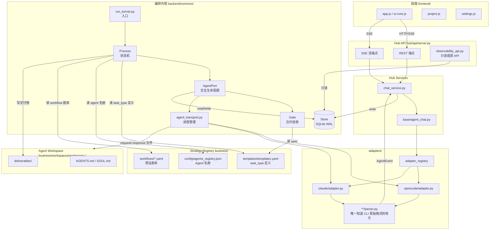
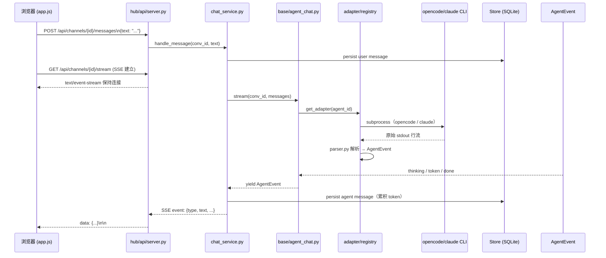
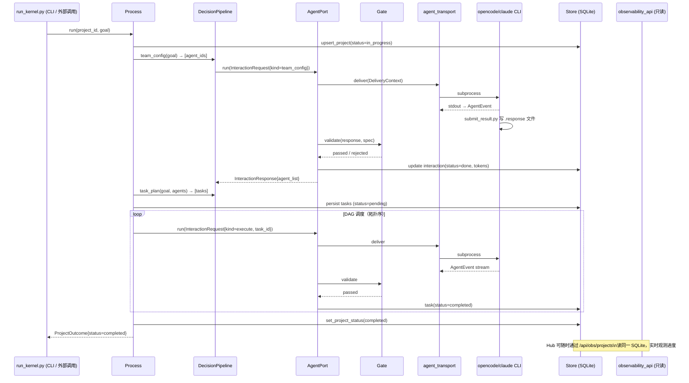

# myteam 平台架构与目标

> 版本：2026-06-09 · 分支：upgrade/continued

---

## 1. 系统目标

以下目标均可通过回归测试或可观测 API 验证：

1. **多 Agent 协作完成结构化目标**：给定一个自然语言 `goal`，平台能将其分解为有向无环图（DAG）任务列表，分派给各专职 Agent 顺序或并行执行，最终交付 `status=completed` 的项目结果。
2. **CLI 后端可插拔、无 UI 侵入**：新增一个 CLI 后端（如 opencode → claude）只需在 `adapters/<cli>/` 下新增适配器和 parser，Hub 前端与内核代码零改动。
3. **合约驱动的可靠执行**：Agent 所有 I/O 均经 Pydantic 模型（`InteractionRequest` / `InteractionResponse`）严格校验，Gate 验收未通过时拒绝（不修复），Process 自动重试并触发 triage，保证任务结果的完整性与可审计性。
4. **幂等断点续跑**：内核崩溃或超 token budget 暂停后，调用 `Process.resume()` 即可从中断处继续，孤儿 interaction 自动回收，已完成任务不重跑。
5. **统一可观测性**：所有内核运行产生的事件（token 消耗、任务状态变更、Gate 判定详情）均实时写入同一 SQLite 文件，Hub 的 `/api/obs/...` 端点以只读方式读同一 DB，Cursor 侧 Agent 与内核共享数据真相源，无需额外消息总线。

---

## 2. 分层架构

三层结构严格隔离，跨层的唯一合法入口是定义明确的数据契约。

| 层 | 代码位置 | 职责 |
|---|---|---|
| **System Kernel** | `backend/common/`、`backend/adapter/`、`hub/api/observability_api.py` | Process 状态机、AgentPort 生命周期、Gate 验收、Store 持久化、contracts 定义、可观测性 API |
| **Strategy Registry** | `business/templates/templates.yaml`、`business/config/agents_registry.json`、`business/rules/`、`business/workflows/*.yaml` | task_type 定义与验收标准、Agent 名册与角色分工、预设 workflow 剧本 |
| **Skill Pack** | `business/skills/*/SKILL.md`、agent workspace `AGENTS.md`/`SOUL.md` | 每个 Agent 如何完成某种具体任务（提示工程、工具调用策略、输出风格） |

**决策规则**：失败会污染系统状态 → System Kernel；改变任务类型/角色选择/验收标准 → Strategy Registry；只影响单任务产出质量 → Skill Pack。新增 task_type 必须先写入 `templates.yaml`，仅凭 Skill 无法让 Process 识别。

---

## 3. Mermaid 架构图

---

## 4. 两条正交流

### 4.1 Chat 流（人 ↔ Agent，实时流式）

### 4.2 编排流（目标 → 任务 DAG，批处理）

---

## 5. 数据真相源（state.db）

所有运行时状态集中存储于 `business/tasks/state.db`（SQLite WAL 模式）。内核与 Hub 共读，无中间层。

| 表 | 主键 | 存储内容 |
|---|---|---|
| `project` | `project_id` | 项目元数据：标题、模式（one_shot/recurring）、状态（pending/in_progress/completed/paused）、goal、token_budget |
| `task` | `(project_id, task_id)` | 任务名称、所属 agent、task_type、状态（pending/in_progress/completed/failed）、依赖列表、父子关系 |
| `interaction` | `interaction_id` | 每次 Agent 调用记录：kind、agent_id、backend、状态、重试次数、token 消耗、`.response` 文件引用 |
| `run_event` | `id (auto)` | 细粒度审计流水：request_snapshot、watchdog 心跳、Gate 判定详情、budget 超额告警，按 `interaction_id` + `seq` 检索 |
| `memory` | `id (auto)` | 项目内跨任务知识片段：标签、标题、内容，供后续任务 RAG 引用 |
| `conversation` | `conversation_id` | Chat 会话元数据：类型（dm/group/project）、参与者、摘要指针 |
| `message` | `id (auto)` | 聊天消息：角色、作者、文本、parts（含 tool_use/tool_result）、token 计数，带 FTS5 全文索引 |
| `workspace_event` | `id (uuid)` | 跨 Agent 事件总线：type/source/target/payload/visibility，用于 Agent 间协作通知 |
| `agent_runtime` | `agent_id` | Agent 运行时状态：在线/离线、当前任务、backend、workspace_ok 标志 |
| `job` | `job_id` | 后台异步 Job 记录：pid、状态、取消请求标志 |

> **不在 DB 里的内容**：Agent 与内核通过文件系统交换请求/响应（`.request` / `.response`，按 `interaction_id` 命名），写入 DB 前做本地原子校验。文件是传输缓存，DB 是权威真相。

---

## 6. 当前态 vs 目标态

### 已闭合（L1/L2）

- **L1 Chat 流**：DM / Group / Project 三种会话模式均已实现，SSE 流式推送稳定，前端 `app.js` 已模块化分离（`ui-core.js`、`project.js`、`settings.js`）。
- **L1 编排内核**：`run_kernel.py` → `Process` → `AgentPort` → `Gate` → `Store` 全链路可运行；`team_config` / `task_plan` / `execute` / `review` / `triage` 五种 kind 全部落地，Gate 合约校验覆盖。
- **L2 断点续跑**：`Process.resume()` 已实现孤儿 interaction 回收与卡住任务重置，REG-05 budget 超额暂停→续跑回归通过。
- **L2 多 backend 切换**：opencode adapter 与 claude adapter 均已接入，`--backend` 参数与 `agents_config.json` 的 per-agent 配置均生效。
- **L2 Workflow 剧本**：`business/workflows/` 下已有 6 条预设 workflow（software-delivery、content-campaign、hotfix、reg-l2-3role、reg-parallel-4leaf、self-upgrade），Process 从 YAML 加载任务图。

### Scaffold 阶段（L3）

- **L3 动态 Agent 注册**：`team_config` 阶段可自动向 `agents_registry.json` 注册新 Agent，但 workspace 初始化（`AGENTS.md`/`SOUL.md` 模板填充）尚未自动化，需人工补全质量内容。
- **L3 PlanExpander**：`split_enabled` 路径可将粗粒度任务拆分为子任务（parent_id 关联），但拆分策略依赖 Main agent 的 task_plan 质量，尚无独立单元测试覆盖边界场景。
- **L3 memory RAG**：`Store.memory` 表已落地，任务完成后可写入知识片段，但检索注入到下游 Agent prompt 的管道尚未闭合（目前只写不读）。
- **L3 workspace_event 总线**：表结构与写入路径就绪，但订阅侧（Agent 间事件驱动协作）尚无消费者实现。
- **L3 可观测 UI**：`/api/obs/` 端点已实现，但前端观测面板（任务 DAG 可视化、token 趋势图）尚处于原型阶段，缺乏交互细节。

### 未动（档C）

- **前端设计系统**：UI 已功能可用，但缺乏统一 Design Token、组件库规范和响应式断点体系，视觉一致性依赖手写 CSS。
- **Auth / 多租户**：Hub 目前绑定 `0.0.0.0` 无鉴权，无用户账户、权限隔离或 API Key 管理。
- **分布式调度**：内核当前为单进程串行调度，并行 DAG 分支在同一进程内线程化，无跨机器 Worker 池或任务队列（Celery/Ray 等）。
- **Agent Skill 自动评测**：`business/regression/` 目录已建立，但端到端 Skill 质量评分（ROUGE / LLM-judge）尚无自动 CI 集成。
- **文档体系**：`docs/0607/` 和 `docs/0608/` 下有大量历史分析文档，但面向新成员的「快速上手」、API Reference 和架构 ADR 尚需从头整理。
