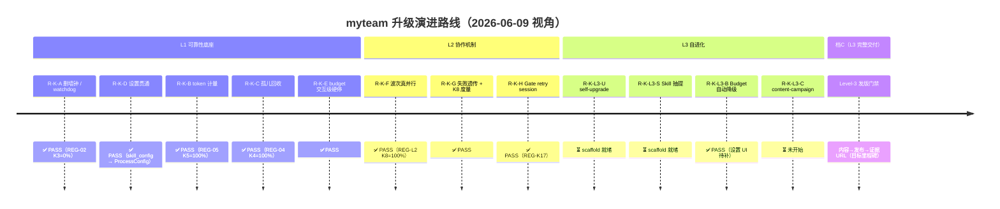
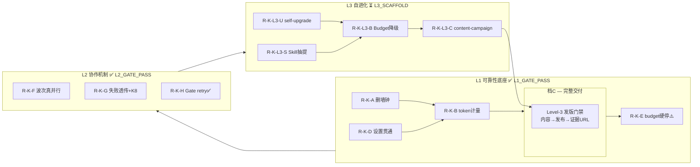

# 03 — 需求·实现映射与演进

**日期**：2026-06-09  
**状态**：L1_GATE_PASS ✅ | L2_GATE_PASS ✅ | L3_SCAFFOLD ⏳  
**用途**：供工程实施时快速定位需求 ID ↔ 代码锚点；单需求实现时使用下方模板。

---

## 一、需求 ID 体系说明

本项目采用 `R-K-<字母>` 命名需求，字母段对应 Sprint/阶段：

| 前缀 | 对应阶段 | 说明 |
|------|---------|------|
| `R-K-A` | L1 可靠性底座 | 超时/watchdog/删墙钟 |
| `R-K-B` | L1 可靠性底座 | token 计量修复 |
| `R-K-C` | L1 可靠性底座 | 孤儿交付物回收 |
| `R-K-D` | L1 可靠性底座 | 设置贯通（skill_config → 内核） |
| `R-K-E` | L1 可靠性底座 | budget 交互级硬停（L1 尾项） |
| `R-K-F` | L2 协作机制 | 波次真并行 + Store 并发加固 |
| `R-K-G` | L2 协作机制 | 失败原因透传 + K8 度量 |
| `R-K-H` | L2 协作机制 | Gate retry session（尾项） |
| `R-K-L3-S` | L3 自进化 | Skill 抽提/回读 scaffold |
| `R-K-L3-U` | L3 自进化 | self-upgrade workflow |
| `R-K-L3-B` | L3 自进化 | Budget 自动降级（接线） |
| `R-K-L3-C` | L3 自进化 | Level-3 content-campaign 发版门禁 |

> 历史文档使用 `S1–S6`（Sprint 0 步骤）、`P0-A/B/C/D`（P0 子任务）。本表为统一 ID；下节给出完整映射。

---

## 二、当前代码锚点表

### L1 已完成需求

| 需求 ID | 旧 ID | 需求摘要 | KPI | 主要文件路径 | 状态 |
|---------|-------|---------|-----|------------|------|
| **R-K-A** | P0-A / S5 | 删 adapter 墙钟，改用 idle watchdog | K3 < 5% | `backend/adapters/claude/adapter.py`<br>`backend/adapters/opencode/adapter.py`<br>`backend/common/agent_port.py`（`WatchdogConfig`） | ✅ PASS |
| **R-K-B** | P0-C2 | token 计量修复（`_extract_tokens` 回退 + grace 排空） | K5 = 100% | `backend/common/agent_port.py`（`_extract_tokens`, `reconcile_on_start`）<br>`backend/common/agent_transport.py`<br>`backend/common/tests/test_agent_port.py` | ✅ REG-05 PASS |
| **R-K-C** | P0-D | 孤儿交付物回收（reconcile → Gate → settle） | K4 ≥ 95% | `backend/common/agent_port.py`（`reconcile_on_start`）<br>`backend/common/task_pipeline.py`（`settle_in_progress_task`）<br>`backend/common/workspace_gc.py`（`gc_orphan_workspace_files`）<br>`backend/common/run_kernel.py`（`resume_project` gc 顺序） | ✅ REG-04 PASS |
| **R-K-D** | P0-B / S2 | 设置贯通（skill_config.process_defaults → ProcessConfig / WatchdogConfig） | 日志可见 WatchdogConfig | `backend/common/kernel_config.py`（`kernel_configs_for_run`, `process_from_defaults`）<br>`backend/common/skill_settings.py`（`process_defaults`, `reload_skill_settings`）<br>`backend/hub/api/server.py`（`update_skill_config_api`）<br>`backend/store/skill_config.py`<br>`frontend/settings.js`, `frontend/index.html` | ✅ PASS |
| **R-K-E** | R-K5 | budget 交互级硬停（`task_pipeline` 遇 `budget_exceeded` 抛 `BudgetExceededError`） | 交互中 pause | `backend/common/task_pipeline.py`<br>`backend/common/agent_port.py`（`budget_checker`）<br>`backend/common/process.py`（`run`/`resume` catch）<br>`backend/common/tests/test_observability.py::test_execute_budget_exceeded_pauses_mid_interaction` | ✅ PASS |

### L2 已完成需求

| 需求 ID | 旧 ID | 需求摘要 | KPI | 主要文件路径 | 状态 |
|---------|-------|---------|-----|------------|------|
| **R-K-F** | L2-P1 | 波次真并行 + Store WAL 并发加固 | K8 ≥ 0.8 | `backend/common/dag_dispatch.py`（`DagDispatcher`）<br>`backend/common/process.py`（`_dispatch` 并行波次）<br>`backend/common/store.py`（WAL busy_timeout）<br>`backend/common/process_types.py`（`parallel_enabled`, `max_parallel`）<br>`backend/common/tests/test_dag_dispatch.py`<br>`backend/common/tests/test_store_concurrency.py` | ✅ REG-L2 PASS |
| **R-K-G** | L2-P2 | 失败原因透传（`fail_reason` meta）+ K8 度量接入 | K8 采集 | `backend/common/agent_port.py`（fail_reason 写 meta）<br>`backend/common/observability.py`（`BudgetConfig`）<br>`backend/common/tests/test_r2_features.py`<br>`scripts/regression/check_kpis.py` | ✅ PASS |
| **R-K-H** | R-K17 | Gate retry session（格式重试续聊，可观测） | K2 ≥ 70%（REG-K2） | `backend/common/agent_transport.py`（`resolve_gate_retry_session` + `gate_retry_session` emit）<br>`backend/common/task_pipeline.py`（`gate_failed.session_id`）<br>`scripts/regression/reg_k17_gate_retry.py`<br>`docs/new/impl/R-K17/IMPL.md` | ✅ PASS |
| **R-K-I** | R-K14 | 任务级 per-agent backend 路由 | — | `backend/common/agent_transport.py`（`_backend_for`, `_adapter_obj`）<br>`backend/base/agent_chat.py`（`agents_config.json`）<br>`scripts/regression/reg_k14_per_agent_backend.py`<br>`docs/new/impl/R-K14/IMPL.md` | ✅ PASS |
| **R-K16** | R-K16 | 外部 recurring 触发入口（cron/webhook bridge） | recurring tick 可由外部触发 | `backend/common/recurring_trigger.py`（payload/CLI → `run_project(mode="recurring")`）<br>`backend/common/tests/test_recurring_trigger.py`<br>`scripts/regression/reg_k16_recurring_trigger.py`<br>`docs/new/impl/R-K16/IMPL.md` | ✅ PASS |
| **R-O8** | R-O8 | 结构化审计日志（request/response hash + 篡改检测） | 审计快照可校验 | `backend/common/audit_log.py`（`hash_json`, `audit_snapshot`, `verify_audit_snapshot`）<br>`backend/common/agent_port.py`（request/response snapshot）<br>`scripts/regression/reg_o8_audit_log.py`<br>`docs/new/impl/R-O8/IMPL.md` | ✅ PASS |
| **R-C9** | R-C9 | Skill Config API（读写 + 热重载） | 配置无需重启生效 | `backend/hub/api/server.py`（`/api/skill-config`, `/api/skill_config`）<br>`backend/common/tests/test_skill_config_api.py`<br>`scripts/regression/reg_c9_skill_config_api.py`<br>`docs/new/impl/R-C9/IMPL.md` | ✅ PASS |

### L3 scaffold（运行时未接线）

| 需求 ID | 需求摘要 | 主要文件路径 | 状态 |
|---------|---------|------------|------|
| **R-K-L3-S** | Skill 抽提/回读 | `backend/common/skill_extract.py`（`extract_skill_draft`）<br>`backend/common/process.py`（项目 completed 后 `_maybe_extract_skills`）<br>`backend/common/tests/test_skill_extract.py`<br>`scripts/regression/reg_l3_skill_extract.py`<br>`business/skills/auto-*` | ✅ PASS |
| **R-K-L3-U** | self-upgrade workflow | `business/workflows/self-upgrade.yaml`<br>`scripts/regression/reg_l3_self_upgrade.py` | ⏳ scaffold |
| **R-K-L3-B** | R-K6 | Budget 自动降级 | `backend/common/process.py`（`_maybe_degrade_budget`）<br>`frontend/settings.js`（`budget_degrade_*`）<br>`scripts/regression/reg_b_budget_degrade.py` | ✅ PASS |
| **R-K-L3-C** | Level-3 content-campaign 发版门禁 | `business/workflows/content-campaign.yaml`<br>`scripts/regression/reg_l3_content_campaign.py`（**未建**） | ⏳ 未开始 |

### 关键辅助路径（非需求专属，跨需求共用）

| 模块 | 路径 | 角色 |
|------|------|------|
| Gate / Registry | `backend/common/gate.py`<br>`backend/common/registry.py`<br>`business/templates/templates.yaml` | 所有 task 输出验收；task_type 约束定义 |
| Store | `backend/common/store.py` | 状态持久化；并发 WAL 加固（R-K-F） |
| Observability API | `backend/hub/api/observability_api.py`<br>`backend/common/audit_log.py` | 只读查询；Budget 告警；结构化审计快照 |
| Hub Server | `backend/hub/api/server.py` | 前端 ↔ 内核桥梁；skill-config API（短横线/下划线双路由） |
| contracts | `backend/common/contracts.py` | Interaction 契约（InteractionRequest/Response）|
| run_kernel | `backend/common/run_kernel.py` | `run_project`, `resume_project` 入口 |

---

## 三、Mermaid 演进路线图



> 若渲染器不支持 `timeline`，可替换为以下 flowchart：



---

## 四、单需求实现文档模板

> 每次只改一项需求时，复制本模板，填写各节，存入 `docs/new/impl-<需求ID>-YYYYMMDD.md`。

```markdown
# 实现说明：<需求 ID> — <需求标题>

**日期**：YYYY-MM-DD  
**需求 ID**：R-K-X  
**KPI**：KX 目标值  
**状态**：WIP | DONE | BLOCKED  

---

## 背景

<!-- 一段话：为什么做这个，当前痛点是什么。引用 docs/0608/ 相关文档。 -->

## 验收标准

| 项 | 阈值 | 说明 |
|----|------|------|
| pytest | 全绿 | `PYTHONPATH=backend venv/bin/python3 -m pytest <相关测试文件> -q` |
| REG | PASS | `scripts/regression/reg_XX_*.py` |
| KPI | KX ≥ Y% | 采集方式 |

## 改动文件

| 文件 | 变更摘要 |
|------|---------|
| `backend/common/xxx.py` | ... |

## 测试

```bash
# 单元测试
PYTHONPATH=backend venv/bin/python3 -m pytest backend/common/tests/test_xxx.py -q

# REG（若适用）
export MYTEAM_ROOT=$PWD PYTHONPATH=$PWD/backend NO_PROXY="localhost,127.0.0.1,::1"
venv/bin/python3 scripts/regression/reg_XX_xxx.py
```

## REG 证据

<!-- 粘贴 reg 脚本关键输出行（KPI 值 + PASS/FAIL） -->

## 回滚方式

<!-- git revert 或手工恢复步骤；影响范围说明。 -->
```

---

## 五、已完成需求实现说明示范

### R-K-D — 设置贯通（skill_config.process_defaults → 内核）

**背景**

Sprint 0（旧 S2/P0-B）发现：前端「设置」Tab 写入的 `skill_config.json` 中的
`process_defaults`（如 `max_gate_retries`、`soft_idle_sec`）未传入内核，每次
`run_kernel` 仍使用硬编码默认值，导致用户在 UI 修改参数无效。

**验收标准**

| 项 | 阈值 |
|----|------|
| `test_kernel_configs_for_run_unified` | pass |
| `test_resume_project_uses_kernel_configs_watchdog` | pass |
| `test_skill_settings_process_defaults_empty` | pass |
| Hub PUT `/api/skill-config` 后新项目 ProcessConfig 含更新值 | 可通过日志验证 |

**改动文件**

| 文件 | 变更摘要 |
|------|---------|
| `backend/common/kernel_config.py` | 新增 `kernel_configs_for_run` / `process_from_defaults` / `watchdog_from_defaults`；从 `process_defaults()` 读取所有字段 |
| `backend/common/skill_settings.py` | `process_defaults()` 从 `skill_config.json` 的 `process_defaults` 节读取；`reload_skill_settings()` 清 lru_cache |
| `backend/hub/api/server.py` | `update_skill_config_api` 写完后调 `reload_skill_settings()` 使缓存失效 |
| `backend/common/run_kernel.py` | `run_project` / `resume_project` 均改用 `kernel_configs_for_run`，保证 Hub 与 CLI 配置同源 |
| `frontend/settings.js`, `frontend/index.html` | 设置 Tab UI 增加 `max_gate_retries`、`soft_idle_sec`、`hard_idle_sec` 输入项，PUT 到 `/api/skill-config` |

**测试**

```bash
PYTHONPATH=backend venv/bin/python3 -m pytest \
  backend/common/tests/test_kernel_config.py -q
# 预期：7 passed
```

**REG 证据**

此需求无独立 REG 脚本；通过 REG-02（K1=100%）间接验证参数传入正常。
日志中可见 `WatchdogConfig(soft_idle_sec=120.0, hard_idle_sec=300.0)` 字样。

**回滚方式**

回退 `kernel_config.py` 前将 `run_project` / `resume_project` 中
`kernel_configs_for_run` 调用换回原 `ProcessConfig()` 默认构造即可；
`skill_settings.py` 与前端无副作用，可保留。

---

### R-K-B — budget 硬停（token 计量链路 + 规划期 pause）

**背景**

旧版 token 计量恒 0（K5=0%）：`_extract_tokens` 直接取 `result.metadata.tokens.total`，
但 Claude CLI 有时不返回 `total` 字段；另外 `step_finish` 事件有 grace window 外的迟到场景
导致计量遗漏。同时 `ProcessConfig.token_budget` 只在规划阶段（`_pause_if_over_budget`）
判断，交互级（`AgentPort` 进行中）尚未接入 `BudgetExceededError`。

**验收标准**

| 项 | 阈值 |
|----|------|
| `test_extract_tokens_input_output_fallback` | pass |
| `test_grace_window_drains_late_step_finish` | pass |
| `test_transport_forwards_events_and_meters_tokens` | pass |
| REG-05 `reg_05_budget.py` K5 | = 100% |
| 规划期超 budget → 项目状态 `paused` | REG-05 PASS |

**改动文件**

| 文件 | 变更摘要 |
|------|---------|
| `backend/common/agent_port.py` | `_extract_tokens`：优先取 `total`，回退 `input+output`；`reconcile_on_start` 含 `timed_out` 状态 |
| `backend/common/agent_transport.py` | `step_finish` 事件 grace 窗口扩充；`done` 路径确保 tokens 已落账 |
| `backend/common/process.py` | `run()` 捕获 `BudgetExceededError` → 写 `paused` + `budget_exceeded_pause` run_event |
| `backend/common/process_types.py` | `BudgetExceededError` 异常类；`ProcessConfig.token_budget` / `budget_alert_ratio` 字段 |
| `backend/common/tests/test_agent_port.py` | T1 token 正/负例；grace window 测试 |
| `scripts/regression/reg_05_budget.py` | REG-05 E2E：budget 超限 → 状态 `paused`；K5 采集 |

**测试**

```bash
PYTHONPATH=backend venv/bin/python3 -m pytest \
  backend/common/tests/test_agent_port.py \
  backend/common/tests/test_agent_transport.py -q
# 预期：含 token 计量相关用例全绿

export MYTEAM_ROOT=$PWD PYTHONPATH=$PWD/backend NO_PROXY="localhost,127.0.0.1,::1"
venv/bin/python3 scripts/regression/reg_05_budget.py
```

**REG 证据**

```
REG-05  K5=100%  status=paused  PASS
```

**回滚方式**

`_extract_tokens` 回退为原始单字段取值即可；`BudgetExceededError` 捕获块移除
（项目将因未捕获异常抛出而 failed，比 paused 更差，需评估后决定是否回滚）。
交互级硬停尚未接线，无需额外回滚操作。

---

*末尾更新：L2_GATE_PASS（2026-06-09）；L3 scaffold 已就绪；下一个实施目标 R-K-E 交互级 budget 硬停。*
