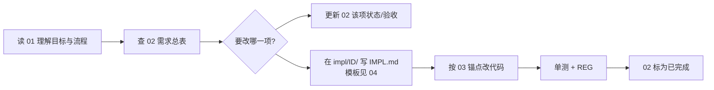

# myteam 整体指导文档集

> 版本：2026-06-09 · 分支：`upgrade/continued`  
> 用途：理解 **myteam 最终应成为什么**、**现在是什么**、**如何逐项演进**。

---

## 文档索引

| 文件 | 读者 | 内容 |
|------|------|------|
| [00-交叉评审共识.md](./00-交叉评审共识.md) | 全员 | 架构师 / 产品 / 工程 三角色共识与分歧裁决 |
| [01-整体指导-架构与目标.md](./01-整体指导-架构与目标.md) | 架构、新人 | 系统目标、三层架构、**架构图**、**两条时序图**、state.db、现状 vs 目标 |
| [02-需求总表.md](./02-需求总表.md) | 产品、QA | **全量需求列表**（ID、验收、优先级、状态）；**全部满足 = 实现整体指导目标** |
| [03-需求-实现映射与演进.md](./03-需求-实现映射与演进.md) | 开发 | 需求 ID ↔ 代码路径、演进路线图、已实现示范 |
| [04-单需求实现模板.md](./04-单需求实现模板.md) | 开发 | 每次只改一项需求时的固定章节模板 |
| `impl/<需求ID>/IMPL.md` | 开发 | 单项需求的实现说明（随迭代新增） |

---

## 推荐使用方式（您描述的流程）

1. **先读** `01`：知道两条流（Chat / 编排）和三层边界（Kernel / Registry / Skill）。
2. **查** `02`：当前缺什么、验收标准是什么。
3. **改一项**：在 `02` 更新描述或状态 → 复制 `04` 模板到 `impl/R-xxx/IMPL.md` → 对照 `03` 改代码。
4. **验证**：`pytest` + 对应 `scripts/regression/reg_*.py` → 把 `02` 状态改为「已完成」。

---

## 需求 ID 两套编号（ intentionally 并存）

| 体系 | 示例 | 用于 |
|------|------|------|
| **序号 ID** | `R-K5`、`R-O3` | `02-需求总表` 分组枚举 |
| **字母 ID** | `R-K-D`、`R-K-E` | `03` 映射表、Sprint 纪要、commit 引用 |

对照见 [03 第一节](./03-需求-实现映射与演进.md#一需求-id-体系说明) 与 [02 附录](./02-需求总表.md#附录-序号-id-与字母-id-对照)。

---

## 当前整体结论（2026-06-09）

| 维度 | 结论 |
|------|------|
| **L1/L2 框架内核** | ✅ 可运行、可回归（REG-02/L2 + D/A/B/C） |
| **L3 自进化** | ⏳ scaffold；场景 E2E 暂缓 |
| **档 C 通用工业级** | 部分完成；调度器 / A2A / 多租户等未开始 |
| **需求完成度** | 约 **75%**（56 项中 42 已完成，见 02 统计） |

---

*由 Cursor Auto 协调三专业 subagent 交叉评审后整理。*
