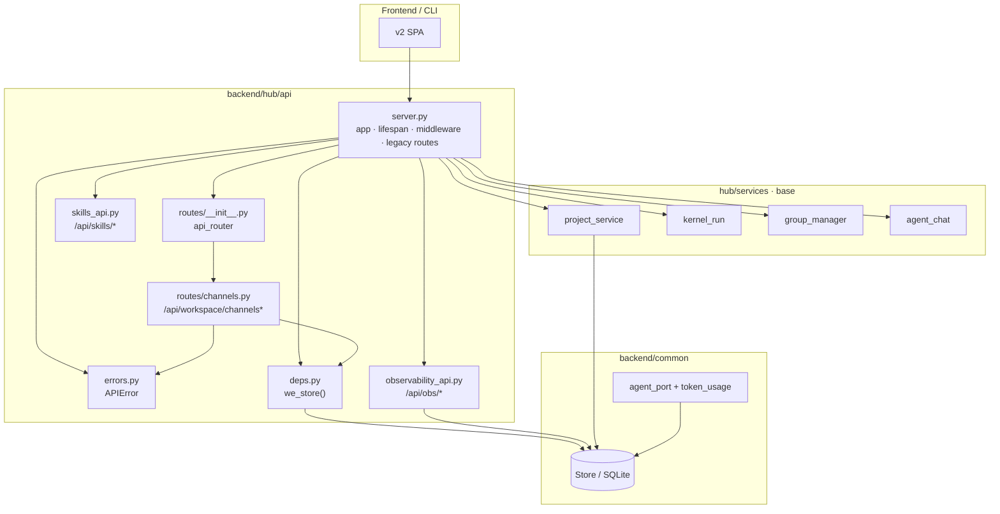

# Hub API 拆分方案（P2.1 / P3.1 部分落地）

> 对象：`backend/hub/api/server.py` 按业务域拆分为独立路由模块。  
> 状态：**P3.1 已启动** — channels 域已提取；其余域仍驻留 `server.py`。

## 目标状态

- `server.py` 仅保留：FastAPI app 装配、lifespan、全局中间件/异常处理、静态资源、尚未迁移的遗留路由。
- 各业务域路由独立文件，经 `hub/api/routes/__init__.py` 聚合后 `include_router` 挂载。
- 共享依赖（Store 单例、统一错误类型）沉淀为 `deps.py` / `errors.py`，避免循环导入。

## 当前差距（2026-06-14 快照）

| 域 | 目标模块 | 状态 |
|---|---|---|
| Workspace Channels | `routes/channels.py` | ✅ 已提取 |
| Observability | `observability_api.py` | ✅ 既有 |
| Skills | `skills_api.py` | ✅ 既有 |
| Workspace Events | `routes/workspace_events.py` | ⏳ 待提取 |
| Jobs / Agent Runtime | `routes/jobs.py` | ⏳ 待提取 |
| Projects / Workflows / Task Types | `routes/projects.py` 等 | ⏳ Wave 2 部分（list/run/detail/log） |
| Agents（列表+活动） | `routes/agents.py` | ✅ Wave 2 已提取 |
| 静态 / SPA fallback | `server.py` | 保留 |

`server.py` 行数：~1900 → ~1540（channels + projects/agents 提取后，约 −360 行）。

## 路由边界图（实际模块）

## 实施步骤（剩余）

1. **Wave 1（已完成）**：`routes/channels.py` + `routes/__init__.py` + `deps.py` / `errors.py`。
2. **Wave 2**：提取 `workspace/events`、`jobs`、`obs/agents` 至 `routes/workspace_events.py`、`routes/jobs.py`。
3. **Wave 3**：agents / backends / config 域 → `routes/agents.py`。
4. **Wave 4**：chat / groups → `routes/chat.py`、`routes/groups.py`。
5. **Wave 5**：projects / workflows / task-types / delivery-templates → 各自路由模块；kernel 启动逻辑保留 `server.py` 或迁至 `hub/lifecycle.py`。

## 验收指标

- [x] channels 四端点行为不变（GET/POST channels、GET/POST messages）
- [x] `test_api_contract.py` 通过
- [x] `server.py` 减少 ≥100 行
- [ ] 全部域提取后 `server.py` < 400 行（仅装配）
- [ ] 每域独立契约测试或 smoke test

## 风险评估

| 风险 | 缓解 |
|---|---|
| 循环导入（路由 ↔ server） | `errors.py` / `deps.py` 下沉共享层 |
| Store 单例测试污染 | `deps.we_store()` 与测试 monkeypatch `common.store.Store` 一致 |
| 路由前缀重复注册 | `api_router` 统一聚合，禁止双挂 |
| 异常 handler 仅 server 注册 | 域模块只 `raise APIError`，handler 留 server |

## 关联

- P2.3a token 计量：`common/token_usage.py` + `AgentPort` 经 `TokenUsageSink` 落盘（修正项 #2）。
- 接口契约：`docs/api-reference.md` 附录 B 错误信封由 `server.py` 全局 handler 保证。
