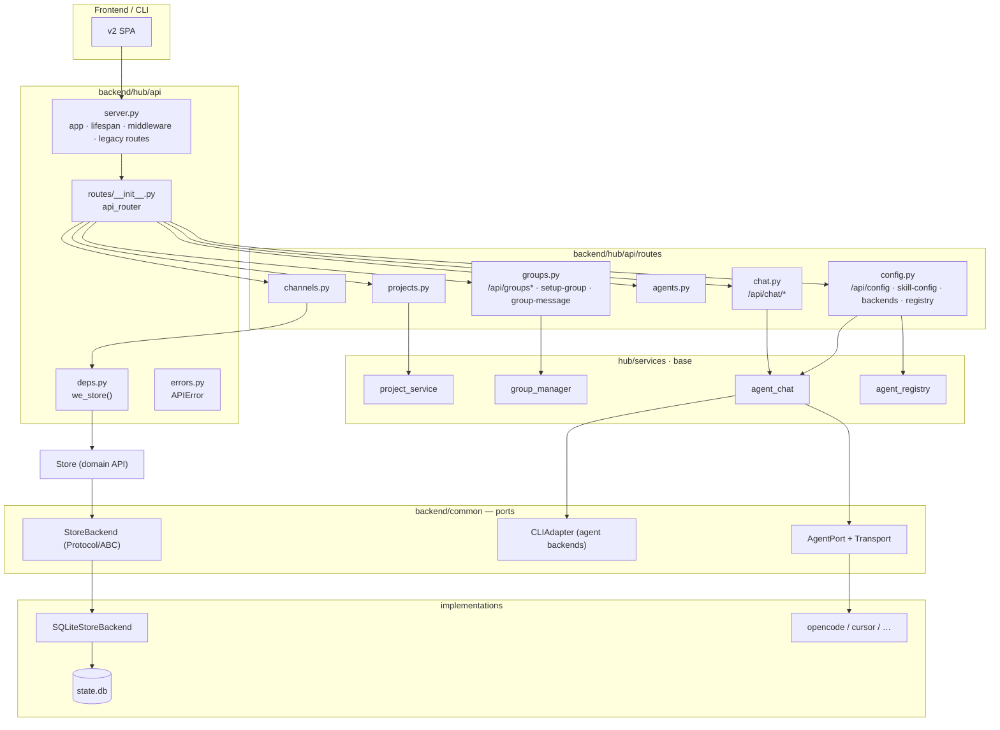

# Backend Modular Architecture

> Hub API 分层 + Store 可插拔持久化（adapter pattern）。  
> 状态：P3.1 Wave 3 落地 — `StoreBackend` / `SQLiteStoreBackend`；`routes/{config,chat,groups}.py` 已从 `server.py` 提取。

## 分层总览

## A) Store 持久化抽象

| 模块 | 职责 |
|------|------|
| `common/store_backend.py` | `StoreBackend` Protocol + `AbstractStoreBackend` ABC |
| `common/store_sqlite.py` | `SQLiteStoreBackend` — WAL、per-thread 连接、FTS bootstrap |
| `common/store.py` | 领域查询方法；`__init__(backend=...)` 默认注入 SQLite |

**委托模式**：Store 保留全部 CRUD/查询方法；backend 仅负责 `connection`、`fts_enabled`、`close()`。换 Postgres 时实现 `StoreBackend` 并传入 `Store(backend=PgStoreBackend(...))`，无需改动 Hub 路由。

**测试**：`backend/common/tests/test_store_backend.py`

## B) API 拆分 Wave 3

| 路由模块 | 端点 |
|----------|------|
| `routes/config.py` | `/api/config`, `/api/skill-config`, `/api/backends*`, `/api/agents/{id}/config`, `/api/agents/apply-model`, `/api/agents/registry`, sync/suggest-task-types |
| `routes/chat.py` | `/api/chat/{agent_id}*`, archives search/clear/archive/restore |
| `routes/groups.py` | `/api/groups*`, `/api/projects/{id}/setup-group`, `/api/projects/{id}/group-message` |

共享依赖：`hub/api/deps.py`（`we_store()`）、`hub/api/errors.py`（`APIError`）。

## C) 后续扩展

1. **PostgresStoreBackend** — 实现 `StoreBackend`，复用 Store 方法或逐步下沉 SQL。
2. **Wave 4+** — workflows / task-types / delivery-templates 继续从 `server.py` 提取。
3. **CLIAdapter 注册表** — `list_all_backends_with_models()` 已是雏形；可统一为 port + registry。

## 验收

- [x] `Store()` 默认行为不变（SQLite）
- [x] `test_store.py` / `test_store_backend.py` 通过
- [x] `test_api_contract.py` 通过
- [x] `server.py` 行数显著下降
