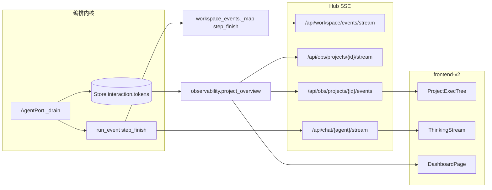

# Store Token 计量契约 + Adapter 采集方案（P2.3a + P2.3b）

> **Workflow**：`myteam-platform-v3` · 任务 `p2-3a-store-token-contract` + `p2-3b-token-adapter-plan`  
> **路由边界**：[`docs/plans/api-split-plan.md`](./api-split-plan.md)  
> **修正项 2**：验收为**功能性三步**（提取 → API 返回 → 前端展示），非覆盖率百分比  
> **生成时间**：2026-06-14（代码库扫描）

---

## Part A — Store 层契约（P2.3a）

### A.1 目标状态

- 所有 token 写入经 **`TokenUsageSink` 协议**，禁止业务层直接 `bump_interaction_tokens`（测试除外）。
- 真相字段：`interaction.tokens`（INT，会话累计 MAX）+ `run_event` 中 `step_finish` payload 保留明细。
- 契约响应信封 `Meta.tokens`（`contracts.py`）与 Store 字段语义一致：累计值，非增量。

### A.2 当前实现（已落地契约代码）

| 组件 | 路径 | 状态 |
|------|------|------|
| `TokenUsageRecord` | `backend/common/token_usage.py:15-23` | ✅ frozen dataclass |
| `TokenUsageSink` Protocol | `token_usage.py:27-41` | ✅ `@runtime_checkable` |
| `StoreTokenUsageSink` | `token_usage.py:44-64` | ✅ → `Store.bump_interaction_tokens` |
| `Store.bump_interaction_tokens` | `store.py:469-477` | ✅ `MAX(COALESCE(tokens,0), ?)` |
| `Meta.tokens` | `contracts.py:36-41` | ✅ Optional[int] |
| 单元测试 | `tests/test_token_usage.py` | ✅ sink / finalize 注入 |

**差距**：契约**代码已存在**；P3.3 重点是 **adapter 全覆盖 + Hub SSE 可验证 + 私聊路径**。

### A.3 接口定义（权威）

```python
# backend/common/token_usage.py（已实现）

@dataclass(frozen=True)
class TokenUsageRecord:
    project_id: str
    interaction_id: str
    tokens: int          # 会话累计
    agent_id: str = ""
    backend: str = ""
    model: str = ""

class TokenUsageSink(Protocol):
    def record_usage(
        self, project_id: str, interaction_id: str, tokens: int,
        *, agent_id: str = "", backend: str = "", model: str = "",
    ) -> None: ...

class StoreTokenUsageSink:
    """默认实现：interaction.tokens = MAX(existing, tokens)"""
```

**语义约定**：

| 字段 | 含义 |
|------|------|
| `tokens` 参数 | 当前会话**累计** token，非单步增量 |
| `bump_interaction_tokens` | SQL MAX，防 finalize 与 step_finish 双写重复累加 |
| `tokens <= 0` | sink 跳过（`test_store_sink_skips_non_positive`） |

### A.4 Store 扩展（P3 可选）

| 项 | 优先级 | 说明 |
|----|--------|------|
| 独立 `token_usage` 表 | P2 | 暂不需要；`interaction.tokens` + `run_event` 已满足 obs |
| `record_usage` 写 model | P3 | `TokenUsageRecord.model` 已定义，sink 暂未持久化 model 列 |
| PG 兼容 | P2.4 | 见 [`pg-migration-plan.md`](./pg-migration-plan.md) |

---

## Part B — Adapter 采集方案（P2.3b）

### B.1 目标状态

各 CLI adapter 在 `step_finish` 事件中输出统一 token 形态 → `AgentPort._drain` → `TokenUsageSink` → Store → SSE/obs 可读。

**功能性三步验收（修正项 2）**：

1. **Adapter 能提取**：真实 CLI 跑一轮，stdout 解析出非零 token。
2. **API 能返回**：`GET /api/obs/projects/{id}` overview / cost / events 含 token。
3. **前端能展示**：v2 Dashboard / ProjectDetail / ThinkingStream 显示 token。

### B.2 当前差距

| Backend | 代码路径 | step_finish | 接入 AgentPort | 备注 |
|---------|----------|-------------|----------------|------|
| **opencode** | `adapters/opencode/parser.py:65-78` | ✅ `tokens.{input,output,total}` | ✅ cumulative MAX | 默认 backend |
| **claude** | `adapters/claude/parser.py:89-116` | ✅ assistant 增量 + result 累计 | ✅ `_apply_step_finish_tokens` | `cumulative` 标志 |
| **codex** | — | ❌ 无 adapter | ❌ | `system_config` 未注册 |
| **cursor** | — | ❌ 无 adapter | ❌ | 同上 |

**Hub 私聊路径**：`hub/services/chat_service.py` → `AdapterTransport` → SSE `thinking`；**不经过** `AgentPort._drain`，**不写** `interaction.tokens`（仅 UI 流内 `step_finish`）。

**编排内核路径**：`Process` → `AgentPort` → `_drain` → `StoreTokenUsageSink` ✅（`test_agent_transport.py` D17）。

### B.3 Adapter 统一输出契约

每个 parser 必须在 `EventKind.STEP_FINISH` 的 `data` 中含：

```json
{
  "reason": "<assistant_message|completed|...>",
  "cumulative": true,
  "tokens": {
    "input": 0,
    "output": 0,
    "total": 1234
  }
}
```

| 模式 | `cumulative` | AgentPort 行为 |
|------|--------------|----------------|
| OpenCode / Claude result | `true`（默认） | 取 total → MAX |
| Claude per-message usage | `false` | Σ(input+output) 累加 |

解析逻辑权威：`agent_port.py:_apply_step_finish_tokens` · `_extract_tokens`（L368-410）。

### B.4 各 Adapter 实施步骤

#### B.4.1 opencode（维护，~0.5 人天）

| 步骤 | 动作 |
|------|------|
| 1 | 确认 OpenCode CLI `--format json` 仍输出 `step_finish.part.tokens` |
| 2 | 回归 `test_agent_transport.py::test_meters_opencode_cumulative_tokens` |
| 3 | E2E：run 项目 → `interaction.tokens > 0` |

#### B.4.2 claude（维护，~0.5 人天）

| 步骤 | 动作 |
|------|------|
| 1 | 保持 `parser.py` 双路径：assistant 块（incremental）+ result 行（cumulative） |
| 2 | 回归 `test_claude_parser.py` · `test_meters_claude_result_tokens_without_total` |
| 3 | 配置 `system_config.backends.claude.cli_path` 后 live 验证 |

#### B.4.3 codex（新建，~2 人天）

| 步骤 | 动作 |
|------|------|
| 1 | 新增 `backend/adapters/codex/{adapter,parser}.py`，继承 `SubprocessCLIAdapter` |
| 2 | 调研 Codex CLI stream 格式，映射 `usage` → `STEP_FINISH`（参照 claude parser） |
| 3 | `agent_transport._default_adapter("codex")` 分支 |
| 4 | `system_config.backends.codex` 注册 + `run_kernel --backend codex` |
| 5 | `test_codex_parser.py` fixture 行 |

#### B.4.4 cursor（新建，~2–3 人天）

| 步骤 | 动作 |
|------|------|
| 1 | 新增 `backend/adapters/cursor/`（或复用 Cursor Agent CLI 若与 claude 同格式则薄封装） |
| 2 | 明确 Cursor CLI 输出格式（stream-json vs NDJSON） |
| 3 | 同上 transport + config + 测试 |

> **诚实说明**：当前 `backend/` 仅存在 `opencode` 与 `claude` 两个 adapter 包；codex/cursor 为 P3.3 新建项，非虚构已完成。

### B.5 StoreTokenUsageSink 接线（已实现 + 待补）

```
CLI stdout
  → adapter/parser.parse_line()
  → AgentEvent(STEP_FINISH, {tokens, cumulative})
  → AgentTransport → ctx.emit("step_finish", payload)
  → AgentPort._drain()
       ├─ store.append_run_event(iid, kind, payload)
       └─ token_sink.record_usage(project_id, iid, running, agent_id, backend)
  → Store.bump_interaction_tokens(iid, running)
  → finalize_interaction()  // meta.tokens 兜底
```

**注入点**：

| 位置 | 代码 |
|------|------|
| AgentPort 构造 | `agent_port.py:110` `StoreTokenUsageSink(self.store)` |
| finalize | `agent_port.py:451-459` 经 sink 写盘 |
| 测试注入 | `finalize_interaction(..., token_sink=mock)` |

**待补：私聊路径**

| 步骤 | 动作 |
|------|------|
| 1 | `chat_service.py` 在 `step_finish` thinking 事件旁，可选写 `message.meta.tokens` 或独立计数表 |
| 2 | 或：私聊不计入项目 budget，文档化「仅编排 interaction 计量」 |

### B.6 Hub SSE Token 事件路径



| SSE 端点 | Token 载体 | 证据 |
|----------|------------|------|
| `/api/obs/projects/{id}/stream` | 签名含 `tok` 字段，变化时 tick | `observability_api.py:171` |
| `/api/workspace/events/stream` | `step_finish` → `project.task.updated` payload.tokens | `workspace_events.py:49-59` |
| `/api/chat/.../stream` | SSE `thinking.data.type=step_finish` + tokens | `adapter/sse.py` · `thinking.ts:357` |
| `/api/groups/{id}/events` | fanout `agent_thinking` 含 step_finish | `stream_fanout.py` |

**P3.3 验证命令示例**：

```bash
# 1. 跑编排 E2E 基线
PYTHONPATH=backend .venv/bin/python scripts/regression/reg_platform_v3_e2e_baseline.py

# 2. 查 Store
sqlite3 business/tasks/state.db "SELECT interaction_id,tokens FROM interaction WHERE tokens>0 LIMIT 5;"

# 3. curl obs
curl -s localhost:8765/api/obs/projects/<pid> | jq '.tokens'
```

### B.7 验收指标

| ID | 步骤 | 标准 | 证据 |
|----|------|------|------|
| T-A1 | Adapter 提取 | opencode + claude live run → `interaction.tokens > 0` | pytest + sqlite 查询 |
| T-A2 | API 返回 | `obs/summary` totals.tokens · `project_overview.tokens` 与 DB 一致 | `test_observability_api.py` |
| T-A3 | SSE 可验证 | 项目 run 中 `step_finish` 出现在 events 或 thinking 流 | 浏览器 Network / 日志 |
| T-A4 | 前端展示 | Dashboard 累计 token · ExecTree tok 标签非空 | 截图 |
| T-A5 | codex/cursor | 各 1 条 parser 单测 + 可选 live（P3 stretch） | 新建 adapter 测试 |

### B.8 风险评估

| 风险 | 缓解 |
|------|------|
| CLI 无 usage 字段 | parser 发空 step_finish；finalize 读 `meta.tokens` 兜底 |
| 过早 cancel 杀进程 → tokens=0 | grace window 排空迟到 step_finish（`test_grace_window_drains_late_step_finish`） |
| 私聊与编排计量不一致 | 文档化边界；P3 决定是否统一 sink |
| codex/cursor CLI 格式漂移 | parser 隔离在 `adapters/*/parser.py` |

### B.9 人天估算

| 项 | 人天 |
|----|------|
| opencode/claude 回归 + live | 1 |
| Hub SSE 验证 + 文档 | 0.5 |
| 私聊 sink（可选） | 1 |
| codex adapter | 2 |
| cursor adapter | 2–3 |
| **P3 最小集（T-A1–A4）** | **1.5** |
| **含 codex+cursor** | **5.5–6.5** |
